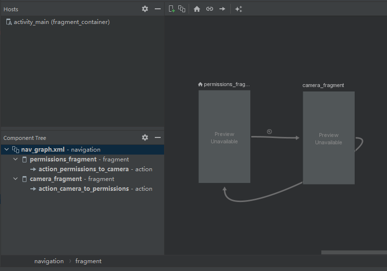
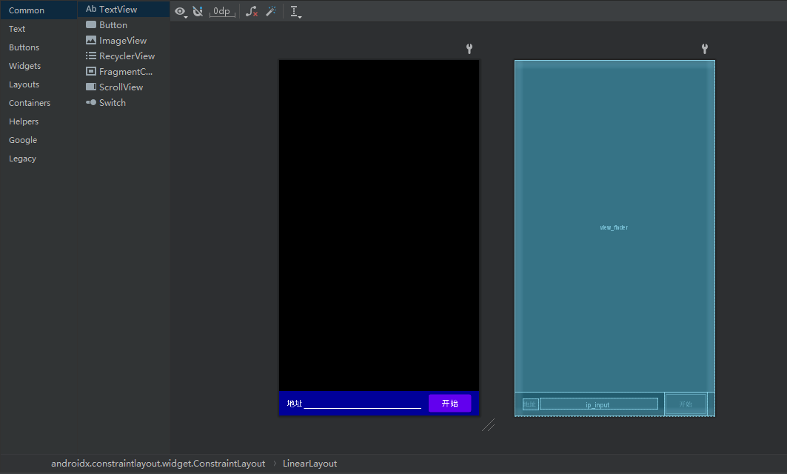

# 00 说明与准备


## 0.1 说明

**project_v1** 计划实现是用Android-kotlin开发一个具有音视频传输功能的软件，目标实现：

> 1. 简单的视频采集预览
> 2. 视频音频的编码和发送
> 3. 接收视频音频并且解码播放
> 4. 检测网络状态、缓存区状态以及丢包率
> 5. 通过网络状态丢包率等调整视频码流，并且判断是否需要中断视频传输
> 6. 音视频的同步机制


## 0.2 准备

新建Android-kotlin工程`project_v1`，并添加navigation组件，具体如下：

在工程的顶层build.gradle文件中的开头加入以下内容：

```groovy
buildscript {
    repositories {
        google()
    }
    dependencies {
        def nav_version = "2.4.1"
        classpath "androidx.navigation:navigation-safe-args-gradle-plugin:$nav_version"
    }
}
```

然后在app层的build.gradle文件中添加以下内容

```groovy
plugins {
    id 'com.android.application'
    id 'org.jetbrains.kotlin.android'
    id 'androidx.navigation.safeargs'
}
... ... ...
dependencies {
	// Navigation library
    def nav_version = '2.4.1'
    implementation "androidx.navigation:navigation-fragment-ktx:$nav_version"
    implementation "androidx.navigation:navigation-ui-ktx:$nav_version"

    // Testing Navigation
    androidTestImplementation "androidx.navigation:navigation-testing:$nav_version"
}
```

同步后就可以在res目录下新建`navigation/nav_graph.xml`了，下面放一个例子：

```xml
<?xml version="1.0" encoding="utf-8"?>
<navigation xmlns:android="http://schemas.android.com/apk/res/android"
    xmlns:app="http://schemas.android.com/apk/res-auto"
    android:id="@+id/nav_graph.xml"
    app:startDestination="@id/permissions_fragment">

    <fragment
        android:id="@+id/permissions_fragment"
        android:name="com.wangs7.project_v1.fragments.PermissionsFragment"
        android:label="PermissionsFragment" >

        <action
            android:id="@+id/action_permissions_to_camera"
            app:destination="@id/camera_fragment"
            app:popUpTo="@id/permissions_fragment"
            app:popUpToInclusive="true" />
    </fragment>
    
    <fragment
        android:id="@+id/camera_fragment"
        android:name="com.wangs7.project_v1.fragments.CameraFragment"
        android:label="CameraFragment" >

        <action
            android:id="@+id/action_camera_to_permissions"
            app:destination="@id/permissions_fragment"
            app:popUpTo="@id/camera_fragment"
            app:popUpToInclusive="true"/>
    </fragment>

</navigation>
```

使用design可以直观看到转跳关系



修改主布局内容，使用一个fragment容器来填充，并指定导航规则 ` app:navGraph="@navigation/nav_graph"` ，接管返回控制 `app:defaultNavHost="true"`

```xml
<?xml version="1.0" encoding="utf-8"?>
<androidx.fragment.app.FragmentContainerView
    xmlns:android="http://schemas.android.com/apk/res/android"
    xmlns:tools="http://schemas.android.com/tools"
    xmlns:app="http://schemas.android.com/apk/res-auto"
    android:id="@+id/fragment_container"
    android:name="androidx.navigation.fragment.NavHostFragment"
    android:layout_width="match_parent"
    android:layout_height="match_parent"
    android:keepScreenOn="true"
    app:defaultNavHost="true"
    app:navGraph="@navigation/nav_graph"
    tools:context=".MainActivity"/>
```

添加相机预览布局 fragment_camera.xml

```xml
<?xml version="1.0" encoding="utf-8"?>
<androidx.constraintlayout.widget.ConstraintLayout xmlns:android="http://schemas.android.com/apk/res/android"
    xmlns:tools="http://schemas.android.com/tools"
    android:layout_width="match_parent"
    android:layout_height="match_parent">

    <LinearLayout
        android:layout_width="match_parent"
        android:layout_height="match_parent"
        android:orientation="vertical">

        <LinearLayout
            android:layout_width="match_parent"
            android:layout_height="0dp"
            android:layout_weight="1"
            tools:ignore="MissingConstraints">
            <!--     预览       -->
            <androidx.camera.view.PreviewView
                android:id="@+id/view_finder"
                android:layout_width="match_parent"
                android:layout_height="match_parent" />
        </LinearLayout>

        <LinearLayout
            android:layout_width="match_parent"
            android:layout_height="50dp"
            android:background="#000099"
            android:gravity="center_vertical"
            android:orientation="horizontal"
            tools:ignore="MissingConstraints">
            <TextView
                android:id="@+id/adress"
                android:layout_width="wrap_content"
                android:layout_height="wrap_content"
                android:background="#00000000"
                android:text="@string/address"
                android:textColor="#ffffff"
                android:textSize="16dp"
                android:layout_marginStart="16dp"
                />
            <EditText
                android:id="@+id/ip_input"
                android:layout_width="0dp"
                android:layout_height="wrap_content"
                android:layout_marginLeft="3dp"
                android:layout_weight="1"
                android:background="#00000000"
                android:drawableBottom="@drawable/line"
                android:singleLine="true"
                android:textColor="#ffffff"
                android:textSize="16dp"
                tools:ignore="SpeakableTextPresentCheck,TouchTargetSizeCheck" />
            <Button
                android:id="@+id/button"
                android:layout_width="wrap_content"
                android:layout_height="wrap_content"
                android:layout_marginLeft="15dp"
                android:layout_marginRight="16dp"
                android:text="@string/start"
                android:textAllCaps="false"
                android:imeOptions="actionDone"
                android:textSize="16dp" />
        </LinearLayout>

    </LinearLayout>

</androidx.constraintlayout.widget.ConstraintLayout>
```

效果：




最后配置CamreaX的依赖，因为懒就全贴出来了

```groovy
dependencies {

    // Kotlin lang
    implementation 'androidx.core:core-ktx:1.7.0'
    //implementation "org.jetbrains.kotlin:kotlin-stdlib-jdk8:$kotlin_version"
    implementation 'org.jetbrains.kotlinx:kotlinx-coroutines-android:1.5.2'

    // App compat and UI things
    implementation 'androidx.appcompat:appcompat:1.4.0'
    implementation 'androidx.lifecycle:lifecycle-runtime-ktx:2.4.0'
    implementation "androidx.viewpager2:viewpager2:1.0.0"
    implementation 'androidx.constraintlayout:constraintlayout:2.1.2'
    implementation 'com.google.android.material:material:1.4.0'

    // Navigation library
    def nav_version = '2.4.1'
    implementation "androidx.navigation:navigation-fragment-ktx:$nav_version"
    implementation "androidx.navigation:navigation-ui-ktx:$nav_version"

    // EXIF Interface
    implementation 'androidx.exifinterface:exifinterface:1.3.2'

    // CameraX core library
    //def camerax_version = '1.0.0-rc03'
    def camerax_version = '1.1.0-beta02'
    implementation "androidx.camera:camera-core:$camerax_version"
    // CameraX Camera2 extensions[可选]拓展库可实现人像、HDR、夜间和美颜、滤镜但依赖于OEM
    implementation "androidx.camera:camera-camera2:$camerax_version"
    // CameraX Lifecycle library[可选]避免手动在生命周期释放和销毁数据
    implementation "androidx.camera:camera-lifecycle:$camerax_version"
    // CameraX View class[可选]最佳实践，最好用里面的PreviewView，它会自行判断用SurfaceView还是TextureView来实现
    implementation "androidx.camera:camera-view:$camerax_version"
    // CameraX Extensions library
    // implementation "androidx.camera:camera-extensions:$camerax_version"

    //WindowManager
    implementation 'androidx.window:window:1.0.0-alpha09'
    
    // Unit testing
    testImplementation 'junit:junit:4.13.2'
    androidTestImplementation 'androidx.test.ext:junit:1.1.3'
    testImplementation 'androidx.test:rules:1.4.0'
    testImplementation 'androidx.test:runner:1.4.0'
    testImplementation 'org.robolectric:robolectric:4.4'
    
    // Instrumented testing
    androidTestImplementation 'androidx.test.ext:junit:1.1.3'
    androidTestImplementation "androidx.test:core:1.4.0"
    androidTestImplementation 'androidx.test:rules:1.4.0'
    androidTestImplementation 'androidx.test:runner:1.4.0'
    androidTestImplementation 'androidx.test.espresso:espresso-core:3.4.0'
    // Testing Navigation
    androidTestImplementation "androidx.navigation:navigation-testing:$nav_version"
}
```


