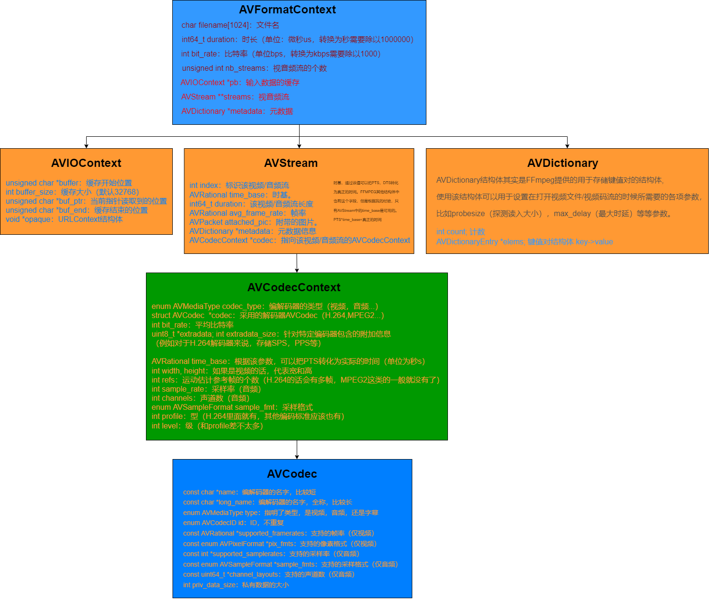

# 0 FFMPEG


## 前期准备

### Linux（CentOS）环境准备

* 源码下载

去官网或GitHub下载源码。我这里是用wget下载的源码：

```
[wangs7@localhost VSCode]$ wget http://www.ffmpeg.org/releases/ffmpeg-3.4.4.tar.gz
[wangs7@localhost VSCode]$ tar -zxvf ffmpeg-3.4.4.tar.gz
```

cd到解压好的目录：

```
[wangs7@localhost VSCode]$ cd ffmpeg-3.4.4/
```

使用命令配置：(这里的`${INSTALL_PAATH}`是要安装的路径，自己随意建个文件夹就可以了)。

```
[wangs7@localhost ffmpeg-3.4.4]$ ./configure --prefix=${INSTALL_PAATH} --enable-shared --disable-static --disable-doc
```

我的会提示缺少yasm，正常去下载安装就可以了，但是我这不知道为啥装不上，这里选择屏蔽这个选项：

```
[wangs7@localhost ffmpeg-3.4.4]$ ./configure --prefix=${INSTALL_PAATH} --enable-shared --disable-static --disable-doc --disable-x86asm
```

然后make && make install：

```
[wangs7@localhost ffmpeg-3.4.4]$ make && make install
```

编译过后就能在指定的安装目录中看到编译好的可执行程序和lib库以及头文件了，我的`${INSTALL_PAATH}`是在项目文件夹下新建了一个ffmpeg目录：

```
[wangs7@localhost ffmpeg-3.4.4]$ cd ffmpeg/
[wangs7@localhost ffmpeg]$ ls
bin  include  lib  share
[wangs7@localhost ffmpeg]$ 
```

bin里面是可执行程序，share里是案例，我暂时不用，这里就不处理。重点在于lib和include的处理，我是用的CentOS不知道其它发行版是怎么添加动态库的，仅供CentOS参考：

首先将lib拷贝到你想要存放的目录下，我是直接放在根目录下的ffmpeg/lib中，然后在/etc/ld.so.conf文件中添加路径保存，并重新加载库

```
[wangs7@localhost ffmpeg]# vim /etc/ld.so.conf
```

编辑内容：

```
include ld.so.conf.d/*.conf
/ffmpeg/lib
```

并重新加载库:

```
[root@localhost /]# vim /etc/ld.so.conf
```

然后写一段测试代码：test.cpp

```cpp
#include <stdio.h>
extern "C"  
{      
    #include "include/libavcodec/avcodec.h"
};  
int main(int argc, char const *argv[])
{    
    printf("%s\n", avcodec_configuration());    
    return 0;
}
```

如果直接包含头文件以及链接库后可能存在报错，提示未引用链接库，可能是因为C和C++兼容问题。需要如下修改

```cpp
extern "C"  
{      
    #include "include/libavcodec/avcodec.h"
};  
```

编译命令及运行结果：

```
[wangs7@localhost ffmpeg_test]$ g++ -o exec test.cpp -I ./include/  -L /ffmpeg/lib -lavcodec -lavdevice -lavfilter -lavformat -lavutil
[wangs7@localhost ffmpeg_test]$ ./exec 
--prefix=host --enable-shared --disable-static --disable-doc --disable-x86asm
```

或者使用CMAKE构建，目录结构：

```
./├── test.cpp
  ├── include
  │   ├── libswscale
  │   │   └── *
  │   ├── libswresample
  │   │   └── *
  │   ├── libavutil
  │   │   └── *
  │   ├── libavformat
  │   │   └── *
  │   ├── libavfilter
  │   │   └── *
  │   ├── libavdevice
  │   │   └── *
  │   └── libavcodec
  │       └── *
  ├── CMakeLists.txt
  └── build 
```

cmake脚本

```cmake
cmake_minimum_required(VERSION 2.8)
project(test)
include_directories(${CMAKE_SOURCE_DIR}/include)
link_directories("/ffmpeg/lib")
add_executable(exec test.cpp)
target_link_libraries(exec avcodec)
```


## 打开文件

### 打开本地文件

打开文件首先需要一个上下文指针`AVFormatContext*`，这个指针贯穿整个处理过程，用来存储视音频封装格式，然后我们需要按照注册编解码器、打开文件、在文件中找到流，打印时长和视频详细信息。

```cpp
#include <stdio.h>
#include <stdlib.h>

extern "C"  
{  
    #include "../../include/libavcodec/avcodec.h"
    #include "../../include/libavformat/avformat.h"
};  


int main(int argc, char const *argv[])
{   
    // 注册库中含有的所有可用的文件格式和编码器
    av_register_all();
	// 文件上下文指针
    AVFormatContext* pFrame = NULL;
    const char* path = "/home/wangs7/Videos/test.mp4"; //文件路径
	/* 打开视频文件 */
    // 上下文指针 文件路径 文件格式 格式参数（NULL 为自动） 
    int ret = avformat_open_input(&pFrame, path, NULL, NULL);
    if (ret < 0)
    {
        printf("avformat_open_input error\n");
        return -1;
    }
    else
    {
        printf("avformat_open_input success\n");
    }
    // 在文件中找到流 network doesn't need
    ret = avformat_find_stream_info(pFrame, NULL);
    if (ret < 0)
    {
        printf("avformat_find_stream_info error\n");
        return -1;
    }
    else
    {
        printf("avformat_find_stream_info success\n");
    }
	
    // 获取时长 um
    int time = pFrame->duration;
    int mbittime = time / 1000000 / 60; //min
    int mmintime = time / 1000000 % 60; //sec
    //打印时间
    printf("%d min : %d s.\n", mbittime, mmintime);
    //打印有关输入或输出格式的详细信息 上下文指针 流索引 文件路径 0/1-->input/output
    av_dump_format(pFrame, NULL, path, 0);
    return 0;
}

```

运行效果：

```
[wangs7@localhost build]$ ./exec 
avformat_open_input success
avformat_find_stream_info success
0 min : 30 s.
Input #0, mov,mp4,m4a,3gp,3g2,mj2, from '/home/wangs7/Videos/test.mp4':
  Metadata:
    major_brand     : isom
    minor_version   : 512
    compatible_brands: isomiso2avc1mp41
    encoder         : Lavf58.29.100
  Duration: 00:00:30.02, start: 0.000000, bitrate: 1412 kb/s
    Stream #0:0(und): Video: h264 (High) (avc1 / 0x31637661), yuv420p, 720x480 [SAR 1:1 DAR 3:2], 1277 kb/s, 25 fps, 25 tbr, 12800 tbn, 50 tbc (default)
    Metadata:
      handler_name    : VideoHandler
    Stream #0:1(und): Audio: aac (LC) (mp4a / 0x6134706D), 44100 Hz, stereo, fltp, 128 kb/s (default)
    Metadata:
      handler_name    : SoundHandler
```

### 打开网络文件

打开网络文件只需要在上述打开本地文件的基础上稍作修改就可以了，具体修改如下：

```cpp
/* network */
avformat_network_init();
AVDictionary* opt = NULL;
const char* path = "/URL";
av_dict_set(&opt, "rtsp_transport", "tcp", 0);
av_dict_set(&opt, "max_delay", "300", 0); 
int ret = avformat_open_input(&pFrame, path, NULL, &opt);

// network doesn't need
// ret = avformat_find_stream_info(pFrame, NULL);
```


## 经典解码案例


### AVFormatContext 结构体

首先先介绍一个始终贯彻ffmpeg的一个重要结构体`AVFormatContext`，这个结构体比较复杂，直接上图：



对于视频的解码过程其实就是帧的解码过程，实质上是从`AVFormatContext`取出对应视频的`Packet`然后再对`Packet`进行解码，转化成`Frame`的过程：


### 简单视频解码实现

下面就是具体的实现了【将本地的mp4视频文件中的视频流提取出来转化成YUV格式的文件，并提取Y、U、V分量】：(环境准备、构建脚本参考前面)

```cpp
#include <stdio.h>
#include <stdlib.h>

extern "C"  
{  
    #include "../../include/libavcodec/avcodec.h"
    #include "../../include/libavformat/avformat.h"
    #include "../../include/libswscale/swscale.h"
    #include "../../include/libavutil/avutil.h"
};  


int main(int argc, char const *argv[])
{   
    av_register_all(); //注册所有需要的编解码器等

    AVFormatContext* pFormat = NULL; //文件上下文指针
    const char* path = "/home/wangs7/Videos/test.mp4"; //文件路径
	//打开文件
    int ret = avformat_open_input(&pFormat, path, NULL, NULL);
    if (ret < 0)
    {
        printf("avformat_open_input error\n");
        return -1;
    }
    else
    {
        printf("avformat_open_input success\n");
    }
    // network doesn't need
    ret = avformat_find_stream_info(pFormat, NULL);
    if (ret < 0)
    {
        printf("avformat_find_stream_info error\n");
        return -1;
    }
    else
    {
        printf("avformat_find_stream_info success\n");
    }
	
    // 视频流 index
    int VideoStream = -1;
    // 寻找视频流
    VideoStream = av_find_best_stream(pFormat, AVMEDIA_TYPE_VIDEO, -1, -1, NULL, NULL);
   	// 将视频的编码信息暂存
    AVCodecContext* codecContext = pFormat->streams[VideoStream]->codec;
	// 根据视频流的编码信息寻找合适的解码器
    AVCodec* vCode = avcodec_find_decoder(codecContext->codec_id);
    if (vCode == NULL)
    {
        printf("avcodec_find_decoder error\n");
        return -1;
    }
    else
    {
        printf("avcodec_find_decoder success\n");
    }
	// 初始化一个视音频编解码器的AVCodecContext【用vCode初始化codecContext】。
    ret = avcodec_open2(codecContext, vCode, NULL);
    if (ret < 0)
    {
        printf("avcodec_open2 error\n");
        return -1;
    }
    else
    {
        printf("avcodec_open2 success\n");
    }
    
    // 申请空间并初始化
    AVFrame* frame = av_frame_alloc();
    AVFrame* frameYUV = av_frame_alloc();
    // 获取帧的宽度和高度
    int width = codecContext->width;
    int height = codecContext->height;
    // 像素格式
    AVPixelFormat fmt = codecContext->pix_fmt;
    // 计算缓冲区大小并分配空间
    int size = avpicture_get_size(AV_PIX_FMT_YUV420P, width, height);
    uint8_t *buff = (uint8_t*)av_malloc(size);
	// avpicture_fill函数将ptr指向的数据填充到picture内，但并没有拷贝，只是将picture结构内的data指针指向了ptr的数据。
    avpicture_fill((AVPicture*)frameYUV, buff, AV_PIX_FMT_YUV420P, width, height);
	// 给 packet 分配空间
    AVPacket* packet = (AVPacket*)av_malloc(sizeof(AVPacket));
	// 格式转换函数初始化
    SwsContext* swsContext =  sws_getContext(width, height, fmt, 
        width, height, AV_PIX_FMT_YUV420P, SWS_BICUBIC, NULL, NULL, NULL);

    int go; //执行标识
    int frameCount = 0; //帧计数
    
    FILE * fp_yuv = fopen("YUV.yuv", "wb+"); //yuv文件
    FILE * fp_y = fopen("YUV_y.y", "wb+"); //y分量
    FILE * fp_u = fopen("YUV_u.y", "wb+"); //u分量
    FILE * fp_v = fopen("YUV_v.y", "wb+"); //v分量
	// 返回流中的下一帧
    while ( av_read_frame(pFormat, packet) == 0 )
    {	// 判断是否是视频帧
        if (packet->stream_index == AVMEDIA_TYPE_VIDEO)
        {	// 压缩视频的解码，go没有可解帧为0，否则有可解帧， 返回值小于零出错，成功返回使用字节数/0
            ret = avcodec_decode_video2(codecContext, frame, &go, packet);
            if (ret < 0)
            {
                printf("avcodec_decode_video2 error\n");
                return -1;
            }
            else
            {
                printf("avcodec_decode_video2 success\n");
            }
            if (go) /* 有可处理帧 */
            {
                // 图片格式转换
                // 第一个参数即是由sws_getContext所取得的参数。 
				// 第二个src及第六个dst分別指向input和output的buffer。 
  				// 第三个srcStride及第七个dstStride分別指向input及outpu的stride；
                // 如果不知道什么是stride，姑且可以先把它看成是每一列的byte数。
				// 第四个srcSliceY，就注解的意思来看，是指第一列要处理的位置；
                // 这里我是从头处理，所以直接填0。想知道更详细说明的人，可以参考 swscale.h 的注解。
				// 第五个srcSliceH指的是source slice的高度。
                sws_scale(swsContext/* 1 */, 
                          frame->data/* 2 */, frame->linesize /* 3 */, 
                          0/* 4 */, height/* 5 */, frameYUV->data/* 6 */, 
                          frameYUV->linesize/* 7 */);
                //处理后的帧写入文件
                fwrite(frameYUV->data[0], 1, width * height, fp_yuv);
                fwrite(frameYUV->data[1], 1, width * height / 4, fp_yuv);
                fwrite(frameYUV->data[2], 1, width * height / 4, fp_yuv);

                fwrite(frameYUV->data[0], 1, width * height, fp_y);
                fwrite(frameYUV->data[1], 1, width * height / 4, fp_u);
                fwrite(frameYUV->data[2], 1, width * height / 4, fp_v);
                frameCount++;
                printf("frame index;%d\n", frameCount);
            }    
            av_free_packet(packet); //释放packet
        }
    }
	// 关闭文件 释放变量空间
    fclose(fp_yuv);
    fclose(fp_y);
    fclose(fp_u);
    fclose(fp_v);
    av_dump_format(pFormat, NULL, path, 0);
    sws_freeContext(swsContext);
    av_frame_free(&frame);
    av_frame_free(&frameYUV);
    avformat_close_input(&pFormat);
    // 打印原视频信息
    printf("frameCount = %d\n", frameCount);

    return 0;
}

```

编译执行后可看到运行目录下有一个`.yuv`和三个`.y`文件，使用yuv播放器查看，视频流畅无卡顿。


