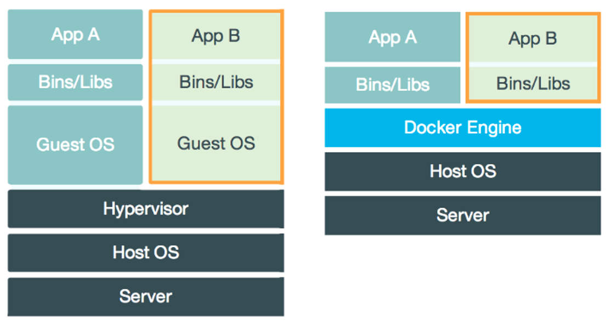
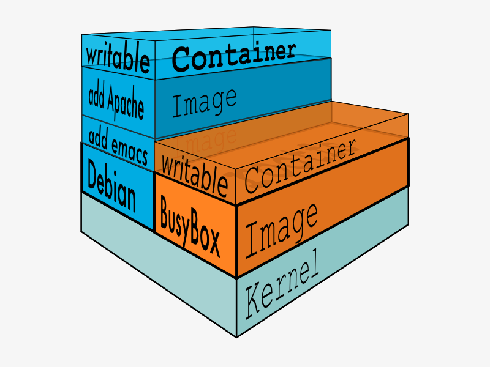

# 01 Docker 基础


## 1.1 Docker是什么？

Docker是一个开源的引擎，可以轻松的为任何应用创建一个轻量级的、可移植的、自给自足的容器。开发者在笔记本上编译测试通过的容器可以批量地在生产环境中部署，包括VMs（虚拟机）、 bare metal、OpenStack 集群和其他的基础应用平台。

Docker通常用于如下场景：

* web应用的自动化打包和发布；
* 自动化测试和持续集成、发布；
* 在服务型环境中部署和调整数据库或其他的后台应用；
* 从头编译或者扩展现有的OpenShift或Cloud Foundry平台来搭建自己的PaaS环境。

### 1.1.1 Docker与虚拟机有什么不同



 Docker在宿主机器的操作系统上创建Docker引擎，直接在宿主主机的操作系统上调用硬件资源，而不是虚拟化操作系统和硬件资源，所以操作速度快。

比较两图的差异，左图虚拟机的Guest OS层和Hypervisor层在docker中被Docker Engine层所替代。虚拟机的Guest OS即为虚拟机安装的操作系统，它是一个完整操作系统内核；虚拟机的Hypervisor层可以简单理解为一个硬件虚拟化平台，它在Host OS是以内核态的驱动存在的。

虚拟机实现资源隔离的方法是利用独立的OS，并利用Hypervisor虚拟化CPU、内存、IO设备等实现的。例如，为了虚拟CPU，Hypervisor会为每个虚拟的CPU创建一个数据结构，模拟CPU的全部寄存器的值，在适当的时候跟踪并修改这些值。需要指出的是在大多数情况下，虚拟机软件代码是直接跑在硬件上的，而不需要Hypervisor介入。只有在一些权限高的请求下，Guest OS需要运行内核态修改CPU的寄存器数据，Hypervisor会介入，修改并维护虚拟的CPU状态。

Hypervisor虚拟化内存的方法是创建一个shadow page table。正常的情况下，一个page table可以用来实现从虚拟内存到物理内存的翻译。在虚拟化的情况下，由于所谓的物理内存仍然是虚拟的，因此shadow page table就要做到：虚拟内存->虚拟的物理内存->真正的物理内存。

对于IO设备虚拟化，当Hypervisor接到page fault，并发现实际上虚拟的物理内存地址对应的是一个I/O设备，Hypervisor就用软件模拟这个设备的工作情况，并返回。比如当CPU想要写磁盘时，Hypervisor就把相应的数据写到一个host OS的文件上，这个文件实际上就模拟了虚拟的磁盘。

对比虚拟机实现资源和环境隔离的方案，docker就显得简练很多。docker Engine可以简单看成对Linux的NameSpace、Cgroup、镜像管理文件系统操作的封装。docker并没有和虚拟机一样利用一个完全独立的Guest OS实现环境隔离，它利用的是目前linux内核本身支持的容器方式实现资源和环境隔离。简单的说，docker利用namespace实现系统环境的隔离；利用Cgroup实现资源限制；利用镜像实现根目录环境的隔离。

**主要区别如下：**

1、启动速度

启动虚拟机需要先启动虚拟机的操作系统，再启动应用，这个过程非常慢;

而启动 Docker 相当于启动宿主操作系统上的一个进程。

2、占用资源

虚拟机是一个完整的操作系统，需要占用大量的磁盘、内存和 CPU 资源，一台机器只能开启几十个的虚拟机。而 Docker 只是一个进程，只需要将应用以及相关的组件打包，在运行时占用很少的资源，一台机器可以开启成千上万个 Docker。

3、隔离性

与虚拟机相比，docker隔离性更弱，docker属于进程之间的隔离，虚拟机可实现系统级别隔离。

4、安全性

docker的安全性也更弱。Docker的租户root和宿主机root等同，一旦容器内的用户从普通用户权限提升为root权限，它就直接具备了宿主机的root权限，进而可进行无限制的操作。虚拟机租户root权限和宿主机的root虚拟机权限是分离的，并且虚拟机利用如Intel的VT-d和VT-x的ring-1硬件隔离技术，这种隔离技术可以防止虚拟机突破和彼此交互，而容器至今还没有任何形式的硬件隔离，这使得容器容易受到攻击。


| 特性     | 容器               | 虚拟机         |
| :------- | ------------------ | -------------- |
| 启动     | 秒级               | 分级           |
| 硬盘使用 | 一般为MB           | 一般为GB       |
| 性能     | 接近原生           | 弱于           |
| 系统支持 | 单机支持上千个容器 | 单机一般十几个 |

**Docker的优势**

除了启动速度快以及占用资源少之外，Docker 具有以下优势：

1、更容易迁移

提供一致性的运行环境。已经打包好的应用可以在不同的机器上进行迁移，而不用担心环境变化导致无法运行。

2、更容易维护

使用分层技术和镜像，使得应用可以更容易复用重复的部分。复用程度越高，维护工作也越容易。

3、更容易扩展

可以使用基础镜像进一步扩展得到新的镜像，并且官方和开源社区提供了大量的镜像，通过扩展这些镜像可以非常容易得到我们想要的镜像。

**镜像与容器**

镜像是一种静态的结构，可以看成面向对象里面的类，而容器是镜像的一个实例。

镜像包含着容器运行时所需要的代码以及其它组件，它是一种分层结构，每一层都是只读的(read-only layers)。构建镜像时，会一层一层构建，前一层是后一层的基础。镜像的这种分层存储结构很适合镜像的复用以及定制。



构建容器时，通过在镜像的基础上添加一个可写层(writable layer)，用来保存着容器运行过程中的修改。


## 1.2 安装Docker（Ubuntu）

### 1.2.1 脚本自动安装

可以使用国内 daocloud 一键安装命令：

```shell
curl -sSL https://get.daocloud.io/docker | sh
```

或者手动安装（参考菜鸟教程）

### 1.2.2 使用 Docker 仓库进行安装

在新主机上首次安装 Docker Engine-Community 之前，需要设置 Docker 仓库。之后，您可以从仓库安装和更新 Docker 。更新 apt 包索引。

```
$ sudo apt-get update
```

安装 apt 依赖包，用于通过HTTPS来获取仓库:

```
$ sudo apt-get install \
  apt-transport-https \
  ca-certificates \
  curl \
  gnupg-agent \
  software-properties-common
```

添加 Docker 的官方 GPG 密钥：

```
$ curl -fsSL https://mirrors.ustc.edu.cn/docker-ce/linux/ubuntu/gpg | sudo apt-key add -
```

9DC8 5822 9FC7 DD38 854A E2D8 8D81 803C 0EBF CD88 通过搜索指纹的后8个字符，验证您现在是否拥有带有指纹的密钥。

```
$ sudo apt-key fingerprint 0EBFCD88

pub  rsa4096 2017-02-22 [SCEA]
     9DC8 5822 9FC7 DD38 854A  E2D8 8D81 803C 0EBF CD88
uid  [unknown] Docker Release (CE deb) <docker@docker.com>
sub  rsa4096 2017-02-22 [S]
```

使用以下指令设置稳定版仓库

```
$sudo add-apt-repository \
  "deb [arch=amd64] https://mirrors.ustc.edu.cn/docker-ce/linux/ubuntu/ \

  $(lsb_release -cs)  \

  stable"
```


* 安装 Docker Engine-Community

更新 apt 包索引。

```
$ sudo apt-get update
```

安装最新版本的 Docker Engine-Community 和 containerd ，或者转到下一步安装特定版本：

```
$ sudo apt-get install docker-ce docker-ce-cli containerd.io
```

要安装特定版本的 Docker Engine-Community，请在仓库中列出可用版本，然后选择一种安装。列出您的仓库中可用的版本：

```
ubuntu@ubuntu:~$ apt-cache madison docker-ce
 docker-ce | 5:20.10.12~3-0~ubuntu-bionic | https://download.docker.com/linux/ubuntu bionic/stable amd64 Packages
 docker-ce | 5:20.10.11~3-0~ubuntu-bionic | https://download.docker.com/linux/ubuntu bionic/stable amd64 Packages
 docker-ce | 5:20.10.10~3-0~ubuntu-bionic | https://download.docker.com/linux/ubuntu bionic/stable amd64 Packages
 docker-ce | 5:20.10.9~3-0~ubuntu-bionic | https://download.docker.com/linux/ubuntu bionic/stable amd64 Packages
 docker-ce | 5:20.10.8~3-0~ubuntu-bionic | https://download.docker.com/linux/ubuntu bionic/stable amd64 Packages
 docker-ce | 5:20.10.7~3-0~ubuntu-bionic | https://download.docker.com/linux/ubuntu bionic/stable amd64 Packages
 docker-ce | 5:20.10.6~3-0~ubuntu-bionic | https://download.docker.com/linux/ubuntu bionic/stable amd64 Packages
 docker-ce | 5:20.10.5~3-0~ubuntu-bionic | https://download.docker.com/linux/ubuntu bionic/stable amd64 Packages
 docker-ce | 5:20.10.4~3-0~ubuntu-bionic | https://download.docker.com/linux/ubuntu bionic/stable amd64 Packages
 docker-ce | 5:20.10.3~3-0~ubuntu-bionic | https://download.docker.com/linux/ubuntu bionic/stable amd64 Packages
 docker-ce | 5:20.10.2~3-0~ubuntu-bionic | https://download.docker.com/linux/ubuntu bionic/stable amd64 Packages
 ...
```

使用第二列中的版本字符串安装特定版本，例如 `5:20.10.12~3-0~ubuntu-bionic`。

```
$ sudo apt-get install docker-ce=<VERSION_STRING> docker-ce-cli=<VERSION_STRING> containerd.io
```

### 1.2.3 简单验证Docker是否安装成功

测试 Docker 是否安装成功，输入以下指令，打印出以下信息则安装成功:

```
ubuntu@ubuntu:~$ sudo docker run hello-world
[sudo] password for ubuntu: 
Unable to find image 'hello-world:latest' locally
latest: Pulling from library/hello-world
2db29710123e: Pull complete 
Digest: sha256:97a379f4f88575512824f3b352bc03cd75e239179eea0fecc38e597b2209f49a
Status: Downloaded newer image for hello-world:latest

Hello from Docker!
This message shows that your installation appears to be working correctly.

To generate this message, Docker took the following steps:
 1. The Docker client contacted the Docker daemon.
 2. The Docker daemon pulled the "hello-world" image from the Docker Hub.
    (amd64)
 3. The Docker daemon created a new container from that image which runs the
    executable that produces the output you are currently reading.
 4. The Docker daemon streamed that output to the Docker client, which sent it
    to your terminal.

To try something more ambitious, you can run an Ubuntu container with:
 $ docker run -it ubuntu bash

Share images, automate workflows, and more with a free Docker ID:
 https://hub.docker.com/

For more examples and ideas, visit:
 https://docs.docker.com/get-started/
```

### 1.2.4 将docker添加到普通用户组

```shell
sudo groupadd docker     #添加docker用户组
sudo gpasswd -a $USER docker     #将登陆用户加入到docker用户组中
newgrp docker     #更新用户组
service docker restart #重启服务
```

成功的话将提示

```
ubuntu@ubuntu:~$ docker version #测试docker命令是否可以不使用sudo正常使用
Client: Docker Engine - Community
 Version:           20.10.12
 API version:       1.41
 Go version:        go1.16.12
 Git commit:        e91ed57
 Built:             Mon Dec 13 11:45:27 2021
 OS/Arch:           linux/amd64
 Context:           default
 Experimental:      true

Server: Docker Engine - Community
 Engine:
  Version:          20.10.12
  API version:      1.41 (minimum version 1.12)
  Go version:       go1.16.12
  Git commit:       459d0df
  Built:            Mon Dec 13 11:43:36 2021
  OS/Arch:          linux/amd64
  Experimental:     false
 containerd:
  Version:          1.4.12
  GitCommit:        7b11cfaabd73bb80907dd23182b9347b4245eb5d
 runc:
  Version:          1.0.2
  GitCommit:        v1.0.2-0-g52b36a2
 docker-init:
  Version:          0.19.0
  GitCommit:        de40ad0
```


