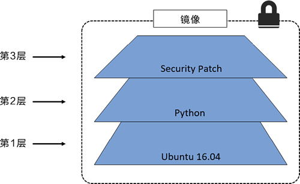

# 02 Docker重要组成

## 2.1 Docker引擎（Engine）

Docker 引擎是用来运行和管理容器的核心软件。通常人们会简单地将其代指为 Docker 或 Docker 平台。

基于开放容器计划（OCI）相关标准的要求，Docker 引擎采用了模块化的设计原则，其组件是可替换的。

从多个角度来看，Docker 引擎就像汽车引擎——二者都是模块化的，并且由许多可交换的部件组成。

汽车引擎由许多专用的部件协同工作，从而使汽车可以行驶，例如进气管、节气门、气缸、火花塞、排气管等。

Docker 引擎由许多专用的工具协同工作，从而可以创建和运行容器，例如 API、执行驱动、运行时、shim 进程等。

Docker 引擎由如下主要的组件构成：Docker 客户端（Docker Client）、Docker 守护进程（Docker daemon）、containerd 以及 runc。它们共同负责容器的创建和运行。总体逻辑如下图所示。


* **开放容器计划（OCI）的影响**
  当 Docker 公司正在进行 Docker daemon 进程的拆解和重构的时候，OCI 也正在着手定义两个容器相关的规范（或者说标准）。镜像规范和容器运行时规范，两个规范均于 2017 年 7 月发布了 1.0 版。Docker 公司参与了这些规范的制定工作，并贡献了许多的代码。从 Docker 1.11 版本（2016 年初）开始，Docker 引擎尽可能实现了 OCI 的规范。例如，Docker daemon 不再包含任何容器运行时的代码——所有的容器运行代码在一个单独的 OCI 兼容层中实现。默认情况下，Docker 使用 runc 来实现这一点。runc 是 OCI 容器运行时标准的参考实现。如上图中的 runc 容器运行时层。runc 项目的目标之一就是与 OCI 规范保持一致。目前 OCI 规范均为 1.0 版本，我们不希望它们频繁地迭代，毕竟稳定胜于一切。除此之外，Docker 引擎中的 containerd 组件确保了 Docker 镜像能够以正确的 OCI Bundle 的格式传递给 runc。其实，在 OCI 规范以 1.0 版本正式发布之前，Docker 引擎就已经遵循该规范实现了部分功能。
* **runc**
  如前所述，runc 是 OCI 容器运行时规范的参考实现。Docker 公司参与了规范的制定以及 runc 的开发。去粗取精，会发现 runc 实质上是一个轻量级的、针对 Libcontainer 进行了包装的命令行交互工具（Libcontainer 取代了早期 Docker 架构中的 LXC）。runc 生来只有一个作用——创建容器，这一点它非常拿手，速度很快！不过它是一个 CLI 包装器，实质上就是一个独立的容器运行时工具。因此直接下载它或基于源码编译二进制文件，即可拥有一个全功能的 runc。但它只是一个基础工具，并不提供类似 Docker 引擎所拥有的丰富功能。有时也将 runc 所在的那一层称为“OCI 层”，如上图所示。关于 runc 的发布信息见 GitHub 中 opencontainers/runc 库的 release。
* **containerd**
  在对 Docker daemon 的功能进行拆解后，所有的容器执行逻辑被重构到一个新的名为 containerd（发音为 container-dee）的工具中。它的主要任务是容器的生命周期管理——start | stop | pause | rm....  。containerd 在 Linux 和 Windows 中以 daemon 的方式运行，从 1.11 版本之后 Docker 就开始在 Linux 上使用它。Docker 引擎技术栈中，containerd 位于 daemon 和 runc 所在的 OCI 层之间。Kubernetes 也可以通过 cri-containerd 使用 containerd。如前所述，containerd 最初被设计为轻量级的小型工具，仅用于容器的生命周期管理。然而，随着时间的推移，它被赋予了更多的功能，比如镜像管理。其原因之一在于，这样便于在其他项目中使用它。比如，在 Kubernetes 中，containerd 就是一个很受欢迎的容器运行时。然而在 Kubernetes 这样的项目中，如果 containerd 能够完成一些诸如 push 和 pull 镜像这样的操作就更好了。因此，如今 containerd 还能够完成一些除容器生命周期管理之外的操作。不过，所有的额外功能都是模块化的、可选的，便于自行选择所需功能。所以，Kubernetes 这样的项目在使用 containerd 时，可以仅包含所需的功能。containerd 是由 Docker 公司开发的，并捐献给了云原生计算基金会（Cloud Native Computing Foundation, CNCF）。2017 年 12 月发布了 1.0 版本，具体的发布信息见 GitHub 中的 containerd/ containerd 库的 releases。


###  启动一个新的容器

现在我们对 Docker 引擎已经有了一个总体认识，也了解了一些历史，下面介绍一下创建新容器的过程。

常用的启动容器的方法就是使用 Docker 命令行工具。下面的`docker container run`命令会基于 alpine:latest 镜像启动一个新容器。

``` 
$ docker container run --name ctr1 -it alpine:latest sh
```

当使用 Docker 命令行工具执行如上命令时，Docker 客户端会将其转换为合适的 API 格式，并发送到正确的 API 端点。

API 是在 daemon 中实现的。这套功能丰富、基于版本的 REST API 已经成为 Docker 的标志，并且被行业接受成为事实上的容器 API。

一旦 daemon 接收到创建新容器的命令，它就会向 containerd 发出调用。daemon 已经不再包含任何创建容器的代码了！

daemon 使用一种 CRUD 风格的 API，通过 gRPC 与 containerd 进行通信。

虽然名叫 containerd，但是它并不负责创建容器，而是指挥 runc 去做。

containerd 将 Docker 镜像转换为 OCI bundle，并让 runc 基于此创建一个新的容器。

然后，runc 与操作系统内核接口进行通信，基于所有必要的工具（Namespace、CGroup等）来创建容器。容器进程作为 runc 的子进程启动，启动完毕后，runc 将会退出。至此，容器启动完毕。整个过程如下图所示。


**该模型的显著优势**

> 将所有的用于启动、管理容器的逻辑和代码从 daemon 中移除，意味着容器运行时与 Docker daemon 是解耦的，有时称之为“无守护进程的容器（daemonless container）”，如此，对 Docker daemon 的维护和升级工作不会影响到运行中的容器。
>
> 在旧模型中，所有容器运行时的逻辑都在 daemon 中实现，启动和停止 daemon 会导致宿主机上所有运行中的容器被杀掉。
>
> 这在生产环境中是一个大问题——想一想新版 Docker 的发布频次吧！每次 daemon 的升级都会杀掉宿主机上所有的容器，这太糟了！
>
> 幸运的是，这已经不再是个问题。

**shim**

> shim 是实现无 daemon 的容器（用于将运行中的容器与 daemon 解耦，以便进行 daemon 升级等操作）不可或缺的工具。
>
> 前面提到，containerd 指挥 runc 来创建新容器。事实上，每次创建容器时它都会 fork 一个新的 runc 实例。
>
> 不过，一旦容器创建完毕，对应的 runc 进程就会退出。因此，即使运行上百个容器，也无须保持上百个运行中的 runc 实例。
>
> 一旦容器进程的父进程 runc 退出，相关联的 containerd-shim 进程就会成为容器的父进程。作为容器的父进程，shim 的部分职责如。
>
> * 保持所有 STDIN 和 STDOUT 流是开启状态，从而当 daemon 重启的时候，容器不会因为管道（pipe）的关闭而终止。
> * 将容器的退出状态反馈给 daemon。

**在 Linux 中的实现**

> 在 Linux 系统中，前面谈到的组件由单独的二进制来实现，具体包括 dockerd(Docker daemon)、docker-containerd(containerd)、docker-containerd-shim (shim) 和 docker-runc (runc)。
>
> 通过在 Docker 宿主机的 Linux 系统中执行 ps 命令可以看到以上组件的进程。当然，有些进程只有在运行容器的时候才可见。


## 2.2 Docker镜像（image）

### 2.2.1Docker镜像介绍

如果曾经做过 VM 管理员，则可以把 Docker 镜像理解为 VM 模板，VM 模板就像停止运行的 VM，而 Docker 镜像就像停止运行的容器；而作为一名研发人员，则可以将镜像理解为类（Class）。

首先需要先从镜像仓库服务中拉取镜像。常见的镜像仓库服务是 Docker Hub，但是也存在其他镜像仓库服务。拉取操作会将镜像下载到本地 Docker 主机，可以使用该镜像启动一个或者多个容器。镜像由多个层组成，每层叠加之后，从外部看来就如一个独立的对象。镜像内部是一个精简的操作系统（OS），同时还包含应用运行所必须的文件和依赖包。因为容器的设计初衷就是快速和小巧，所以镜像通常都比较小。

前面多次提到镜像就像停止运行的容器（类）。实际上，可以停止某个容器的运行，并从中创建新的镜像。在该前提下，镜像可以理解为一种构建时（build-time）结构，而容器可以理解为一种运行时（run-time）结构，如下图所示。


* **镜像和容器**

上图从顶层设计层面展示了镜像和容器间的关系。通常使用docker container run和docker service create命令从某个镜像启动一个或多个容器。

一旦容器从镜像启动后，二者之间就变成了互相依赖的关系，并且在镜像上启动的容器全部停止之前，镜像是无法被删除的。尝试删除镜像而不停止或销毁使用它的容器，会导致出错。

* **镜像通常比较小**

容器目的就是运行应用或者服务，这意味着容器的镜像中必须包含应用/服务运行所必需的操作系统和应用文件。但是，容器又追求快速和小巧，这意味着构建镜像的时候通常需要裁剪掉不必要的部分，保持较小的体积。

例如，Docker 镜像通常不会包含 6 个不同的 Shell 让读者选择——通常 Docker 镜像中只有一个精简的Shell，甚至没有 Shell。镜像中还不包含内核——容器都是共享所在 Docker 主机的内核。所以有时会说容器仅包含必要的操作系统（通常只有操作系统文件和文件系统对象）。

> 提示：Hyper-V 容器运行在专用的轻量级 VM 上，同时利用 VM 内部的操作系统内核。

Docker 官方镜像 Alpine Linux 大约只有 4MB，可以说是 Docker 镜像小巧这一特点的比较典型的例子。但是，镜像更常见的状态是如 Ubuntu 官方的 Docker 镜像一般，大约有 110MB。这些镜像中都已裁剪掉大部分的无用内容。Windows 镜像要比 Linux 镜像大一些，这与 Windows OS 工作原理相关。比如，未压缩的最新 Microsoft .NET 镜像（microsoft/dotnet:latest）超过 1.7GB。Windows Server 2016 Nano Server 镜像（microsoft/nanoserver:latest）在拉取并解压后，其体积略大于 1GB。

* **拉取镜像**

Docker 主机安装之后，本地并没有镜像。`docker image pull` 是下载镜像的命令。镜像从远程镜像仓库服务的仓库中下载。默认情况下，镜像会从 Docker Hub 的仓库中拉取。`docker image pull ubuntu:latest` 命令会从 Docker Hub 的 ubuntu 仓库中拉取标签为 latest 的镜像。

Linux Docker 主机本地镜像仓库通常位于 `/var/lib/docker/<storage-driver>`，Windows Docker 主机则是` C:\ProgramData\docker\windowsfilter`。

可以使用以下命令检查 Docker 主机的本地仓库中是否包含镜像。

```
ubuntu@ubuntu:~$ docker image ls
REPOSITORY    TAG       IMAGE ID       CREATED        SIZE
hello-world   latest    feb5d9fea6a5   5 months ago   13.3kB
```


### 2.2.2 镜像仓库服务

Docker 镜像存储在镜像仓库服务（Image Registry）当中。Docker 客户端的镜像仓库服务是可配置的，默认使用 Docker Hub。镜像仓库服务包含多个镜像仓库（Image Repository）。同样，一个镜像仓库中可以包含多个镜像。可能这听起来让人有些迷惑，所以下图展示了包含 3 个镜像仓库的镜像仓库服务，其中每个镜像仓库都包含一个或多个镜像。


**官方和非官方镜像仓库**

Docker Hub 也分为官方仓库（Official Repository）和非官方仓库（Unofficial Repository）。

顾名思义，官方仓库中的镜像是由 Docker 公司审查的。这意味着其中的镜像会及时更新，由高质量的代码构成，这些代码是安全的，有完善的文档和最佳实践。非官方仓库更像江湖侠客，其中的镜像不一定具备官方仓库的优点，但这并不意味着所有非官方仓库都是不好的！非官方仓库中也有一些很优秀的镜像。在信任非官方仓库镜像代码之前需要我们保持谨慎。说实话，读者在使用任何从互联网上下载的软件之前，都要小心，甚至是使用那些来自官方仓库的镜像时也应如此。大部分流行的操作系统和应用在 Docker Hub 的官方仓库中都有其对应镜像。这些镜像很容易找到，基本都在 Docker Hub 命名空间的顶层。

### 2.2.3镜像命名和标签

只需要给出镜像的名字和标签，就能在官方仓库中定位一个镜像（采用“:”分隔）。从官方仓库拉取镜像时，docker image pull 命令的格式如下。

```
docker image pull <repository>:<tag>
```

在之前的 Linux 示例中，通过下面的两条命令完成 Alpine 和 Ubuntu 镜像的拉取。

```
docker image pull alpine:latest
docker image pull ubuntu:latest
```

这两条命令从 alpine 和 ubuntu 仓库拉取了标有“latest”标签的镜像。

下面来介绍一下如何从官方仓库拉取不同的镜像。

```shell
docker image pull mongo:3.3.11 #该命令会从官方Mongo库拉取标签为3.3.11的镜像
docker image pull redis:latest #该命令会从官方Redis库拉取标签为latest的镜像
docker image pull alpine #该命令会从官方Alpine库拉取标签为latest的镜像
```

关于上述命令，需要注意以下几点。

> 首先，如果没有在仓库名称后指定具体的镜像标签，则 Docker 会假设用户希望拉取标签为 latest 的镜像。
>
> 其次，标签为 latest 的镜像没有什么特殊魔力！标有 latest 标签的镜像不保证这是仓库中最新的镜像！例如，Alpine 仓库中最新的镜像通常标签是 edge。通常来讲，使用 latest 标签时需要谨慎！
>
> 从非官方仓库拉取镜像也是类似的，读者只需要在仓库名称面前加上 Docker Hub 的用户名或者组织名称。

下面通过示例来展示如何从 tu-demo 仓库中拉取 v2 这个镜像，其中镜像的拥有者是 Docker Hub 账户 nigelpoulton，一个不应该被信任的账户。

```shell
docker image pull nigelpoulton/tu-demo:v2 #该命令会从以我自己的 Docker Hub 账号为命名空间的 tu-demo 库中下载标签为 v2 的镜像
```

**通过 CLI 方式搜索 Docker Hub**

`docker search` 命令允许通过 CLI 的方式搜索 Docker Hub。可以通过“NAME”字段的内容进行匹配，并且基于返回内容中任意列的值进行过滤。

```
ubuntu@ubuntu:~$ docker search centos
NAME                              DESCRIPTION                                     STARS     OFFICIAL   AUTOMATED
centos/systemd                    systemd enabled base container.                 105                  [OK]
centos/mysql-57-centos7           MySQL 5.7 SQL database server                   92                   
centos/postgresql-96-centos7      PostgreSQL is an advanced Object-Relational …   45                   
centos/httpd-24-centos7           Platform for running Apache httpd 2.4 or bui…   43                   
centos/python-35-centos7          Platform for building and running Python 3.5…   39                   
centos/php-56-centos7             Platform for building and running PHP 5.6 ap…   34                   
centos/mysql-56-centos7           MySQL 5.6 SQL database server                   21                   
centos/postgresql-10-centos7      PostgreSQL is an advanced Object-Relational …   19                   
centos/postgresql-94-centos7      PostgreSQL is an advanced Object-Relational …   16                   
centos/nginx-112-centos7          Platform for running nginx 1.12 or building …   16                   
kasmweb/centos-7-desktop          CentOS 7 desktop for Kasm Workspaces            15                   
centos/nginx-18-centos7           Platform for running nginx 1.8 or building n…   13                   
centos/mariadb-101-centos7        MariaDB 10.1 SQL database server                12                   
centos/mongodb-36-centos7         MongoDB NoSQL database server                   8                    
centos/redis-32-centos7           Redis in-memory data structure store, used a…   6                    
centos/mariadb-102-centos7        MariaDB 10.2 SQL database server                6                    
centos/mongodb-34-centos7         MongoDB NoSQL database server                   3                    
centos/ruby-25-centos7            Platform for building and running Ruby 2.5 a…   3                    
kasmweb/core-centos-7             CentOS 7 base image for Kasm Workspaces         1                    
ibmcom/fhe-toolkit-centos         The IBM Fully Homomorphic Encryption (FHE) T…   0                    
ibmcom/fhe-toolkit-centos-amd64   The IBM Fully Homomorphic Encryption (FHE) T…   0                    
datadog/centos-i386                                                               0                    
bitnami/centos-extras-base                                                        0                    
bitnami/centos-base-buildpack     Centos base compilation image                   0                    [OK]
centos                            The official build of CentOS.                   0         [OK]  
```

### 2.2.3 镜像和分层

Docker 镜像由一些松耦合的只读镜像层组成。如下图所示。


Docker 负责堆叠这些镜像层，并且将它们表示为单个统一的对象。查看镜像分层的方式可以通过 docker image inspect 命令。下面同样以 ubuntu:20.04 镜像为例。

```
ubuntu@ubuntu:~$ docker image inspect ubuntu:20.04 
[
    {
        "Id": "sha256:54c9d81cbb440897908abdcaa98674db83444636c300170cfd211e40a66f704f",
        "RepoTags": [
            "ubuntu:20.04"
        ],
        "RepoDigests": [
            "ubuntu@sha256:669e010b58baf5beb2836b253c1fd5768333f0d1dbcb834f7c07a4dc93f474be"
        ],
        "Parent": "",
        "Comment": "",
        "Created": "2022-02-02T02:14:46.177066251Z",
        "Container": "3d4cc5cf7dc1af55a2be4440b5be4f96ea35516b98407a9b9446c218bb43818a",
        "ContainerConfig": {
            "Hostname": "3d4cc5cf7dc1",
            "Domainname": "",
            "User": "",
            "AttachStdin": false,
            "AttachStdout": false,
            "AttachStderr": false,
            "Tty": false,
            "OpenStdin": false,
            "StdinOnce": false,
            "Env": [
                "PATH=/usr/local/sbin:/usr/local/bin:/usr/sbin:/usr/bin:/sbin:/bin"
            ],
            "Cmd": [
                "/bin/sh",
                "-c",
                "#(nop) ",
                "CMD [\"bash\"]"
            ],
            "Image": "sha256:b7032458728a84cd355ae42a8f7b323e29af86a22b211f4701363191b25fa805",
            "Volumes": null,
            "WorkingDir": "",
            "Entrypoint": null,
            "OnBuild": null,
            "Labels": {}
        },
        "DockerVersion": "20.10.7",
        "Author": "",
        "Config": {
            "Hostname": "",
            "Domainname": "",
            "User": "",
            "AttachStdin": false,
            "AttachStdout": false,
            "AttachStderr": false,
            "Tty": false,
            "OpenStdin": false,
            "StdinOnce": false,
            "Env": [
                "PATH=/usr/local/sbin:/usr/local/bin:/usr/sbin:/usr/bin:/sbin:/bin"
            ],
            "Cmd": [
                "bash"
            ],
            "Image": "sha256:b7032458728a84cd355ae42a8f7b323e29af86a22b211f4701363191b25fa805",
            "Volumes": null,
            "WorkingDir": "",
            "Entrypoint": null,
            "OnBuild": null,
            "Labels": null
        },
        "Architecture": "amd64",
        "Os": "linux",
        "Size": 72775208,
        "VirtualSize": 72775208,
        "GraphDriver": {
            "Data": {
                "MergedDir": "/var/lib/docker/overlay2/013eb2eea93672932bd23decd647b57605bcf3a80e2907ca9a201a6f5b74b02c/merged",
                "UpperDir": "/var/lib/docker/overlay2/013eb2eea93672932bd23decd647b57605bcf3a80e2907ca9a201a6f5b74b02c/diff",
                "WorkDir": "/var/lib/docker/overlay2/013eb2eea93672932bd23decd647b57605bcf3a80e2907ca9a201a6f5b74b02c/work"
            },
            "Name": "overlay2"
        },
        "RootFS": {
            "Type": "layers",
            "Layers": [
                "sha256:36ffdceb4c77bf34325fb695e64ea447f688797f2f1e3af224c29593310578d2"
            ]
        },
        "Metadata": {
            "LastTagTime": "0001-01-01T00:00:00Z"
        }
    }
]
ubuntu@ubuntu:~$ 
```

这里显示该镜像只包含一层镜像，`docker history` 命令显示了镜像的构建历史记录，但其并不是严格意义上的镜像分层。例如，有些 Dockerfile 中的指令并不会创建新的镜像层。比如 ENV、EXPOSE、CMD 以及 ENTRY- POINT。不过，这些命令会在镜像中添加元数据。

```
ubuntu@ubuntu:~$ docker history ubuntu:20.04 
IMAGE          CREATED       CREATED BY                                      SIZE      COMMENT
54c9d81cbb44   3 weeks ago   /bin/sh -c #(nop)  CMD ["bash"]                 0B        
<missing>      3 weeks ago   /bin/sh -c #(nop) ADD file:3ccf747d646089ed7…   72.8MB   
```

所有的 Docker 镜像都起始于一个基础镜像层，当进行修改或增加新的内容时，就会在当前镜像层之上，创建新的镜像层。举一个简单的例子，假如基于 Ubuntu Linux 16.04 创建一个新的镜像，这就是新镜像的第一层；如果在该镜像中添加 Python 包，就会在基础镜像层之上创建第二个镜像层；如果继续添加一个安全补丁，就会创建第三个镜像层。该镜像当前已经包含 3 个镜像层，如下图所示（这只是一个用于演示的很简单的例子）。



在添加额外的镜像层的同时，镜像始终保持是当前所有镜像的组合，理解这一点非常重要。下图中举了一个简单的例子，每个镜像层包含 3 个文件，而镜像包含了来自两个镜像层的 6 个文件。


上图中的镜像层跟之前图中的略有区别，主要目的是便于展示文件。下图中展示了一个稍微复杂的三层镜像，在外部看来整个镜像只有 6 个文件，这是因为最上层中的文件 7 是文件 5 的一个更新版本。


这种情况下，上层镜像层中的文件覆盖了底层镜像层中的文件。这样就使得文件的更新版本作为一个新镜像层添加到镜像当中。

Docker 通过存储引擎（新版本采用快照机制）的方式来实现镜像层堆栈，并保证多镜像层对外展示为统一的文件系统。Linux 上可用的存储引擎有 AUFS、Overlay2、Device Mapper、Btrfs 以及 ZFS。顾名思义，每种存储引擎都基于 Linux 中对应的文件系统或者块设备技术，并且每种存储引擎都有其独有的性能特点。Docker 在 Windows 上仅支持 windowsfilter 一种存储引擎，该引擎基于 NTFS 文件系统之上实现了分层和 CoW[1]。

下图展示了与系统显示相同的三层镜像。所有镜像层堆叠并合并，对外提供统一的视图。


**共享镜像层**

多个镜像之间可以并且确实会共享镜像层。这样可以有效节省空间并提升性能。Docker 很聪明，可以识别出要拉取的镜像中，哪几层已经在本地存在。

> 例如，Docker 首先尝试拉取标签为 latest 的镜像。然后，当拉取标签为 v1 和 v2 的镜像时，Docker 注意到组成这两个镜像的镜像层，有一部分已经存在了。出现这种情况的原因是前面 3 个镜像相似度很高，所以共享了很多镜像层。如前所述，Docker 在 Linux 上支持很多存储引擎（Snapshotter）。每个存储引擎都有自己的镜像分层、镜像层共享以及写时复制（CoW）技术的具体实现。但是，其最终效果和用户体验是完全一致的。尽管 Windows 只支持一种存储引擎，还是可以提供与 Linux 相同的功能体验。


### 2.2.4 多层架构的镜像

Docker 最值得称赞的一点就是使用方便。例如，运行一个应用就像拉取镜像并运行容器这么简单。无须担心安装、依赖或者配置的问题。开箱即用。

但是，随着 Docker 的发展，事情开始变得复杂——尤其是在添加了新平台和架构之后，例如 Windows、ARM 以及 s390x。这是会突然发现，在拉取镜像并运行之前，需要考虑镜像是否与当前运行环境的架构匹配，这破坏了 Docker 的流畅体验。

多架构镜像（Multi-architecture Image）的出现解决了这个问题！Docker（镜像和镜像仓库服务）规范目前支持多架构镜像。这意味着某个镜像仓库标签（repository:tag）下的镜像可以同时支持 64 位 Linux、PowerPC Linux、64 位 Windows 和 ARM 等多种架构。简单地说，就是一个镜像标签之下可以支持多个平台和架构。下面通过实操演示该特性。为了实现这个特性，镜像仓库服务 API 支持两种重要的结构：Manifest 列表（新）和 Manifest。Manifest 列表是指某个镜像标签支持的架构列表。其支持的每种架构，都有自己的 Mainfest 定义，其中列举了该镜像的构成。下图使用 Golang 官方镜像作为示例。图左侧是 Manifest 列表，其中包含了该镜像支持的每种架构。Manifest 列表的每一项都有一个箭头，指向具体的 Manifest，其中包含了镜像配置和镜像层数据。


在具体操作之前，先来了解一下原理。

> 假设要在 Raspberry Pi（基于 ARM 架构的 Linux）上运行 Docker。
>
> 在拉取镜像的时候，Docker 客户端会调用 Docker Hub 镜像仓库服务相应的 API 完成拉取。
>
> 如果该镜像有 Mainfest 列表，并且存在 Linux on ARM 这一项，则 Docker Client 就会找到 ARM 架构对应的 Mainfest 并解析出组成该镜像的镜像层加密 ID。
>
> 然后从 Docker Hub 二进制存储中拉取每个镜像层。
>
> 下面的示例就展示了多架构镜像是如何在拉取官方 Golang 镜像（支持多架构）时工作的，并且通过一个简单的命令展示了 Go 的版本和所在主机的 CPU 架构。
>
> 需要注意的是，两个例子都使用相同的命令 docker container run。不需要告知 Docker 具体的镜像版本是 64 位 Linux 还是 64 位 Windows。

示例中只运行了普通的命令，选择当前平台和架构所需的正确镜像版本是有由 Docker 完成的。

```
ubuntu@ubuntu:~$ docker container run --rm golang go version
Unable to find image 'golang:latest' locally
latest: Pulling from library/golang
0c6b8ff8c37e: Pull complete 
412caad352a3: Pull complete 
e6d3e61f7a50: Pull complete 
461bb1d8c517: Pull complete 
9297634c9537: Pull complete 
378ec17cbe4c: Pull complete 
e6ff4e95ec2f: Pull complete 
Digest: sha256:e06c83493ef6d69c95018da90f2887bf337470db074d3c648b8b648d8e3c441e
Status: Downloaded newer image for golang:latest
go version go1.17.7 linux/amd64
ubuntu@ubuntu:~$ 
```


### 2.2.5 删除镜像

当读者不再需要某个镜像的时候，可以通过 `docker image rm` 命令从 Docker 主机删除该镜像。其中，rm 是 remove 的缩写。

删除操作会在当前主机上删除该镜像以及相关的镜像层。这意味着无法通过 docker image ls 命令看到删除后的镜像，并且对应的包含镜像层数据的目录会被删除。但是，如果某个镜像层被多个镜像共享，那只有当全部依赖该镜像层的镜像都被删除后，该镜像层才会被删除。


### Docker镜像常用命令

下面介绍几种镜像中常用的操作命令。

`docker image pull`是下载镜像的命令。镜像从远程镜像仓库服务的仓库中下载。

默认情况下，镜像会从 Docker Hub 的仓库中拉取。

`docker image pull alpine:latest`命令会从 Docker Hub 的 alpine 仓库中拉取标签为 latest 的镜像。

`docker image ls`列出了本地 Docker 主机上存储的镜像。可以通过 --digests 参数来查看镜像的 SHA256 签名。

`docker image inspect`命令非常有用！该命令完美展示了镜像的细节，包括镜像层数据和元数据。

`docker image rm`用于删除镜像。

`docker image rm alpine:latest`命令的含义是删除 alpine:latest 镜像。当镜像存在关联的容器，并且容器处于运行（Up）或者停止（Exited）状态时，不允许删除该镜像。

## 2.3  Docker容器（container）

### 2.3.1 Docker容器介绍

容器是镜像的运行时实例。正如从虚拟机模板上启动 VM 一样，用户也同样可以从单个镜像上启动一个或多个容器。虚拟机和容器最大的区别是容器更快并且更轻量级——与虚拟机运行在完整的操作系统之上相比，容器会共享其所在主机的操作系统/内核。

下图为使用单个 Docker 镜像启动多个容器的示意图。


启动容器的简便方式是使用`docker container run`命令。该命令可以携带很多参数，在其基础的格式`docker container run <image> <app>`中，指定了启动所需的镜像以及要运行的应用。`docker container run -it ubuntu /bin/bash`则会启动某个 Ubuntu Linux 容器，并运行 Bash Shell 作为其应用。如果想启动 PowerShell 并运行一个应用，则可以使用命令`docker container run -it microsoft- /powershell:nanoserver pwsh.exe`。-it 参数可以将当前终端连接到容器的 Shell 终端之上。容器随着其中运行应用的退出而终止。其中 Linux 容器会在 Bash Shell 退出后终止，而 Windows 容器会在 PowerShell 进程终止后退出。一个简单的验证方法就是启动新的容器，并运行 sleep 命令休眠 10s。容器会启动，然后运行休眠命令，在 10s 后退出。如果在 Linux 主机（或者在 Linux 容器模式下的 Windows 主机上）运行`docker container run alpine:latest sleep 10`命令，Shell 会连接到容器 Shell 10s 的时间，然后退出。可以使用 `docker container stop` 命令手动停止容器运行，并且使用 `docker container start` 再次启动该容器。如果再也不需要该容器，则使用 `docker container rm` 命令来删除容器。

### 2.3.2 容器和虚拟机

容器和虚拟机都依赖于宿主机才能运行。宿主机可以是笔记本，是数据中心的物理服务器，也可以是公有云的某个实例。在下面的示例中，假设宿主机是一台需要运行 4 个业务应用的物理服务器。

> 在虚拟机模型中，首先要开启物理机并启动 Hypervisor 引导程序。一旦 Hypervisor 启动，就会占有机器上的全部物理资源，如 CPU、RAM、存储和 NIC。
>
> Hypervisor 接下来就会将这些物理资源划分为虚拟资源，并且看起来与真实物理资源完全一致。
>
> 然后 Hypervisor 会将这些资源打包进一个叫作虚拟机（VM）的软件结构当中。这样用户就可以使用这些虚拟机，并在其中安装操作系统和应用。
>
> 前面提到需要在物理机上运行 4 个应用，所以在 Hypervisor 之上需要创建 4 个虚拟机并安装 4 个操作系统，然后安装 4 个应用。当操作完成后，结构如下图所示。


而容器模型则略有不同。

服务器启动之后，所选择的操作系统会启动。在 Docker 世界中可以选择 Linux，或者内核支持内核中的容器原语的新版本 Windows。与虚拟机模型相同，OS 也占用了全部硬件资源。在 OS 层之上，需要安装容器引擎（如 Docker）。容器引擎可以获取系统资源，比如进程树、文件系统以及网络栈，接着将资源分割为安全的互相隔离的资源结构，称之为容器。每个容器看起来就像一个真实的操作系统，在其内部可以运行应用。按照前面的假设，需要在物理机上运行 4 个应用。因此，需要划分出 4 个容器并在每个容器中运行一个应用，如下图所示。


### 2.3.3 检查 Docker daemon

通常登录 Docker 主机后的第一件事情是检查 Docker 是否正在运行。

```
ubuntu@ubuntu:~$ docker version 
Client: Docker Engine - Community
 Version:           20.10.12
 API version:       1.41
 Go version:        go1.16.12
 Git commit:        e91ed57
 Built:             Mon Dec 13 11:45:27 2021
 OS/Arch:           linux/amd64
 Context:           default
 Experimental:      true

Server: Docker Engine - Community
 Engine:
  Version:          20.10.12
  API version:      1.41 (minimum version 1.12)
  Go version:       go1.16.12
  Git commit:       459d0df
  Built:            Mon Dec 13 11:43:36 2021
  OS/Arch:          linux/amd64
  Experimental:     false
 containerd:
  Version:          1.4.12
  GitCommit:        7b11cfaabd73bb80907dd23182b9347b4245eb5d
 runc:
  Version:          1.0.2
  GitCommit:        v1.0.2-0-g52b36a2
 docker-init:
  Version:          0.19.0
  GitCommit:        de40ad0

```

### 2.3.4 启动一个简单容器

启动容器的一个简单的方式是通过 `docker container run` 或 `docker run` 命令。

下面的命令启动了一个简单的容器，其中运行了容器化版本的 Ubuntu Linux。查看目录下的文件，并退出。

（命令中使用了 `-it` 或 `-i -t` 参数使容器具备交互性并与终端进行连接。）

```
ubuntu@ubuntu:~$ docker run -t -i ubuntu:20.04 /bin/bash
root@864521d281fd:/# ls
bin  boot  dev  etc  home  lib  lib32  lib64  libx32  media  mnt  opt  proc  root  run  sbin  srv  sys  tmp  usr  var
root@864521d281fd:/# exit
exit
ubuntu@ubuntu:~$
```

通过输入 `exit` 退出 Bash Shell，那么容器也会退出（终止）。原因是容器如果不运行任何进程则无法存在，杀死 Bash Shell 即杀死了容器唯一运行的进程，导致这个容器也被杀死。

按下 Ctrl-PQ 组合键则会退出容器但并不终止容器运行。这样做会切回到 Docker 主机的 Shell，并保持容器在后台运行。可以使用 `docker container ls` 命令来观察当前系统正在运行的容器列表。

```
ubuntu@ubuntu:~$ docker container ls
CONTAINER ID   IMAGE     COMMAND   CREATED   STATUS    PORTS     NAMES
ubuntu@ubuntu:~$ docker run -it ubuntu:20.04 /bin/bash
root@02475dc852d9:/# 
root@02475dc852d9:/# 
root@02475dc852d9:/# ps -elf
F S UID         PID   PPID  C PRI  NI ADDR SZ WCHAN  STIME TTY          TIME CMD
4 S root          1      0  0  80   0 -  1027 do_wai 01:21 pts/0    00:00:00 /bin/bash
4 R root          9      1  0  80   0 -  1474 -      01:21 pts/0    00:00:00 ps -elf
root@02475dc852d9:/# ps -elf
ubuntu@ubuntu:~$ 
```

当前容器仍然在运行，并且可以通过 docker container exec 命令将终端重新连接到 Docker，理解这一点很重要。这时再次运行 ps 命令，会看到两个 Bash 或者 PowerShell 进程，这是因为 `docker container exec` 命令创建了新的 Bash 或者 PowerShell 进程并且连接到容器。

这意味着在当前 Shell 输入 exit 并不会导致容器终止，因为原 Bash 或者 PowerShell 进程还在运行当中。

```
ubuntu@ubuntu:~$ docker container ls
CONTAINER ID   IMAGE          COMMAND       CREATED          STATUS          PORTS     NAMES
02475dc852d9   ubuntu:20.04   "/bin/bash"   53 seconds ago   Up 52 seconds             blissful_wescoff
ubuntu@ubuntu:~$ docker container exec -it 02475dc852d9 bash
root@02475dc852d9:/# 
```

输入 exit 退出容器，并通过命令 `docker container ps` 来确认容器依然在运行中。果然容器还在运行。如果在自己的 Docker 主机上运行示例，则需要使用下面两个命令来停止并删除容器（需要将 ID 替换为自己容器的 ID）。

```
ubuntu@ubuntu:~$ docker ps
CONTAINER ID   IMAGE          COMMAND       CREATED         STATUS         PORTS     NAMES
02475dc852d9   ubuntu:20.04   "/bin/bash"   4 minutes ago   Up 4 minutes             blissful_wescoff
ubuntu@ubuntu:~$ docker stop 02475dc852d9
02475dc852d9
ubuntu@ubuntu:~$ docker rm 02475dc852d9
02475dc852d9
ubuntu@ubuntu:~$ docker ps
CONTAINER ID   IMAGE     COMMAND   CREATED   STATUS    PORTS     NAMES
ubuntu@ubuntu:~$
```

### 2.3.5 容器生命周期

人们认为容器不擅长持久化工作或者持久化数据，很大程度上是因为容器在非持久化领域上表现得太出色。

但是在一个领域做得很好并不意味着不擅长其他的领域。很多虚拟机管理员会记得微软或者 Oracle 告诉他们不能在虚拟机中运行他们的应用，至少他们不会支持这么做。下面来介绍一下容器的生命周期，从创建、运行、休眠，直至销毁的整个过程。前面介绍了如何使用 `docker container run` 命令来启动容器。接下来会重新启动一个新的容器，这样就可以观察期完整的生命周期。

下面的示例中会采用 Linux Docker 主机来运行 Ubuntu 容器。但同时，示例内容在前面例子中使用过的 Windows PowerShell 容器中也是生效的。

```
ubuntu@ubuntu:~$  docker container run --name percy -it ubuntu:20.04 /bin/bash
root@2df44923b43a:/# 
root@2df44923b43a:/# 
root@2df44923b43a:/# 
==================================================================================
ubuntu@ubuntu:~$ docker ps
CONTAINER ID   IMAGE          COMMAND       CREATED         STATUS         PORTS     NAMES
2df44923b43a   ubuntu:20.04   "/bin/bash"   4 seconds ago   Up 4 seconds             percy
```

这就是新建的容器，名称为“percy”，意指持久化（persistent）。接下来把该容器投入使用，将一部分数据写入其中。在新容器内部 Shell 中，执行下面的步骤来将部分数据写入到 tmp 目录下的某个文件中，并确认数据是否写入成功。按 Ctrl-PQ 组合键退出当前容器。

```
root@2df44923b43a:/# cd tmp/
root@2df44923b43a:/tmp# ls -l
total 0
root@2df44923b43a:/tmp# echo "DevOps FTW" > newfile
root@2df44923b43a:/tmp# ls -l
total 4
-rw-r--r-- 1 root root 11 Mar  1 01:48 newfile
root@2df44923b43a:/tmp# ll
total 12
drwxrwxrwt 1 root root 4096 Mar  1 01:48 ./
drwxr-xr-x 1 root root 4096 Mar  1 01:45 ../
-rw-r--r-- 1 root root   11 Mar  1 01:48 newfile
root@2df44923b43a:/tmp# cat newfile 
DevOps FTW
root@2df44923b43a:/tmp# 
ubuntu@ubuntu:~$ 
```

现在使用 `docker container stop` 命令来停止容器运行，切换到暂停（vacation）状态。

```
ubuntu@ubuntu:~$ docker ps
CONTAINER ID   IMAGE          COMMAND       CREATED         STATUS         PORTS     NAMES
2df44923b43a   ubuntu:20.04   "/bin/bash"   5 minutes ago   Up 5 minutes             percy
ubuntu@ubuntu:~$ docker stop percy 
percy
```

可以在 `docker container stop`命令中指定容器的名称或者 ID。具体格式为：

```
docker container stop <container-id or container-name>
```

现在运行 docker container ls 命令列出全部处于运行中状态的容器。新建的容器没有在上面的列表中出现，原因是读者通过 `docker container stop` 命令使该容器停止运行。加上 -a 参数再次运行前面的命令，就会显示出全部的容器，包括处于停止状态的。

```
ubuntu@ubuntu:~$ docker container ls
CONTAINER ID   IMAGE     COMMAND   CREATED   STATUS    PORTS     NAMES
ubuntu@ubuntu:~$ docker container ls -a
CONTAINER ID   IMAGE          COMMAND       CREATED         STATUS                     PORTS     NAMES
2df44923b43a   ubuntu:20.04   "/bin/bash"   8 minutes ago   Exited (0) 2 minutes ago             percy
```

现在可以看到该容器显示当前状态为 Exited(0)。停止容器就像停止虚拟机一样。尽管已经停止运行，容器的全部配置和内容仍然保存在 Docker 主机的文件系统之中，并且随时可以重新启动。使用 `docker container start` 命令可以将容器重新启动。

```
ubuntu@ubuntu:~$ docker restart percy 
percy
ubuntu@ubuntu:~$ docker ps
CONTAINER ID   IMAGE          COMMAND       CREATED          STATUS         PORTS     NAMES
2df44923b43a   ubuntu:20.04   "/bin/bash"   11 minutes ago   Up 6 seconds             percy
ubuntu@ubuntu:~$ docker container ls
CONTAINER ID   IMAGE          COMMAND       CREATED          STATUS          PORTS     NAMES
2df44923b43a   ubuntu:20.04   "/bin/bash"   11 minutes ago   Up 41 seconds             percy
ubuntu@ubuntu:~$ 
```

现在停止的容器已经重新启动了，此时可以确认之前创建的文件是否还存在。使用 `docker container exec` 命令连接到重启后的容器。

```
ubuntu@ubuntu:~$ docker exec -it percy bash
root@2df44923b43a:/# cat /tmp/newfile 
DevOps FTW
root@2df44923b43a:/# 
```

之前创建的文件依然存在，并且文件中包含的数据正是离开的方式！这证明停止容器运行并不会损毁容器或者其中的数据。

尽管上面的示例阐明了容器的持久化特性，还是需要指出卷（volume）才是在容器中存储持久化数据的首选方式。现在停止该容器并从系统中删除它。通过在 `docker container rm` 命令后面添加 -f 参数来一次性删除运行中的容器是可行的。但是，删除容器的最佳方式还是分两步，先停止容器然后删除。这样可以给容器中运行的应用/进程一个停止运行并清理残留数据的机会。

在下一个示例中会停止 percy 容器，删除它并确认操作成功。如果读者终端仍连接到 percy 容器，则需要按下 Ctrl-PQ 组合键先返回 Docker 主机终端。

```
ubuntu@ubuntu:~$ docker container ls
CONTAINER ID   IMAGE          COMMAND       CREATED          STATUS         PORTS     NAMES
2df44923b43a   ubuntu:20.04   "/bin/bash"   15 minutes ago   Up 4 minutes             percy
ubuntu@ubuntu:~$ docker stop percy 
percy
ubuntu@ubuntu:~$ docker rm percy 
percy
ubuntu@ubuntu:~$ docker container ls -a
CONTAINER ID   IMAGE     COMMAND   CREATED   STATUS    PORTS     NAMES
ubuntu@ubuntu:~$ 
```

现在容器已经删除了——在系统中消失。如果这是一个有用的容器，那么之后可以作为无服务的工具使用；如果没有用处，则充其量也就是一个蹩脚的终端。

总结一下容器的生命周期。可以根据需要多次停止、启动、暂停以及重启容器，并且这些操作执行得很快。但是容器及其数据是安全的。直至明确删除容器前，容器都不会丢弃其中的数据。就算容器被删除了，如果将容器数据存储在卷中，数据也会被保存下来。

**优雅地停止容器**

Linux 世界中，大部分容器都会运行单一进程；在Windows 中可能运行若干个，但是下面的原则对于两者都适用。前面的示例中容器正在运行 /bin/bash 应用。当使用 `docker container rm <container> -f`来销毁运行中的容器时，不会发出任何告警。这个过程相当暴力——有点像悄悄接近容器后在脑后突施冷枪。毫无征兆地被销毁，会令容器和应用猝不及防，来不及“处理后事”。但是，`docker container stop` 命令就有礼貌多了（就像用枪指着容器的脑袋然后说“你有 10s 时间说出你的遗言”）。该命令给容器内进程发送将要停止的警告信息，给进程机会来有序处理停止前要做的事情。一旦 docker stop 命令返回后，就可以使用 `docker container rm` 命令删除容器了。

这背后的原理可以通过 Linux/POSIX 信号来解释。`docker container stop` 命令向容器内的 PID 1 进程发送了 SIGTERM 这样的信号。就像前文提到的一样，会为进程预留一个清理并优雅停止的机会。如果 10s 内进程没有终止，那么就会收到 SIGKILL 信号。这是致命一击。但是，进程起码有 10s 的时间来“解决”自己。`docker container rm <container> -f` 命令不会先友好地发送 SIGTERM，这条命令会直接发出 SIGKILL。就像刚刚所打的比方一样，该命令悄悄接近并对容器发起致命一击。

**利用重启策略进行容器的自我修复**

通常建议在运行容器时配置好重启策略。这是容器的一种自我修复能力，可以在指定事件或者错误后重启来完成自我修复。

重启策略应用于每个容器，可以作为参数被强制传入 `docker container run` 命令中，或者在 Compose 文件中声明（在使用 Docker Compose 以及 Docker Stacks 的情况下）。容器支持的重启策略包括 always、unless-stopped 和 on-failed。

> always 策略是一种简单的方式。除非容器被明确停止，比如通过 `docker container stop` 命令，否则该策略会一直尝试重启处于停止状态的容器。

一种简单的证明方式是启动一个新的交互式容器，并在命令后面指定 --restart always 策略，同时在命令中指定运行 Shell 进程。当容器启动的时候，会登录到该 Shell。退出 Shell 时会杀死容器中 PID 为 1 的进程，并且杀死这个容器。但是因为指定了 --restart always 策略，所以容器会自动重启。如果运行 `docker container ls` 命令，就会看到容器的启动时间小于创建时间。

--restart always 策略有一个很有意思的特性，当 daemon 重启的时候，停止的容器也会被重启。

> 例如，新创建一个容器并指定 --restart always 策略，然后通过 `docker container stop`命令停止该容器。
>
> 现在容器处于 Stopped (Exited) 状态。但是，如果重启 Docker daemon，当 daemon 启动完成时，该容器也会重新启动。
>
> always 和 unless-stopped 的最大区别，就是那些指定了 --restart unless-stopped 并处于 Stopped (Exited) 状态的容器，不会在 Docker daemon 重启的时候被重启。创建两个新容器，其中“always”容器指定 --restart always 策略，另一个“unless- stopped”容器指定了 --restart unless-stopped 策略。两个容器均通过 `docker container stop` 命令停止，接着重启 Docker。结果“always”容器会重启，但是“unless-stopped”容器不会。

### 2.3.6 查看容器详情

当运行`docker container run` 命令的时候，有时并没有指定容器中的具体应用。但是容器却启动了一个 服务。这是如何发生的？

当构建 Docker 镜像的时候，可以通过嵌入指令来列出希望容器运行时启动的默认应用。如果运行 `docker image inspect` 命令来查看运行容器时使用的镜像，就能看到容器启动时将要运行的应用列表了。

> Cmd 一项中展示了容器将会执行的命令或应用，除非在启动的时候读者指定另外的应用。如果去掉示例脚本中的转义字符，可以得到这样的命令：/bin/sh -c "cd /src && node ./app.js。这是基于该镜像的容器会默认运行的应用。在构建镜像时指定默认命令是一种很普遍的做法，因为这样可以简化容器的启动。这也为镜像指定了默认的行为，并且从侧面阐述了镜像的用途——可以通过 Inspect 镜像的方式来了解所要运行的应用。


### 2.3.7 快速清除

* 停用全部运行中的容器:

```ruby
docker stop $(docker ps -q)
```

* 删除全部容器：

```ruby
docker rm $(docker ps -aq)
```

* 一条命令实现停用并删除容器：

```ruby
docker stop $(docker ps -q) & docker rm $(docker ps -aq)
```


### 2.3.8 Docker容器常用命令

下面介绍一些 Docker容器中常用的命令。

* docker container run

> 启动新容器的命令。该命令的最简形式接收镜像和命令作为参数。镜像用于创建容器，而命令则是希望容器运行的应用。
>
> docker container run -it ubuntu /bin/bash 命令会在前台启动一个 Ubuntu 容器，并运行 Bash Shell。
>
> Ctrl-PQ 会断开 Shell 和容器终端之间的链接，并在退出后保持容器在后台处于运行（UP）状态。

* docker container ls

> 用于列出所有在运行（UP）状态的容器。如果使用 -a 标记，还可以看到处于停止（Exited）状态的容器。

* docker container exec

> 用于在运行状态的容器中，启动一个新进程。该命令在将 Docker 主机 Shell 连接到一个运行中容器终端时非常有用。
>
> `docker container exec -it <container-name or container-id> bash` 命令会在容器内部启动一个 Bash Shell 进程，并连接到该 Shell。
>
> 为了使该命令生效，用于创建容器的镜像必须包含 Bash Shell。

* docker container stop

> 此命令会停止运行中的容器，并将状态置为 Exited(0)。
>
> 该命令通过发送 SIGTERM 信号给容器内 PID 为 1 的进程达到目的。
>
> 如果进程没有在 10s 之内得到清理并停止运行，那么会接着发送 SIGKILL 信号来强制停止该容器。
>
> docker container stop 可以接收容器 ID 以及容器名称作为参数。

* docker container start

> 重启处于停止（Exited）状态的容器。可以在 docker container start 命令中指定容器的名称或者 ID。

* docker container rm

> 删除停止运行的容器。可以通过容器名称或者 ID 来指定要删除的容器。推荐首先使用 docker container stop 命令停止容器，然后使用 docker container rm 来完成删除。

* docker container inspect

> 显示容器的配置细节和运行时信息。该命令接收容器名称和容器 ID 作为主要参数。


