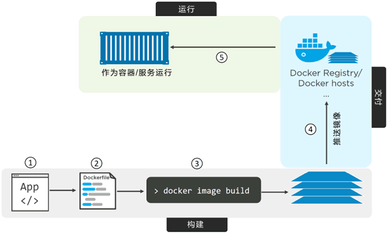

# 03 Docker应用容器化（将应用程序部署到容器中）

Docker 的核心思想就是如何将应用整合到容器中，并且能在容器中实际运行。

将应用整合到容器中并且运行起来的这个过程，称为“容器化”（Containerizing），有时也叫作“Docker化”（Dockerizing）。容器是为应用而生的，具体来说，容器能够简化应用的构建、部署和运行过程。完整的应用容器化过程主要分为以下几个步骤。

- 编写应用代码。
- 创建一个 Dockerfile，其中包括当前应用的描述、依赖以及该如何运行这个应用。
- 对该 Dockerfile 执行 docker image build 命令。
- 等待 Docker 将应用程序构建到 Docker 镜像中。


一旦应用容器化完成（即应用被打包为一个 Docker 镜像），就能以镜像的形式交付并以容器的方式运行了。下图展示了上述步骤。



## 3.1单体应用容器化

接下来我们会逐步展示如何将一个简单的单节点 Node.js Web 应用容器化。（代码在同级目录`代码资源`终）

应用容器化的过程大致分为如下几个步骤：

- 获取应用代码。
- 分析 Dockerfile。
- 构建应用镜像。
- 运行该应用。
- 测试应用。
- 容器应用化细节。
- 生产环境中的多阶段构建。
- 最佳实践。

### 3.1.1 代码目录

```
ubuntu@ubuntu:~$ cd psweb/
ubuntu@ubuntu:~/psweb$ ll
total 36
drwxrwxr-x  4 ubuntu ubuntu 4096 Feb 28 19:22 ./
drwxr-xr-x 24 ubuntu ubuntu 4096 Feb 28 21:38 ../
-rw-rw-r--  1 ubuntu ubuntu  341 Sep 27  2017 app.js
-rw-rw-r--  1 ubuntu ubuntu  216 Sep 27  2017 circle.yml
-rw-rw-r--  1 ubuntu ubuntu  331 Feb 28 19:22 Dockerfile
-rw-rw-r--  1 ubuntu ubuntu  421 Sep 27  2017 package.json
-rw-rw-r--  1 ubuntu ubuntu  370 Sep 27  2017 README.md
drwxrwxr-x  2 ubuntu ubuntu 4096 Sep 27  2017 test/
drwxrwxr-x  2 ubuntu ubuntu 4096 Sep 27  2017 views/
ubuntu@ubuntu:~/psweb$ tree -r ./
./
├── views
│   └── home.pug
├── test
│   ├── test.js
│   └── mocha.opts
├── README.md
├── package.json
├── Dockerfile
├── circle.yml
└── app.js

2 directories, 8 files

```

该目录下包含了全部的应用源码，以及包含界面和单元测试的子目录。这个应用结构非常简单。

应用代码准备就绪后，接下来分析一下 Dockerfile 的具体内容。

### 3.1.2 Dockerfile 分析

在代码目录当中，有个名称为 Dockerfile 的文件。这个文件包含了对当前应用的描述，并且能指导 Docker 完成镜像的构建。在 Docker 当中，包含应用文件的目录通常被称为构建上下文（Build Context）。通常将 Dockerfile 放到构建上下文的根目录下。另外很重要的一点是，文件开头字母是大写 D，这里是一个单词。像“dockerfile”或者“Docker file”这种写法都是不允许的。

接下来了解一下 Dockerfile 文件当中都包含哪些具体内容。

```
# Test web-app to use with Pluralsight courses and Docker Deep Dive book
# Linux x64
FROM alpine

LABEL maintainer="nigelpoulton@hotmail.com"

# Install Node and NPM
RUN apk add --update nodejs npm

# Copy app to /src
COPY . /src

WORKDIR /src

# Install dependencies
RUN  npm install

EXPOSE 8080

ENTRYPOINT ["node", "./app.js"]

```

Dockerfile 主要包括两个用途：

- 对当前应用的描述。
- 指导 Docker 完成应用的容器化（创建一个包含当前应用的镜像）。


不要因 Dockerfile 就是一个描述文件而对其有所轻视！Dockerfile 能实现开发和部署两个过程的无缝切换。同时 Dockerfile 还能帮助新手快速熟悉这个项目。Dockerfile 对当前的应用及其依赖有一个清晰准确的描述，并且非常容易阅读和理解。因此，要像重视你的代码一样重视这个文件，并且将它纳入到源控制系统当中。

下面是这个文件中的一些关键步骤概述：以 alpine 镜像作为当前镜像基础，指定维护者（maintainer）为“nigelpoultion@hotmail.com”，安装 Node.js 和 NPM，将应用的代码复制到镜像当中，设置新的工作目录，安装依赖包，记录应用的网络端口，最后将 app.js 设置为默认运行的应用。

**每个 Dockerfile 文件第一行都是 FROM 指令。**

> FROM 指令指定的镜像，会作为当前镜像的一个基础镜像层，当前应用的剩余内容会作为新增镜像层添加到基础镜像层之上。
>
> 本例中的应用基于 Linux 操作系统，所以在 FROM 指令当中所引用的也是一个 Linux 基础镜像；如果要容器化的应用是一个基于 Windows 操作系统的应用，就需要指定一个像 microsoft/aspnetcore-build 这样的 Windows 基础镜像了。截至目前，基础镜像的结构如下图所示。


接下来，Dockerfile 中通过标签**（LABLE）**方式指定了当前镜像的维护者为“nigelpoulton@hotmail. com”。

> 每个标签其实是一个键值对（Key-Value），在一个镜像当中可以通过增加标签的方式来为镜像添加自定义元数据。
>
> 备注维护者信息有助于为该镜像的潜在使用者提供沟通途径，这是一种值得提倡的做法。

**RUN 指令一般为安装指令**

> `RUN apk add --update nodejs npm` 指令使用 alpine 的 apk 包管理器将 nodejs 和 nodejs-npm 安装到当前镜像之中。
>
> RUN 指令会在 FROM 指定的 alpine 基础镜像之上，新建一个镜像层来存储这些安装内容。当前镜像的结构如下图所示。


**COPY. / src** 指令将应用相关文件从构建上下文复制到了当前镜像中，并且新建一个镜像层来存储。COPY 执行结束之后，当前镜像共包含 3 层，如下图所示。


下一步，Dockerfile 通过 **WORKDIR** 指令，为 Dockerfile 中尚未执行的指令设置工作目录。

> 该目录与镜像相关，并且会作为元数据记录到镜像配置中，但不会创建新的镜像层。
>
> 然后，`RUN npm install` 指令会根据 package.json 中的配置信息，使用 npm 来安装当前应用的相关依赖包。
>
> npm 命令会在前文设置的工作目录中执行，并且在镜像中新建镜像层来保存相应的依赖文件。
>
> 目前镜像一共包含 4 层，如下图所示。


因为当前应用需要通过 TCP 端口 8080 对外提供一个 Web 服务，所以在 Dockerfile 中通过 **EXPOSE 8080** 指令来完成相应端口的设置。

这个配置信息会作为镜像的元数据被保存下来，并不会产生新的镜像层。

最终，通过 **ENTRYPOINT** 指令来指定当前镜像的入口程序。ENTRYPOINT 指定的配置信息也是通过镜像元数据的形式保存下来，而不是新增镜像层。

### 3.1.3 镜像制作

下面的命令会构建并生成一个名为 psweb:latest 的镜像。命令最后的点（.）表示 Docker 在进行构建的时候，使用当前目录作为构建上下文。一定要在命令最后包含这个点，并且在执行命令前，要确认当前目录是 psweb（包含 Dockerfile 和应用代码的目录）。

```
ubuntu@ubuntu:~/psweb$ docker build -t psweb:latest .
Sending build context to Docker daemon  10.24kB
Step 1/8 : FROM alpine
 ---> c059bfaa849c
Step 2/8 : LABEL maintainer="nigelpoulton@hotmail.com"
 ---> Using cache
 ---> d62a8fcea574
Step 3/8 : RUN apk add --update nodejs npm
 ---> Using cache
 ---> 87f0d1d80cc6
Step 4/8 : COPY . /src
 ---> Using cache
 ---> 192e216aad11
Step 5/8 : WORKDIR /src
 ---> Using cache
 ---> 9bf26e6182b6
Step 6/8 : RUN  npm install
 ---> Using cache
 ---> 8a38d51dc2ec
Step 7/8 : EXPOSE 8080
 ---> Using cache
 ---> 11a01a29c7d6
Step 8/8 : ENTRYPOINT ["node", "./app.js"]
 ---> Using cache
 ---> 7b747070646f
Successfully built 7b747070646f
Successfully tagged psweb:latest

```

命令执行结束后，检查本地 Docker 镜像库是否包含了刚才构建的镜像。

```
ubuntu@ubuntu:~/psweb$ docker image ls
REPOSITORY    TAG       IMAGE ID       CREATED        SIZE
psweb         latest    7b747070646f   4 hours ago    78.3MB
```

### 3.1.4 运行应用程序

前文中容器化的这个应用程序其实很简单，从 app.js 这个文件内容中可以看出，这其实就是一个在 8080 端口提供 Web 服务的应用程序。下面的命令会基于 psweb:latest 这个镜像，启动一个名为 c1 的容器。该容器将内部的 8080 端口与 Docker 主机的 80 端口进行映射。这意味读者可以打开一个浏览器，在地址栏输入 Docker 主机的 DNS 名称或者 IP 地址，然后就能直接访问这个 Web 应用了。

如果 Docker 主机已经运行了某个使用 80 端口的应用程序，读者可以在执行 `docker container run` 命令时指定一个不同的映射端口。例如，可以使用 -p 5000:8080 参数，将 Docker 内部应用程序的 8080 端口映射到主机的 5000 端口。

```
docker container run -d -p 80:8080 --name c1 c psweb:latest
```

> -d 参数的作用是让应用程序以守护线程的方式在后台运行。
>
> -p 80:8080 参数的作用是将主机的80端口与容器内的8080端口进行映射。

接下来验证一下程序是否真的成功运行，并且对外提供服务的端口是否正常工作。

```
ubuntu@ubuntu:~/psweb$ docker container ls
CONTAINER ID   IMAGE          COMMAND           CREATED          STATUS          PORTS                                   NAMES
e5de93717db5   psweb:latest   "node ./app.js"   18 seconds ago   Up 17 seconds   0.0.0.0:80->8080/tcp, :::80->8080/tcp   c1
ubuntu@ubuntu:~/psweb$ 
```

为了方便阅读，只截取了命令输出内容的一部分。从上面的输出内容中可以看到，容器已经正常运行。需要注意的是，80端口已经成功映射到了 8080 之上，并且任意外部主机（0.0.0.0:80）均可以通过 80 端口访问该容器。

运行结果：在本机浏览器输入`127.0.0.1:80`地址，可以看到页面


## 3.2 最佳实践

下面介绍一些最佳实践。

### 3.2.1 利用构建缓存

Docker 的构建过程利用了缓存机制。观察缓存效果的一个方法，就是在一个干净的 Docker 主机上构建一个新的镜像，然后再重复同样的构建。

第一次构建会拉取基础镜像，并构建镜像层，构建过程需要花费一定时间；第二次构建几乎能够立即完成。这就是因为第一次构建的内容（如镜像层）能够被缓存下来，并被后续的构建过程复用。`docker image build` 命令会从顶层开始解析 Dockerfile 中的指令并逐行执行。而对每一条指令，Docker 都会检查缓存中是否已经有与该指令对应的镜像层。

如果有，即为缓存命中（Cache Hit），并且会使用这个镜像层；如果没有，则是缓存未命中（Cache Miss），Docker 会基于该指令构建新的镜像层。缓存命中能够显著加快构建过程。下面通过实例演示其效果。

示例用的 Dockerfile 如下。

```
FROM alpine
RUN apk add --update nodejs nodejs-npm
COPY . /src
WORKDIR /src
RUN npm install
EXPOSE 8080
ENTRYPOINT ["node", "./app.js"]
```

> 第一条指令告诉 Docker 使用 alpine:latest 作为基础镜像。如果主机中已经存在这个镜像，那么构建时会直接跳到下一条指令；如果镜像不存在，则会从 Docker Hub（docker.io）拉取。
>
> 下一条指令（RUN apk...）对镜像执行一条命令。此时，Docker 会检查构建缓存中是否存在基于同一基础镜像，并且执行了相同指令的镜像层。在此例中，Docker 会检查缓存中是否存在一个基于 alpine:latest 镜像且执行了 `RUN apk add --update nodejs nodejs-npm` 指令构建得到的镜像层。
>
> 如果找到该镜像层，Docker 会跳过这条指令，并链接到这个已经存在的镜像层，然后继续构建；如果无法找到符合要求的镜像层，则设置缓存无效并构建该镜像层。此处“设置缓存无效”作用于本次构建的后续部分。也就是说 Dockerfile 中接下来的指令将全部执行而不会再尝试查找构建缓存。
>
> 假设 Docker 已经在缓存中找到了该指令对应的镜像层（缓存命中），并且假设这个镜像层的 ID 是 AAA。
>
> 下一条指令会复制一些代码到镜像中（COPY . /src）。因为上一条指令命中了缓存，Docker 会继续查找是否有一个缓存的镜像层也是基于 AAA 层并执行了 COPY . /src 命令。如果有，Docker 会链接到这个缓存的镜像层并继续执行后续指令；如果没有，则构建镜像层，并对后续的构建操作设置缓存无效。
>
> 假设 Docker 已经有一个对应该指令的缓存镜像层（缓存命中），并且假设这个镜像层的 ID 是 BBB。那么 Docker 将继续执行 Dockerfile 中剩余的指令。

理解以下几点很重要。

> 首先，一旦有指令在缓存中未命中（没有该指令对应的镜像层），则后续的整个构建过程将不再使用缓存。在编写 Dockerfile 时须特别注意这一点，尽量将易于发生变化的指令置于 Dockerfile 文件的后方执行。这意味着缓存未命中的情况将直到构建的后期才会出现，从而构建过程能够尽量从缓存中获益。通过对 `docker image build` 命令加入 --nocache=true 参数可以强制忽略对缓存的使用。
>
> 还有一点也很重要，那就是 COPY 和 ADD 指令会检查复制到镜像中的内容自上一次构建之后是否发生了变化。
>
> 例如，有可能 Dockerfile 中的 COPY . /src 指令没有发生变化，但是被复制的目录中的内容已经发生变化了。为了应对这一问题，Docker 会计算每一个被复制文件的 Checksum 值，并与缓存镜像层中同一文件的 checksum 进行对比。如果不匹配，那么就认为缓存无效并构建新的镜像层。

### 3.2.2 合并镜像

合并镜像并非一个最佳实践，因为这种方式利弊参半。

总体来说，Docker 会遵循正常的方式构建镜像，但之后会增加一个额外的步骤，将所有的内容合并到一个镜像层中。当镜像中层数太多时，合并是一个不错的优化方式。例如，当创建一个新的基础镜像，以便基于它来构建其他镜像的时候，这个基础镜像就最好被合并为一层。缺点是，合并的镜像将无法共享镜像层。这会导致存储空间的低效利用，而且 push 和 pull 操作的镜像体积更大。执行 `docker image build`命令时，可以通过增加 --squash 参数来创建一个合并的镜像。

下图阐释了合并镜像层带来的存储空间低效利用的问题。


两个镜像的内容是完全一样的，区别在于是否进行了合并。在使用 `docker image push` 命令发送镜像到 Docker Hub 时，合并的镜像需要发送全部字节，而不合并的镜像只需要发送不同的镜像层即可。

### 3.2.3 其它注意事项

**使用 no-install-recommends**

> 在构建 Linux 镜像时，若使用的是 APT 包管理器，则应该在执行 apt-get install 命令时增加 no-install-recommends 参数。
>
> 这能够确保 APT 仅安装核心依赖（Depends 中定义）包，而不是推荐和建议的包。这样能够显著减少不必要包的下载数量。

**不要安装 MSI 包（Windows）**

> 在构建 Windows 镜像时，尽量避免使用 MSI 包管理器。因其对空间的利用率不高，会大幅增加镜像的体积。


