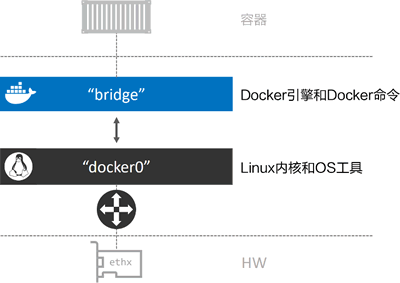

# 04 Docker网络简介


## 4.1 介绍

在 Docker 早期阶段，网络设计确实非常复杂，那时候配置网络几乎是一种乐趣。

Docker 在容器内部运行应用，这些应用之间的交互依赖于大量不同的网络，这意味着 Docker 需要强大的网络功能。幸运的是，Docker 对于容器之间、容器与外部网络和 VLAN 之间的连接均有相应的解决方案。

后者对于那些需要跟外部系统（如虚拟机和物理机）的服务打交道的容器化应用来说至关重要。

Docker 网络架构源自一种叫作容器网络模型（CNM）的方案，该方案是开源的并且支持插接式连接。

Libnetwork 是 Docker 对 CNM 的一种实现，提供了 Docker 核心网络架构的全部功能。不同的驱动可以通过插拔的方式接入 Libnetwork 来提供定制化的网络拓扑。

为了实现开箱即用的效果，Docker 封装了一系列本地驱动，覆盖了大部分常见的网络需求。其中包括单机桥接网络（Single-Host Bridge Network）、多机覆盖网络（Multi-Host Overlay），并且支持接入现有 VLAN。

Docker 生态系统中的合作伙伴通过提供驱动的方式，进一步拓展了 Docker 的网络功能。Libnetwork 提供了本地服务发现和基础的容器负载均衡解决方案。

## 4.2 基础理论

在顶层设计中，Docker 网络架构由 3 个主要部分构成：CNM、Libnetwork 和驱动。

- CNM 是设计标准。在 CNM 中，规定了 Docker 网络架构的基础组成要素。
- Libnetwork 是 CNM 的具体实现，并且被 Docker 采用，Libnetwork 通过 Go 语言编写，并实现了 CNM 中列举的核心组件。
- 驱动通过实现特定网络拓扑的方式来拓展该模型的能力。


下图展示了顶层设计中的每个部分是如何组装在一起的。


## 4.3 CNM

一切都始于设计！

Docker 网络架构的设计规范是 CNM。CNM 中规定了 Docker 网络的基础组成要素，完整内容见 GitHub 的 docker/libnetwork 库。

抽象来讲，CNM 定义了 3 个基本要素：沙盒（Sandbox）、终端（Endpoint）和网络（Network）。

- 沙盒是一个独立的网络栈。其中包括以太网接口、端口、路由表以及 DNS 配置。
- 终端就是虚拟网络接口。就像普通网络接口一样，终端主要职责是负责创建连接。在 CNM 中，终端负责将沙盒连接到网络。
- 网络是 802.1d 网桥（类似大家熟知的交换机）的软件实现。因此，网络就是需要交互的终端的集合，并且终端之间相互独立。


下图展示了 3 个组件是如何连接的。


Docker 环境中最小的调度单位就是容器，而 CNM 也恰如其名，负责为容器提供网络功能。下图展示了 CNM 组件是如何与容器进行关联的——沙盒被放置在容器内部，为容器提供网络连接。


容器 A 只有一个接口（终端）并连接到了网络 A。容器 B 有两个接口（终端）并且分别接入了网络 A 和网络 B。容器 A 与 B 之间是可以相互通信的，因为都接入了网络 A。但是，如果没有三层路由器的支持，容器 B 的两个终端之间是不能进行通信的。需要重点理解的是，终端与常见的网络适配器类似，这意味着终端只能接入某一个网络。因此，如果容器需要接入到多个网络，就需要多个终端。

下图对前面的内容进行拓展，加上了 Docker 主机。虽然容器 A 和容器 B 运行在同一个主机上，但其网络堆栈在操作系统层面是互相独立的，这一点由沙盒机制保证。


## 4.4 Libnetwork

CNM 是设计规范文档，Libnetwork 是标准的实现。Libnetwork 是开源的，采用 Go 语言编写，它跨平台（Linux 以及 Windows），并且被 Docker 所使用。

> 在 Docker 早期阶段，网络部分代码都存在于 daemon 当中。daemon 变得臃肿，并且不符合 UNIX 工具模块化设计原则，即既能独立工作，又易于集成到其他项目。所以，Docker 将该网络部分从 daemon 中拆分，并重构为一个叫作 Libnetwork 的外部类库。
>
> 现在，Docker 核心网络架构代码都在 Libnetwork 当中。Libnetwork 实现了 CNM 中定义的全部 3 个组件。此外它还实现了本地服务发现（Service Discovery）、基于 Ingress 的容器负载均衡，以及网络控制层和管理层功能。

## 4.5 驱动

如果说 Libnetwork 实现了控制层和管理层功能，那么驱动就负责实现数据层。比如，网络连通性和隔离性是由驱动来处理的，驱动层实际创建网络对象也是如此，其关系如下图所示。


## 4.6 Docker 单机桥接网络

最简单的 Docker 网络就是单机桥接网络。从名称中可以看到两点，单机意味着该网络只能在单个 Docker 主机上运行，并且只能与所在 Docker 主机上的容器进行连接，桥接意味着这是 802.1.d 桥接的一种实现（二层交换机）。Linux Docker 创建单机桥接网络采用内置的桥接驱动，而 Windows Docker 创建时使用内置的 NAT 驱动。实际上，这两种驱动工作起来毫无差异。

下图展示了两个均包含相同本地桥接网络 mynet 的 Docker 主机。虽然网络是相同的，但却是两个独立的网络。这意味着图中容器无法直接进行通信，因为并不在一个网络当中。


每个 Docker 主机都有一个默认的单机桥接网络。在 Linux 上网络名称为 bridge，在 Windows 上叫作 nat。除非读者通过命令行创建容器时指定参数--network，否则默认情况下，新创建的容器都会连接到该网络。

下面列出了 docker network ls 命令在刚完成安装的 Docker 主机上的输出内容。输出内容做了截取处理，只展示了每个主机上的默认网络。注意，网络的名称和创建时使用的驱动名称是一致的——这只是个巧合。

```
//Linux
ubuntu@ubuntu:~$ docker network ls
NETWORK ID     NAME      DRIVER    SCOPE
31fcdf8b6276   bridge    bridge    local
c1db7ed5df6d   host      host      local
c5cf8f1f889e   none      null      local


//Windows
> docker network ls
> NETWORK ID 	NAME 	DRIVER 	SCOPE
> 095d4090fa32 	nat 	nat 	local
```

docker network inspect命令就是一个信息宝藏。推荐各位小伙伴仔细阅读该命令的输出内容。

```
ubuntu@ubuntu:~$ docker network inspect bridge 
[
    {
        "Name": "bridge",
        "Id": "31fcdf8b6276cb3d0f0cc3024fe2a217e04493328fb30f0a7760915f791056e1",
        "Created": "2022-03-06T17:12:33.689348999-08:00",
        "Scope": "local",
        "Driver": "bridge",
        "EnableIPv6": false,
        "IPAM": {
            "Driver": "default",
            "Options": null,
            "Config": [
                {
                    "Subnet": "172.17.0.0/16",
                    "Gateway": "172.17.0.1"
                }
            ]
        },
        "Internal": false,
        "Attachable": false,
        "Ingress": false,
        "ConfigFrom": {
            "Network": ""
        },
        "ConfigOnly": false,
        "Containers": {
            "de61c4fda6b53a1fa9d46180538ea2108f369def82cdf5c1b8a1d822dbb48049": {
                "Name": "prtainer-libai",
                "EndpointID": "1920ec3f550e6be413e55d92c1c53032d320e7cb7e2bf97206250767f91c129b",
                "MacAddress": "02:42:ac:11:00:02",
                "IPv4Address": "172.17.0.2/16",
                "IPv6Address": ""
            }
        },
        "Options": {
            "com.docker.network.bridge.default_bridge": "true",
            "com.docker.network.bridge.enable_icc": "true",
            "com.docker.network.bridge.enable_ip_masquerade": "true",
            "com.docker.network.bridge.host_binding_ipv4": "0.0.0.0",
            "com.docker.network.bridge.name": "docker0",
            "com.docker.network.driver.mtu": "1500"
        },
        "Labels": {}
    }
]

```

在 Linux 主机上，Docker 网络由 Bridge 驱动创建，而 Bridge 底层是基于 Linux 内核中久经考验达 15 年之久的 Linux Bridge 技术。

这意味着 Bridge 是高性能并且非常稳定的！同时这还表示可以通过标准的 Linux 工具来查看这些网络，代码如下。

```
ubuntu@ubuntu:~$ ip link show docker0
3: docker0: <BROADCAST,MULTICAST,UP,LOWER_UP> mtu 1500 qdisc noqueue state UP mode DEFAULT group default 
    link/ether 02:42:80:96:49:d5 brd ff:ff:ff:ff:ff:ff
```

在 Linux Docker 主机之上，默认的“bridge”网络被映射到内核中为“docker0”的 Linux 网桥。可以通过 docker network inspect 命令观察到上面的输出内容。

```
ubuntu@ubuntu:~$ docker network inspect bridge | grep bridge.name
            "com.docker.network.bridge.name": "docker0",
```

Docker 默认“bridge”网络和 Linux 内核中的“docker0”网桥之间的关系如下图所示。


下图对上图的内容进行了扩展，在顶部补充了接入“bridge”网络的容器。



“bridge”网络在主机内核中映射到名为“docker0”的 Linux 网桥，该网桥可以通过主机以太网接口的端口映射进行反向关联。


