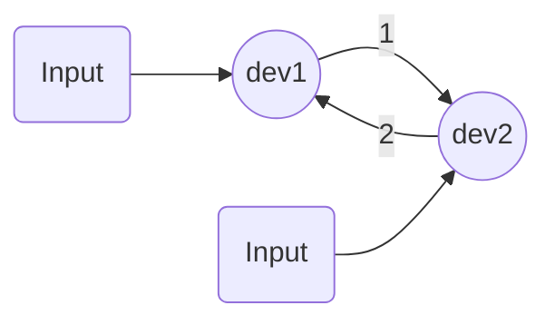
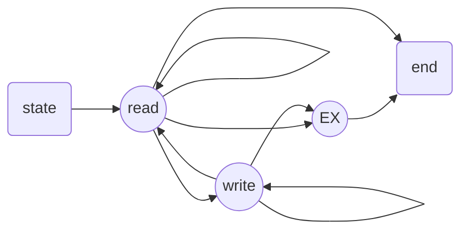

# 高级 IO

非阻塞IO -- 阻塞IO

IO多路转接

其他读写函数

存储映射IO

文件锁

## 非阻塞 IO

简单流程：如果一个程序的自然流程是结构化的，就是简单流程。（明确能分析结构流程的）

复杂流程：如果一个程序的自然流程不是结构化的，就是复杂流程。


有限状态机的实现方法：

任务：实现一个数据中继模型。（流式套接字）

​	- - -> 设备1  <——> 设备2 < - - -

目标：

> a. 读设备1——写设备2——读设备2——写设备1

如果采用阻塞的方式，假如正在读设备1，且设备1上没有数据，程序就会一直阻塞在读设备1；假设设备2有数据产生，就会无法读设备2并像设备1中写入。这种方案的阻塞是无法实现功能的。

如果采用非阻塞方式，假如在读取某一个设备时没有数据，就会去尝试读取另一个设备，就不会产生上述问题。

> a.读设备1——写设备2
>
> b.读设备2——写设备1

这种采用两个线程分工，如果采用阻塞的方式是可以实现功能，但是效果很差。

这种采用两个线程分工，如果采用非阻塞的方式是可以实现功能。


原型：



> 1. 读dev1写dev2
> 2. 读dev2写dev1

状态机：



### 有限状态机简单实现

简单实现：relay.c

```c
/******************************************************************************
 * @file relay.c
 * @brief 非阻塞有限状态机数据中继简单实现，可以通过状态机实现两个终端的数据同步
 * @author wangs7__
 * @date 2020/10/05
 * 
*******************************************************************************/
#include <stdio.h>
#include <stdlib.h>
#include <unistd.h>
#include <fcntl.h>
#include <errno.h>

#define TTY1    "/dev/tty11"    //设备1
#define TTY2    "/dev/tty12"    //设备2
#define BUFSIZE 1024            //缓冲区大小

//状态图
enum{
    STATE_R = 1,    //写状态
    STATE_W ,       //读状态
    STATE_Ex,       //出错状态
    STATE_T         //退出态
};

//状态机结构体
struct fsm_st {
    int state;  //状态描述变量
    int sfd;    //源文件描述符
    int dfd;    //目标文件描述符
    int len;    //读取的字节数
    int pos;    //写指针

    char buf[BUFSIZE];  //读写缓冲区
    char *errstr;       //报错提示
};

/**
 * @name fsm_driver
 * @brief 状态机驱动函数，推动状态机运转
 * @param fsm 状态机结构体指针
 * @return void
*/
static void fsm_driver(struct fsm_st *fsm){
    
    int ret;    //写函数返回值

    //开关选择语句 状态机分支
    switch (fsm->state)
    {
        //R态-------------------------------------------------------------------
        case STATE_R:
            fsm->len = read(fsm->sfd, fsm->buf, BUFSIZE);//从源文件读取字符
            if(fsm->len == 0){  //读取文件为空 转T态
                fsm->state = STATE_T;
            }
            else if (fsm->len < 0){ //读取失败
                if(errno == EAGAIN){    //假错 保持R态
                    fsm->state = STATE_R;
                }
                else{                   //真错 转Ex态
                    fsm->errstr = "read()";
                    fsm->state = STATE_Ex;
                }
            }
            else{   //读成功 转W态
                fsm->pos = 0;   //写指针初始化
                fsm->state = STATE_W;
            }
            break;
        //W态-------------------------------------------------------------------
        case STATE_W:
            ret = write(fsm->dfd, fsm->buf+fsm->pos, fsm->len);//从缓冲区向目标文件写入
            if(ret < 0){    //写错误
                if(errno == EAGAIN){    //假错 保持写
                    fsm->state = STATE_W;
                }
                else{                   //真错 转Ex态
                    fsm->errstr = "write()";
                    fsm->state = STATE_Ex;
                }
            }
            else{           //写成功
                fsm->len -= ret;       //写剩余长度
                fsm->pos += ret;       //写指针位置更新
                if(fsm->len == 0){  //写完 转读态
                    fsm->state = STATE_R;
                }
                else{               //未写完 保持写
                    fsm->state = STATE_W;
                }
            }
            break; 
        //Ex态------------------------------------------------------------------       
        case STATE_Ex:
            perror(fsm->errstr);    //报错提示
            fsm->state = STATE_T;   //转T态
            break;
        //T态-------------------------------------------------------------------
        case STATE_T:
            /* do something */
            break;
        //---------------------------------------------------------------------
        default:
            abort();
            break;
    }
}

/**
 * @name relay
 * @brief 数据中继函数
 * @param fd1 设备1文件描述符
 * @param fd2 设备2文件描述符
 * @return void
*/
void relay(int fd1, int fd2){

    int fd1_save, fd2_save; //原始文件打开状态
    struct fsm_st fsm12, fsm21; //1->>2状态机 和 2->1状态机

    //添加非阻塞打开方式
    fd1_save = fcntl(fd1, F_GETFL);
    fcntl(fd1, F_SETFL, fd1_save | O_NONBLOCK);
    fd2_save = fcntl(fd2, F_GETFL);
    fcntl(fd2, F_SETFL, fd2_save | O_NONBLOCK);

    //初始化状态机
    fsm12.state = STATE_R;
    fsm12.sfd = fd1;
    fsm12.dfd = fd2;
    fsm21.state = STATE_R;
    fsm21.sfd = fd2;
    fsm21.dfd = fd1;

    //状态机运转
    while (fsm12.state != STATE_T ||fsm21.state != STATE_T){
        fsm_driver(&fsm12);//驱动 1->2
        fsm_driver(&fsm21);//驱动 2->1
    }

    //回复文件原始打开状态
    fcntl(fd1, F_SETFL, fd1_save);
    fcntl(fd2, F_SETFL, fd2_save);

}


//主函数
int main(int argc, char *argv[]){

    int fd1, fd2;
    fd1 = open(TTY1, O_RDWR);
    /* 如果出错 */
    write(fd1, "TTY1\n", 5);
    fd2 = open(TTY2, O_RDWR | O_NONBLOCK);
    /* 如果出错 */
    write(fd2, "TTY2\n", 5);

    //数据中继驱动函数
    relay(fd1, fd2);

    close(fd1);
    close(fd2);

    exit(0);
}
```

### 有限状态机数据中继库函数封装

makefile

```makefile
CFLAGS+=-pthread
LDFLAGS+=-pthread


target:relayer

relayer: main.o relayer.o
	gcc $^ -o $@ $(CFLAGS) $(LDFLAGS)

clean:
	rm -rf *.o relayer
```

relayer.h

```c
/******************************************************************************
 * @file relay.h
 * @brief 非阻塞有限状态机数据中继简单实现，可以通过状态机实现多对终端的数据同步
 * @author wangs7__
 * @date 2020/10/05
 * 
*******************************************************************************/

#ifndef RELAYER_H__
#define RELAYER_N__

#define REL_JOB_MAX 10000


/**
 * @name
 * @brief
 * @param
 * @return
 * 
*/

enum{
    STATE_RUNNING = 1,
    STATE_CANCELED,
    STATE_OVER
};

struct rel_stat_at{
    int state;
    int fd1, fd2;
    long long int count12, count21; 
    //struct timerval start, end;
};


/**
 * @name
 * @brief
 * @param
 * @return  >= 0    成功，返回当前任务ID；
 *          == -EINVAL  失败，参数非法；
 *          == -ENOSPC  失败，任务数组满；
 *          == -ENOMEM  失败，内存分配失败。
 * 
*/
int rel_addjob(int fd1, int fd2);

/**
 * @name
 * @brief
 * @param
 * @return  == 0    成功，指定任务成功取消；
 *          == -EINVAL  失败，参数非法；
 *          == -EBUSY   失败，任务已经被取消。
 * 
*/
int rel_canceljob(int id);


/**
 * @name
 * @brief
 * @param
 * @return  == 0    成功，指定任务已终止并返回状态；
 *          == -EINVAL  失败，参数非法；
 * 
*/
//int rel_waitjob(int id, struct rel_stat_st *);


/**
 * @name
 * @brief
 * @param
 * @return  == 0    成功，指定任务状态成功返回；
 *          == -EINVAL  失败，参数非法；
 * 
*/
//int rel_statjob(int id, struct rel_stat_st *);

#endif
```

relayer.c

```c
/******************************************************************************
 * @file relay.c
 * @brief 非阻塞有限状态机数据中继简单实现，可以通过状态机实现两个终端的数据同步
 * @author wangs7__
 * @date 2020/10/05
 * 
*******************************************************************************/
#include <stdio.h>
#include <stdlib.h>
#include <unistd.h>
#include <string.h>
#include <fcntl.h>
#include <errno.h>
#include <pthread.h>

#include "relayer.h"

#define BUFSIZE 1024            //缓冲区大小

//状态图
enum{
    STATE_R = 1,    //写状态
    STATE_W ,       //读状态
    STATE_Ex,       //出错状态
    STATE_T         //退出态
};

//状态机结构体
struct rel_fsm_st {
    int state;  //状态描述变量
    int sfd;    //源文件描述符
    int dfd;    //目标文件描述符
    int len;    //读取的字节数
    int pos;    //写指针
    long long int count;//读写计数

    char buf[BUFSIZE];  //读写缓冲区
    char *errstr;       //报错提示
};

struct rel_job_st{
    int job_state;
    int fd1, fd2;
    int fd1_save, fd2_save;
    struct rel_fsm_st fsm12, fsm21;
};

static struct rel_job_st *rel_job[REL_JOB_MAX];
static pthread_mutex_t mut_rel_job = PTHREAD_MUTEX_INITIALIZER;
static pthread_once_t init_once = PTHREAD_ONCE_INIT;

/**
 * @name fsm_driver
 * @brief 状态机驱动函数，推动状态机运转
 * @param fsm 状态机结构体指针
 * @return void
*/
static void fsm_driver(struct rel_fsm_st *fsm){
    
    int ret;    //写函数返回值

    //开关选择语句 状态机分支
    switch (fsm->state)
    {
        //R态-------------------------------------------------------------------
        case STATE_R:
            fsm->len = read(fsm->sfd, fsm->buf, BUFSIZE);//从源文件读取字符
            if(fsm->len == 0){  //读取文件为空 转T态
                fsm->state = STATE_T;
            }
            else if (fsm->len < 0){ //读取失败
                if(errno == EAGAIN){    //假错 保持R态
                    fsm->state = STATE_R;
                }
                else{                   //真错 转Ex态
                    fsm->errstr = "read()";
                    fsm->state = STATE_Ex;
                }
            }
            else{   //读成功 转W态
                fsm->pos = 0;   //写指针初始化
                fsm->state = STATE_W;
            }
            break;
        //W态-------------------------------------------------------------------
        case STATE_W:
            ret = write(fsm->dfd, fsm->buf+fsm->pos, fsm->len);//从缓冲区向目标文件写入
            if(ret < 0){    //写错误
                if(errno == EAGAIN){    //假错 保持写
                    fsm->state = STATE_W;
                }
                else{                   //真错 转Ex态
                    fsm->errstr = "write()";
                    fsm->state = STATE_Ex;
                }
            }
            else{           //写成功
                fsm->len -= ret;       //写剩余长度
                fsm->pos += ret;       //写指针位置更新
                if(fsm->len == 0){  //写完 转读态
                    fsm->state = STATE_R;
                }
                else{               //未写完 保持写
                    fsm->state = STATE_W;
                }
            }
            break; 
        //Ex态------------------------------------------------------------------       
        case STATE_Ex:
            perror(fsm->errstr);    //报错提示
            fsm->state = STATE_T;   //转T态
            break;
        //T态-------------------------------------------------------------------
        case STATE_T:
            /* do something */
            break;
        //---------------------------------------------------------------------
        default:
            abort();
            break;
    }
}


static void *thr_relayer(void *p){
    int i;
    while(1){
        pthread_mutex_lock(&mut_rel_job);
        for(i = 0; i < REL_JOB_MAX; i++){
            if(rel_job[i] != NULL){
                if(rel_job[i]->job_state == STATE_RUNNING){
                    
                    fsm_driver(&rel_job[i]->fsm12);
                    fsm_driver(&rel_job[i]->fsm21);
                    if(rel_job[i]->fsm12.state == STATE_T && \
                    rel_job[i]->fsm21.state == STATE_T){
                        rel_job[i]->job_state = STATE_OVER;
                    }
                }
            }
        }
        pthread_mutex_lock(&mut_rel_job);
    }
}

// static void module_unload(void)

static void module_load(void){
    pthread_t tid_relayer;
    int err;
    err = pthread_create(&tid_relayer, NULL, thr_relayer, NULL);
    if(err){
        fprintf(stderr, "pthread_create():%s\n", strerror(err));
        exit(1);
    }
}

static int get_free_pos_unlocked(){
    int pos;
    for (pos = 0; pos < REL_JOB_MAX; pos++){
        if(rel_job[pos] == NULL){
            return pos;
        }
    }

    return -1;
}

/**
 * @name
 * @brief
 * @param
 * @return  >= 0    成功，返回当前任务ID；
 *          == -EINVAL  失败，参数非法；
 *          == -ENOSPC  失败，任务数组满；
 *          == -ENOMEM  失败，内存分配失败。
 * 
*/
int rel_addjob(int fd1, int fd2){
    int pos;
    struct rel_job_st *me;

    pthread_once(&init_once, module_load);

    me = malloc(sizeof(*me));
    if(me == NULL){
        return -ENOMEM;
    }

    me->fd1 = fd1;
    me->fd2 = fd2;
    me->job_state = STATE_RUNNING;
    
    me->fd1_save = fcntl(me->fd1, F_GETFL);
    fcntl(me->fd1, F_SETFL, me->fd1_save | O_NONBLOCK);
    me->fd2_save = fcntl(me->fd2, F_GETFL);
    fcntl(me->fd2, F_SETFL, me->fd2_save | O_NONBLOCK);
    
    me->fsm12.sfd = me->fd1;
    me->fsm12.dfd = me->fd2;
    me->fsm12.state = STATE_R;

    me->fsm21.sfd = me->fd2;
    me->fsm21.dfd = me->fd1;
    me->fsm21.state = STATE_R;

    pthread_mutex_lock(&mut_rel_job);

    pos = get_free_pos_unlocked();
    if(pos < 0){
        pthread_mutex_unlock(&mut_rel_job);

        fcntl(me->fd1, F_SETFL, me->fd1_save);
        fcntl(me->fd2, F_SETFL, me->fd2_save);
        free(me);
        return -ENOSPC;
    }
    rel_job[pos] = me;
    pthread_mutex_unlock(&mut_rel_job);
    return pos;
}

#if 0
/**
 * @name
 * @brief
 * @param
 * @return  == 0    成功，指定任务成功取消；
 *          == -EINVAL  失败，参数非法；
 *          == -EBUSY   失败，任务已经被取消。
 * 
*/
int rel_canceljob(int id){

}


/**
 * @name
 * @brief
 * @param
 * @return  == 0    成功，指定任务已终止并返回状态；
 *          == -EINVAL  失败，参数非法；
 * 
*/
int rel_waitjob(int id, struct rel_stat_st *ptr){

}


/**
 * @name
 * @brief
 * @param
 * @return  == 0    成功，指定任务状态成功返回；
 *          == -EINVAL  失败，参数非法；
 * 
*/
int rel_statjob(int id, struct rel_stat_st *ptr){

}

#endif
```

main.c

```c
/******************************************************************************
 * @file main.c
 * @brief 非阻塞有限状态机数据中继简单实现，可以通过状态机实现两对终端的数据同步
 * @author wangs7__
 * @date 2020/10/05
 * 
*******************************************************************************/
#include <stdio.h>
#include <stdlib.h>
#include <string.h>
#include <unistd.h>
#include <fcntl.h>
#include <errno.h>

#include "relayer.h"

#define TTY1    "/dev/tty11"    //设备1
#define TTY2    "/dev/tty12"    //设备2
#define TTY3    "/dev/tty9"    //设备1
#define TTY4    "/dev/tty10"    //设备2
#define BUFSIZE 1024            //缓冲区大小

//主函数
int main(int argc, char *argv[]){

    int fd1, fd2, fd3, fd4;
    int job1, job2;
    fd1 = open(TTY1, O_RDWR);
    /* 如果出错 */
    write(fd1, "TTY1\n", 5);
    fd2 = open(TTY2, O_RDWR | O_NONBLOCK);
    /* 如果出错 */
    write(fd2, "TTY2\n", 5);

    job1 = rel_addjob(fd1, fd2);
    if(job1 < 0){
        fprintf(stderr, "rel_addjob():%s", strerror(-job1));
    }

    fd3 = open(TTY3, O_RDWR);
    /* 如果出错 */
    write(fd3, "TTY3\n", 5);
    fd4 = open(TTY4, O_RDWR | O_NONBLOCK);
    /* 如果出错 */
    write(fd4, "TTY4\n", 5);

    job2 = rel_addjob(fd3, fd4);
    if(job2 < 0){
        fprintf(stderr, "rel_addjob():%s", strerror(-job2));
    }

    while(1){

    }

    close(fd1);
    close(fd2);
    close(fd3);
    close(fd4);

    exit(0);
}
```


## IO多路转接

用来监视文件描述符号。

函数：

> select( );		移植性好，太古老了。以事件为单位组织文件描述符的监视
>
> poll( );			以文件描述符为单位组织事件。
>
> epoll( );		  Linux方言，对于poll的优化。

select

```c
SYNOPSIS
       /* According to POSIX.1-2001, POSIX.1-2008 */
       #include <sys/select.h>

       /* According to earlier standards */
       #include <sys/time.h>
       #include <sys/types.h>
       #include <unistd.h>
		
    	/*
    	nfds		所要监视的文件描述符最大的+1 不是数量！！！
    	readfds 	希望关心的读情况文件描述符集合
    	writefds 	希望关心的写情况文件描述符集合
    	exceptfds 	希望关心的异常情况文件描述符集合
    	timeout		超时设置 不设置的话为死等
    	*/
       int select(int nfds, fd_set *readfds, fd_set *writefds,
                  fd_set *exceptfds, struct timeval *timeout);

       void FD_CLR(int fd, fd_set *set);	//删除
       int  FD_ISSET(int fd, fd_set *set);	//是否存在
       void FD_SET(int fd, fd_set *set);	//添加
       void FD_ZERO(fd_set *set);			//清空

       #include <sys/select.h>

       int pselect(int nfds, fd_set *readfds, fd_set *writefds,
                   fd_set *exceptfds, const struct timespec *timeout,
                   const sigset_t *sigmask);
RETURN VALUE
       On success, select() and pselect() return the number of file d
    escriptors contained in the three  returned  descriptor  sets  (that  
    is, the total number of bits that are set in readfds, writefds, 
    exceptfds) which may be zero if the timeout expires before anything 
    interesting happens.  On error, -1 is returned, and errno is set to 
    indicate the error; the file descriptor sets are unmodified, and timeout 
    becomes undefined.

```

select 问题：监视文件描述符的集合和返回结果的集合为同一个变量，监视现场和监视结果放在同一个位置，对于大量多次次循环操作需要重复布置大量监视现场；nfds可能溢出。以事件为单位组织文件描述符，监视种类过于单一。


poll

```c
NAME
       poll, ppoll - wait for some event on a file descriptor

SYNOPSIS
       #include <poll.h>
		/*
		fds		文件描述符结构体数组起点地址
		nfds 	文件描述符结构体的长度！！！
		timeout 超时设置ms 0 非阻塞 -1 阻塞
		*/
       int poll(struct pollfd *fds, nfds_t nfds, int timeout);
		//return 有多少个事件发生 失败 -1 并设置erron
       #define _GNU_SOURCE         /* See feature_test_macros(7) */
       #include <signal.h>
       #include <poll.h>

       int ppoll(struct pollfd *fds, nfds_t nfds,
               const struct timespec *tmo_p, const sigset_t *sigmask);
DESCRIPTION
       poll() performs a similar task to select(2): it waits for one of a 
       set of file descriptors to become ready to perform I/O.

       The set of file descriptors to be monitored is specified in the fds 
       argument, which is an  array  of structures of the following form:

           struct pollfd {
               int   fd;         /* file descriptor */
               short events;     /* requested events */
               short revents;    /* returned events */
           };
		
// events revents 的选项 以下都是位图
       POLLIN There is data to read.

       POLLPRI
              There is some exceptional condition on the file descriptor.  
              Possibilities include:

              *  There is out-of-band data on a TCP socket (see tcp(7)).

              *  A pseudoterminal master in packet  mode  has seen a state
                 change  on  the  slave  (see ioctl_tty(2)).

              *  A cgroup.events file has been modified (see cgroups(7)).

       POLLOUT
              Writing  is  now possible, though a write larger that the 
              available space in a socket or pipe will still block (unless 
              O_NONBLOCK is set).

       POLLRDHUP (since Linux 2.6.17)
              Stream socket peer closed connection, or shut down writing  
              half of connection. The _GNU_SOURCE  feature  test macro must 
              be defined (before including any header files) in order
              to obtain this definition.

       POLLERR
              Error condition (only returned in revents; ignored in events).  
              This bit is also set for a file descriptor referring to the 
              write end of a pipe when the read end has been closed.

       POLLHUP
              Hang up (only returned in revents; ignored in events).  Note 
              that when reading from a channel such as a pipe or a stream 
              socket, this event merely indicates that the peer closed  its  
              end of the channel.  Subsequent reads from the channel will 
              return 0 (end of file) only after all outstanding data in the 
              channel has been consumed.

       POLLNVAL
              Invalid request: fd not open (only returned in revents; ignored 
              in events).

       When compiling with _XOPEN_SOURCE defined, one also has the following, 
       which convey no  further  information beyond the bits listed above:

       POLLRDNORM
              Equivalent to POLLIN.

       POLLRDBAND
              Priority band data can be read (generally unused on Linux).

```


epoll

```c
NAME
       epoll - I/O event notification facility

SYNOPSIS
       #include <sys/epoll.h>

DESCRIPTION
       The epoll API performs a similar task to poll(2): monitoring multiple 
       file descriptors to see if I/O is possible on any of them. The epoll 
       API can be used either as an edge-triggered or a  level-triggered 
       interface and scales well to large numbers of watched file descriptors.
       The following system calls are provided to create and manage an epoll 
       instance:

       *  epoll_create(2) creates a new epoll instance and returns a file 
          descriptor referring to that  instance.  (The more recent 
          epoll_create1(2) extends the functionality of epoll_create(2).)

       *  Interest in particular file descriptors is then registered via
          epoll_ctl(2).  The set of file descriptors currently registered 
          on an epoll instance is sometimes called an epoll set.

       *  epoll_wait(2) waits for I/O events, blocking the calling thread 
          if no events are currently available.

```


epoll_create

```c
NAME
       epoll_create, epoll_create1 - open an epoll file descriptor

SYNOPSIS
       #include <sys/epoll.h>
		/*
		size 以size宽度处理？随便给个正数？
		return 成功返回文件描述符 失败返回-1
		*/
       int epoll_create(int size);
       int epoll_create1(int flags);

DESCRIPTION
       epoll_create()  creates  a  new epoll(7) instance.  Since Linux 2.6.8, 
       the size argument is ignored, but must be greater than zero; see NOTES 
       below.

       epoll_create() returns a file descriptor referring to the new epoll 
       instance.  This file  descriptor is  used for all the subsequent calls 
       to the epoll interface.  When no longer required, the file descriptor 
       returned by epoll_create() should be closed by using close(2).  When 
       all file descriptors referring to an epoll instance have been closed, 
       the kernel destroys the instance and releases the associated resources for reuse.

```


epoll_ctl

```c
NAME
       epoll_ctl - control interface for an epoll file descriptor

SYNOPSIS
       #include <sys/epoll.h>
		/*
		epfd epoll实例id
		op 操作 指定动作
		fd opt操作文件描述符 指定对象
		event 事件 指定事件
		*/
       int epoll_ctl(int epfd, int op, int fd, struct epoll_event *event);

//opt 的行为
       EPOLL_CTL_ADD
              Register the target file descriptor fd on the epoll instance 
              referred to by the file descriptor epfd and associate the event 
              event with the internal file linked to fd.

       EPOLL_CTL_MOD
              Change the event event associated with the target file 
              descriptor fd.

       EPOLL_CTL_DEL
              Remove  (deregister)  the  target  file  descriptor fd from the 
              epoll instance referred to by epfd.  The event is ignored and 
              can be NULL (but see BUGS below).

```


epoll_wait

```c
NAME
       epoll_wait, epoll_pwait - wait for an I/O event on an epoll file descriptor

SYNOPSIS
       #include <sys/epoll.h>

       int epoll_wait(int epfd, struct epoll_event *events,
                      int maxevents, int timeout);
       int epoll_pwait(int epfd, struct epoll_event *events,
                      int maxevents, int timeout,
                      const sigset_t *sigmask);

```


epoll使用实例

```c
/******************************************************************************
 * @file relay.c
 * @brief 非阻塞有限状态机数据中继简单实现，
 *        可以通过状态机实现两个终端的数据同步
 *        使用epoll监视文件名描述符行为 解决忙等问题
 * @author wangs7__
 * @date 2020/10/08
 * 
*******************************************************************************/
#include <stdio.h>
#include <stdlib.h>
#include <math.h>
#include <sys/epoll.h>
#include <sys/time.h>
#include <sys/types.h>
#include <unistd.h>
#include <fcntl.h>
#include <errno.h>

#define TTY1    "/dev/tty11"    //设备1
#define TTY2    "/dev/tty12"    //设备2
#define BUFSIZE 1024            //缓冲区大小

//状态图
enum{
    STATE_R = 1,    //写状态
    STATE_W ,       //读状态
STATE_AUTO,
    STATE_Ex,       //出错状态
    STATE_T         //退出态
};

//状态机结构体
struct rel_fsm_st {
    int state;  //状态描述变量
    int sfd;    //源文件描述符
    int dfd;    //目标文件描述符
    int len;    //读取的字节数
    int pos;    //写指针

    char buf[BUFSIZE];  //读写缓冲区
    char *errstr;       //报错提示
};

/**
 * @name fsm_driver
 * @brief 状态机驱动函数，推动状态机运转
 * @param fsm 状态机结构体指针
 * @return void
*/
static void fsm_driver(struct rel_fsm_st *fsm){
    
    int ret;    //写函数返回值

    //开关选择语句 状态机分支
    switch (fsm->state)
    {
        //R态-------------------------------------------------------------------
        case STATE_R:
            fsm->len = read(fsm->sfd, fsm->buf, BUFSIZE);//从源文件读取字符
            if(fsm->len == 0){  //读取文件为空 转T态
                fsm->state = STATE_T;
            }
            else if (fsm->len < 0){ //读取失败
                if(errno == EAGAIN){    //假错 保持R态
                    fsm->state = STATE_R;
                }
                else{                   //真错 转Ex态
                    fsm->errstr = "read()";
                    fsm->state = STATE_Ex;
                }
            }
            else{   //读成功 转W态
                fsm->pos = 0;   //写指针初始化
                fsm->state = STATE_W;
            }
            break;
        //W态-------------------------------------------------------------------
        case STATE_W:
            ret = write(fsm->dfd, fsm->buf+fsm->pos, fsm->len);//从缓冲区向目标文件写入
            if(ret < 0){    //写错误
                if(errno == EAGAIN){    //假错 保持写
                    fsm->state = STATE_W;
                }
                else{                   //真错 转Ex态
                    fsm->errstr = "write()";
                    fsm->state = STATE_Ex;
                }
            }
            else{           //写成功
                fsm->len -= ret;       //写剩余长度
                fsm->pos += ret;       //写指针位置更新
                if(fsm->len == 0){  //写完 转读态
                    fsm->state = STATE_R;
                }
                else{               //未写完 保持写
                    fsm->state = STATE_W;
                }
            }
            break; 
        //Ex态------------------------------------------------------------------       
        case STATE_Ex:
            perror(fsm->errstr);    //报错提示
            fsm->state = STATE_T;   //转T态
            break;
        //T态-------------------------------------------------------------------
        case STATE_T:
            /* do something */
            break;
        //---------------------------------------------------------------------
        default:
            abort();
            break;
    }
}


/**
 * @name relay
 * @brief 数据中继函数
 * @param fd1 设备1文件描述符
 * @param fd2 设备2文件描述符
 * @return void
*/
void relay(int fd1, int fd2){

    int fd1_save, fd2_save; //原始文件打开状态
    struct rel_fsm_st fsm12, fsm21; //1->>2状态机 和 2->1状态机
    int epfd;
    struct epoll_event ev;

    //添加非阻塞打开方式
    fd1_save = fcntl(fd1, F_GETFL);
    fcntl(fd1, F_SETFL, fd1_save | O_NONBLOCK);
    fd2_save = fcntl(fd2, F_GETFL);
    fcntl(fd2, F_SETFL, fd2_save | O_NONBLOCK);

    //初始化状态机
    fsm12.state = STATE_R;
    fsm12.sfd = fd1;
    fsm12.dfd = fd2;
    fsm21.state = STATE_R;
    fsm21.sfd = fd2;
    fsm21.dfd = fd1;

    epfd = epoll_create(10);
    ev.events = 0;
    ev.data.fd = fd1;
    epoll_ctl(epfd, EPOLL_CTL_ADD, fd1, &ev);
    ev.events = 0;
    ev.data.fd = fd2;    
    epoll_ctl(epfd, EPOLL_CTL_ADD, fd2, &ev);

    //状态机运转
    while (fsm12.state != STATE_T ||fsm21.state != STATE_T){
        
        // 布置监视任务
        ev.events = 0;
        ev.data.fd = fd1;    
        if(fsm12.state == STATE_R){
            ev.events |= EPOLLIN;
        }
        if(fsm21.state == STATE_W){
            ev.events |= EPOLLOUT;
        }  
        epoll_ctl(epfd, EPOLL_CTL_MOD, fd1, &ev);

        ev.events = 0;
        ev.data.fd = fd2; 
        if(fsm12.state == STATE_W){
            ev.events |= EPOLLOUT;
        }
        if(fsm21.state == STATE_R){
            ev.events |= EPOLLIN;
        }
        epoll_ctl(epfd, EPOLL_CTL_MOD, fd2, &ev);
        

        //监视
        if(fsm12.state < STATE_AUTO || fsm21.state < STATE_AUTO){
            while( epoll_wait(epfd, &ev, 1, -1) ){
                if (errno == EINTR){
                    continue;
                }
                perror("epoll_wait:");
                exit(1);
            }
        }
        //查看监视结果

        if( ev.data.fd == fd1 && ev.events & EPOLLIN \
            || ev.data.fd == fd2 && ev.events & EPOLLOUT\
            || fsm12.state > STATE_AUTO)
            fsm_driver(&fsm12);//驱动 1->2
        if( ev.data.fd == fd2 && ev.events & EPOLLIN \
            || ev.data.fd == fd1 && ev.events & EPOLLOUT\
            || fsm21.state > STATE_AUTO)    
            fsm_driver(&fsm21);//驱动 2->1

            
    }

    //回复文件原始打开状态
    fcntl(fd1, F_SETFL, fd1_save);
    fcntl(fd2, F_SETFL, fd2_save);

    close(epfd);
}


//主函数
int main(int argc, char *argv[]){

    int fd1, fd2;
    fd1 = open(TTY1, O_RDWR);
    /* 如果出错 */
    write(fd1, "TTY1\n", 5);
    fd2 = open(TTY2, O_RDWR | O_NONBLOCK);
    /* 如果出错 */
    write(fd2, "TTY2\n", 5);

    //数据中继驱动函数
    relay(fd1, fd2);

    close(fd1);
    close(fd2);

    exit(0);
}
```


## 其它读写函数

readv && writev

```c
NAME
       readv, writev, preadv, pwritev, preadv2, pwritev2 - read or write 
       data into multiple buffers
		//读写散乱地址存储的数据
SYNOPSIS
       #include <sys/uio.h>
		//iov 空间结构体数组首地址
    	//iovcnt 空间结构体数组长度
       ssize_t readv(int fd, const struct iovec *iov, int iovcnt);

       ssize_t writev(int fd, const struct iovec *iov, int iovcnt);

       ssize_t preadv(int fd, const struct iovec *iov, int iovcnt,
                      off_t offset);

       ssize_t pwritev(int fd, const struct iovec *iov, int iovcnt,
                       off_t offset);

       ssize_t preadv2(int fd, const struct iovec *iov, int iovcnt,
                       off_t offset, int flags);

       ssize_t pwritev2(int fd, const struct iovec *iov, int iovcnt,
                        off_t offset, int flags);
// iovec 
			//iov_base 存储空间起始位置
			//iov_len  空间长度
           struct iovec {
               void  *iov_base;    /* Starting address */
               size_t iov_len;     /* Number of bytes to transfer */
           };

```

readn && writen <apue.h> 坚持读或写够指定长度。


## 存储映射IO

mmap

将内存中某块地址的空间映射到当前进程空间中。

```c
NAME
       mmap, munmap - map or unmap files or devices into memory

SYNOPSIS
       #include <sys/mman.h>
		/*
		addr 地址 写空的话默认使用pmap寻找可用地址
		length 映射空间长度
		prot 属性/操作权限
		flags 特殊要求/操作权限
		fd 文件描述符 待映射
		offset 偏移量（文件的偏移量）
		*/
       void *mmap(void *addr, size_t length, int prot, int flags,
                  int fd, off_t offset);

       int munmap(void *addr, size_t length);

       See NOTES for information on feature test macro requirements.
			
           //匿名映射
           MAP_ANONYMOUS

```

实例：使用mmap构造父子进程的共享内存

```c
/*
mmap 实例
实现父子进程的共享内存

*/
#include <stdio.h>
#include <stdlib.h>
#include <unistd.h>
#include <string.h>
#include <sys/types.h>
#include <sys/stat.h>
#include <fcntl.h>
#include <sys/wait.h>
#include <sys/mman.h>

#define MMSIZE 1024

int main(){

    int fd;
    int stats;
    char *ptr;
    pid_t pid;
    ptr = mmap(NULL, MMSIZE, PROT_READ | PROT_WRITE, \
                MAP_SHARED | MAP_ANONYMOUS, -1, 0);
    
    if(ptr == MAP_FAILED){
        fprintf(stderr, "mmap error1\n");
        exit(1);       
    }

    pid = fork();

    if(pid == 0){//是子进程
        //写空间
        memccpy(ptr, "hello",MMSIZE, 6);
       
    }
    else{//是父进程
        
        wait(&stats);
        //读空间
        puts(ptr);
        munmap(ptr, MMSIZE);
    }

    
    exit(0);
}
```


## 文件锁

相关函数：fcntl()	lockf()	flock()

文件锁并不是体现在文件描述符结构体上，而是反映在iNode层面；如果另外一个进程关闭已锁定的文件，就会造成文件的意外解锁。

lockf()

```c
NAME
       lockf - apply, test or remove a POSIX lock on an 
       open file

SYNOPSIS
       #include <unistd.h>
		
    	/*
    	fd 文件描述符
    	cmd 锁模式
    	len 锁长度 如果是 0 锁位置从指针开始到结尾
    	*/
    
       int lockf(int fd, int cmd, off_t len);
		// int fileno(FILE *stream);文件流 转 文件描述符

       F_LOCK Set an exclusive lock on the specified 
           section of the file.  If (part of) this section 
           is already  locked, the call blocks until the 
           previous lock is released.  If this section 
           overlaps an earlier locked section, both are 
           merged.  File locks are released as soon as  the 
           process holding the locks closes some file 
           descriptor for the file.  A child process does 
           not inherit these locks.

       F_TLOCK
              Same as F_LOCK but the call never blocks and 
              returns an error instead if the file is  
              already locked.

       F_ULOCK
              Unlock  the  indicated section of the file.  
              This may cause a locked section to be split 
              into two locked sections.

       F_TEST Test the lock: return 0 if the specified 
           section is unlocked or locked by this  process; 
		   return -1, set errno to EAGAIN (EACCES on some 
           other systems), if another process holds a lock.
```

