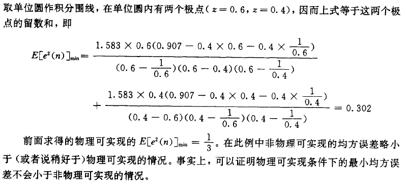

# 第二章 维纳滤波

[TOC]

## 2.1 引言

信号检测目标：从噪声中提取信号。

对于一个线性系统来说，如果其冲激响应为 $h(n)$ ，则当输入某一随机信号 $x(n)$ 时，它的输入为
$$
y(n)=\sum_{m}h(m)x(n-m)
$$
这里的输入往往是掺杂着噪声的信号，噪声是我们无法避免的，我们只能尽量减小噪声对信号的影响。
$$
x(n)=s(n)+v(n)
$$
式中 $s(n)$ 表示信号， $v(n)$ 表示噪声。

这时我们希望这种线性系统的输出是尽量逼急 $s(n)$ 的，即
$$
y(n) = \widehat{s}(n)
$$
而我们的目标就是求出能够使均方误差（ $E[e^2(n)]=E[(s(n)-\widehat{s}(n))^2],\quad e(n)=s(n)-\widehat{s}(n)$ ）最小的冲激响应函数 $h(n)$ 。

这种估计器的主要功能是利用当前的观测值以及一系列过去的观测值来完成对当前信号值的某种估计。

已知： $x(n),x(n-1),x(n-2),\cdots$ 期望输出：
$$
d(n)=
\left\{
\begin{aligned}
&\widehat{s}(n)\quad  &滤波\\
&\widehat{s}(n+N)\quad &预测\\
&\widehat{s}(n-N)\quad &内插/平滑
\end{aligned}
\right.
$$

## 2.2 维纳滤波器的时域解

### 2.2.1 教材内容

$$
y(n)=\widehat{s}(n)=\sum_{m}h(m)x(n-m)
$$
如果系统是物理可实现（因果系统）的，即
$$
h(n)=0,\qquad n<0
$$
则此时的
$$
y(n)=\widehat{s}(n)=\sum_{m=0}^{\infty}h(m)x(n-m)
$$
维纳滤波器的设计则是要确定均方误差
$$
E[e^2(n)]=E[(s(n)-\widehat{s}(n))^2]
$$
最小意义下的冲激响应 $h_{opt}(n)$ 。

为了方便得出矩阵表示，我们现将
$$
\widehat{s}(n)=\sum_{m=0}^{\infty}h(m)x(n-m)
$$
改写成
$$
\widehat{s}(n)=\sum_{i=1}^{\infty}h_ix_i \\
\left.
\begin{matrix}
i=m+1,或m=i-1\\
h_i=h(m)=h(i-1)\\
x_i=x(n-m)=x(n-i-1)
\end{matrix}
\right\}
$$
这时我们将均方误差对 $h_j$ 求偏导
$$
\frac{\partial E[e^2(n)]}{\partial h_j}=
E[2(s-(h_1x_1+h_2x_2+\cdots))(-x_j)], \quad j \geq 1
$$

令偏导数等于0得
$$
E[(s-\sum_{i=1}^{\infty}h_ix_i)x_j]=0, \quad j \geq 1\\
E[ex_j]=0, \quad j \geq 1
$$
由于上式符合正交性原理，即满足两个矢量的内积为0，故满足正交性原理与满足均方误差最小的条件是一致的。由于 $E[x_ix_j]=\phi_{x_i,x_j}$ 以及 $E[x_is]=\phi_{x_i,s}$  可得
$$
\phi_{x_js}=\sum_{i=1}^{\infty}h_i\phi_{x_ix_j}
$$
所以有
$$
E\{[s(n)-\sum_{m=0}^{\infty}h_{opt}(m)x(n-m)]x(n-k)\}=0,\quad k \geq 0
$$
即（维纳-霍夫方程）
$$
\phi_{xs}(k)=\sum_{m=0}^{\infty}h_{opt}(m)\phi_{xx}(k-m), \quad k \geq 0
$$
如果没有物理条件限制（因果系统 $k\geq 0$）那么非因果的维纳-霍夫方程可以变换到 $z$ 域，
$$
\Phi_{xs}(z)=H_{opt}(z)\Phi_{xx}(z)\\
H_{opt}(z)=\frac{\Phi_{xs}(z)}{\Phi_{xx}(z)}
$$
**==从而很方便地解出==**
$$
h_{opt}(n)=Z^{-1}[\frac{\Phi_{xs}(z)}{\Phi_{xx}(z)}]
$$
对于有物理条件限制的情况，对于 $x(n)$ 而言相当于只能取当前的与过去的观测数据。如果从 $\{x(n)\}$ 求 $\widehat{s}(n)$ 时，并不严格要求实时得到有关结果，二是允许在将来（例如可以经过一定等待或延迟）得到相应的结果，这在数字信号处理中实现起来比较方便，那么
$$
y(n)=\widehat{s}(n)=\sum_{m=0}^{\infty}h(m)x(n-m)
$$
中的求和下限不必限于 $m=0$ ，而是可以让 $m< 0$ 了，也没有了 $h(m<0)=0$ 的限制，因而前述的维纳-霍夫方程就也不再有 $k \geq 0$ 的限制了。

在要求严格实时处理的场合，不允许有过多的等待和延迟，则必须考虑因果性限制，在工程实际中常在时域逼近的方法解上述方程，这时如果具有因果性约束的 $h(n)$ 可用长度为 $N$ 的有限长序列来逼近，则上述方程可变成如下形式：
$$
y(n)=\widehat{s}(n)=\sum_{m=0}^{\infty}h(m)x(n-m)\\
\widehat{s}(n)=\sum_{m=0}^{N-1}h(m)\phi_{xx}(k-m), \quad k=0, 1,2,\cdots,N
$$
和
$$
E[(s-\sum_{i=1}^{N}h_ix_i)x_j]=0, \quad j=0, 1,2,\cdots,N\\
E[ex_j]=0, \quad j =0, 1,2,\cdots,N
$$
以及
$$
\phi_{x_js}=\sum_{i=1}^{\infty}h_i\phi_{x_ix_j},
\quad j=0, 1,2,\cdots,N\\
\phi_{xs}(k)=\sum_{m=0}^{\infty}h_{opt}(m)\phi_{xx}(k-m), \quad k=0, 1,2,\cdots,N
$$
矩阵表达形式
$$
[\phi_{xs}]=[\phi_{xx}][h]\\
\quad \\

[\phi_{xs}]=
\left[
    \begin{matrix}
      \phi_{x_1s}  \\
      \phi_{x_2s}  \\
      \vdots  \\
      \phi_{x_Ns}  \\      
    \end{matrix}
\right]  \quad
[\phi_{xx}]=
\left[
	\begin{matrix}
		\phi_{x_1x_1} & \phi_{x_1x_2} & \cdots & \phi_{x_1x_N}  \\
		\phi_{x_2x_1} & \phi_{x_2x_2} & \cdots & \phi_{x_2x_N}  \\
		\vdots 		  & \vdots 		  &        & \vdots			\\
		\phi_{x_Nx_1} & \phi_{x_Nx_2} & \cdots & \phi_{x_Nx_N}  \\
	\end{matrix}
\right] \quad 
[h]=
\left[
    \begin{matrix}
      h_{1}  \\
      h_{2}  \\
      \vdots  \\
      h_{N}  \\     
    \end{matrix}
\right]
$$

==故可以解得==
$$
[h]=[h_{opt}]=[\phi_{xx}]^{-1}[\phi_{xs}]
$$

### 2.2.2 课堂笔记

从另一个角度上来看 $E[e(n)x(n-k)]=0,\quad k \geq 0$ 满足正交性原理与满足最小均方误差是等价的，我们可以假设 $h(n)$ 的长度为 N 。令：

输入矢量： $X(n)=[x(n),x(n-1),\cdots,x(n-k+1)]^T$ 

权向量： $W=[w_0,w_1,\cdots,w_{N-1}]^T=[h(0),h(1),\cdots,h(N-1)]^T$ 

滤波器输出： $y(n)=W^TX(n)=X^T(n)W$ 

均方误差：
$$
\begin{aligned}
E[e^2(n)]&=E[(d(n)-W^TX(n))(d(n)-X(n)^TW)]\\
		 &=E[d^2(n)]-E[d(n)X(n)^TW]-E[d(n)W^TX(n)]-W^TE[X(n)X(n)^T]W
\end{aligned}
$$
令互相关矢量
$$
P=E[X(n)d(n)]=
\left\{
	\begin{aligned}
		&\phi_{xd}(0)  \\
		&\phi_{xd}(1)  \\
		&\vdots	\\
		&\phi_{xd}(N-1)  \\
	\end{aligned}
\right.
$$
$d(n)$ 的平均功率：	 $\sigma_{d}^2=E[d^2(n)]$ 

代价函数
$$
\begin{aligned}
	J(w)&=E[e^2(n)]	\\
	    &=\sigma_d^2-P^TW-W^TP+W^TR_xW	\\
	    &=\sigma_d^2-2W^TP+W^TR_xW
\end{aligned}
$$
$J(w)$ 是 $w$ 的二次函数，有唯一的极小值点，下面用两种方法求解使得 $J(w)$ 取最小值时 $w$ 的值：

* 配方法：

令 $U=R^{-1}P\quad\longrightarrow (W-U)^TR(W-U)=W^TRW-2W^TP+P^TR^{-1}P$ 

故 $J(w)=\sigma_d^2-P^TR^{-1}P+(W-R^{-1}P)^TR(W-R^{-1}P)$ 

$R$  是正定的， $R^{-1}$ 也是正定的，所以 $h_{opt}=W_{opt}=R^{-1}P$ ，最小值
$$
\begin{aligned}
	J_{min}&=J(W_{opt})	\\
		 &=\sigma_d^2-P^TR^{-1}P	\\
		 &=\sigma_d^2-P^TW_{opt}
\end{aligned}
$$

* 求导法

设 $X=[x_1,x_2,\cdots,x_n] \quad f(X)=f(x_1,x_2,\cdots,x_n)$ 

则 $f$ 的微分形式如下
$$
\nabla f(X)=[\frac{\partial f}{\partial x_1},\frac{\partial f}{\partial x_2,}
	  \cdots,\frac{\partial f}{\partial x_n}]
$$

$$
\nabla^2f(X)=
\left[
	\begin{array}{cc}
		\frac{\partial^2 f}{\partial x_1\partial x_1}  &
		\frac{\partial^2 f}{\partial x_1\partial x_2}  &
		\cdots  &
		\frac{\partial^2 f}{\partial x_1\partial x_n}  \\
		\vdots  &
		\vdots  &
		        &
		\vdots  \\       
		\frac{\partial^2 f}{\partial x_n\partial x_1}  &
		\frac{\partial^2 f}{\partial x_n\partial x_2}  &
		\cdots  &
		\frac{\partial^2 f}{\partial x_n\partial x_n}  \\		
		
	\end{array}\tag{12}
\right]
$$

若 $f(X)=\frac{1}{2}X^TAX+b^TX+C$ 其中 $A$ 是对称阵，$b$ 是列向量， $C$ 是常数。则
$$
\nabla f(X)=AX+b\\
\nabla^2f(X)=A
$$
所以 $J(W)=W^TR_xW-2P^TW+\sigma_d^2$ 对 $W$ 求导，得
$$
\nabla J(W)=2RW-2P=0
$$
==解得== $h_{opt}=W_{opt}=R^{-1}P$

* 坐标系的平移旋转

考虑到在计算均方误差时二次项 $W^TR_xW$ 的结果中含有交叉乘积项，不便于计算分析，这里我们对坐标系进行平移旋转，使得表达式尽量的简单便于计算。

首先我们根据上述的 $W$ 的最优解，对 $W$ 进行平移：
$$
\widetilde{W}=W-W_{opt}
$$
这样将最优解的点平移到了 零向量处，考虑讲矩阵 $R$ 对角化
$$
R=Q\Lambda Q^{-1}=Q\Lambda Q^T(Q是正交阵)
$$
原式变形为
$$
\begin{aligned}
	J&=J_{min}+\widetilde{W}^TQ\Lambda Q^T\widetilde{W}  \\
	 &=J_{min}+(Q^T\widetilde{W})^T\Lambda (Q^T\widetilde{W})  \\
\end{aligned}
$$
令 $V=Q^T\widetilde{W}$ 得：
$$
\begin{aligned}
	J&=J_{min}+V^T \Lambda V \\
	 &=J_{min}+\sum_{i=0}^{N-1}\lambda_{i}v_{i}^2  \\
\end{aligned}
$$
从数学上考虑当 $Q$ 为单位阵时，即 $R$ 本身就是对角阵 ，求解最简单。这时我们考虑物理情景，自相关函数只有对角线上不为零，这时显然该信号为冲激函数。当 $R$ 本身不为对角阵时 考虑讲信号通过白噪声的逆滤波器（信号经过该滤波器后输出高斯白噪声），后再进行上述过程，这便是下一节处理维纳滤波的 z 域解的主要处理方法。

## 2.3 维纳滤波器的 z 域解

根据上一节所提到的方法，任何一个具有功率谱密度的随机信号都可以看作是由一个白噪声 $w(n)$ 激励某个物理网络所得到的，若信号用 $s(n)$ 表示，则有 $S(z)=A(z)W(z)$ ，白噪声的自相关函数以及功率谱密度分别为
$$
\phi_{ww}(n)=\sigma_w^2\delta(n)  \\
\Phi_{ww}(z)=\sigma_w^2
$$
当信号模型的冲激响应为实序列时， $s(n)$ 的功率谱密度为
$$
\Phi_{ss}(z)=\sigma_w^2A(z)A(z^{-1})
$$
对于实际信号 $x(n)=s(n)+v(n)$ 也可以使用这种模型来表示。
$$
\Phi_{xx}(z)=\sigma_w^2B(z)B(z^{-1})\\
X(z)=B(z)W(z)
$$
对于一个系统 $B(z)$ 稳定的条件为极点在单位圆内，零点无要求。但是我们为了实现逆滤波，需要构建物理系统 $\frac{1}{B(z)}$ ，因为 系统 $B(z)$  的零点就是系统 $\frac{1}{B(z)}$  的极点， 所以要求系统 $B(z)$ 的零点也要位于单位圆内，这样的的系统，我们叫做最小相位系统。
$$
W(z)=\frac{X(z)}{B(z)}
$$
为了方便得到 $H_{opt}(z)$ 我们通过将信号白化来实现
$$
x(n)=s(n)+v(n)\longrightarrow H(z) \longrightarrow y(n)=\widehat{s}(n)
$$

$$
x(n)\longrightarrow \frac{1}{B(z)} \stackrel{w(n)}{\longrightarrow}
G(z)\longrightarrow y(n)=\widehat{s}(n)
$$

==这里我们就能相对简单地得到==
$$
H(z)=\frac{G(z)}{B(z)}
$$

### 2.3.1 非因果维纳滤波器

根据前面的讨论，可得
$$
\widehat{S}(z)=G(z)W(z) \longrightarrow 
\widehat{s}(n)=\sum_{k=-\infty}^{\infty}g(k)w(n-k)
$$
所以均方误差
$$
\begin{aligned}
  E[e^2(n)]&=E\{[s(n)-\sum_{k=-\infty}^{\infty}g(k)w(n-k)]^2\}  \\
		   &=E\{ s^2(n)-2\sum_{k=-\infty}^{\infty}g(k)w(n-k)s(n)  \\
		   &\quad +\sum_{k=-\infty}^{\infty}
			\sum_{r=-\infty}^{\infty}g(k)g(r)w(n-k)w(n-r)\}\\
		   &=E[s^2(n)]-2\sum_{k=-\infty}^{\infty}g(k)E[w(n-k)s(n)]\\
		   &\quad +\sum_{k=-\infty}^{\infty}
			\sum_{r=-\infty}^{\infty}g(k)g(r)E[w(n-k)w(n-r)]\\
		   &=\phi_{ss}(0)-2\sum_{k=-\infty}^{\infty}g(k)\phi_{ws}(k)
		    +\sum_{k=-\infty}^{\infty}\sum_{r=-\infty}^{\infty}
		    g(k)g(r)\phi_{ww}(k-r)
\end{aligned}
$$
由于 $\phi_{ww}(n)=\sigma_{w}^2\delta(n)$ 所以上式可表示成
$$
\begin{aligned}
  E[e^2(n)]&=\phi_{ss}(0)-2\sum_{k=-\infty}^{\infty}g(k)\phi_{ws}(k)
           +\sum_{k=-\infty}^{\infty}g^2(k)\sigma_w^2\\
           &=\phi_{ss}(0)+\sum_{k=-\infty}^{\infty}
           [\sigma_wg(k)-\frac{\phi_{ws}(k)}{\sigma_w}]^2
           -\sum_{k=-\infty}^{\infty}\frac{\phi_{ws}^2(k)}{\sigma_w^2}
\end{aligned}
$$
对 $g(k)$ 求导，并令导数等于0
$$
\frac{\partial E[e^2(n)]}{\partial g(k)}=0
$$
解得 
$$
g_{opt}(k)=\frac{\phi_{ws}(k)}{\sigma_w^2},\qquad -\infty<k<\infty\\
G_{opt}(z)=g_{opt}(k)=\frac{1}{\sigma_w^2}\Phi_{ws}(z)
$$

由于上面提到 $H(z)=\frac{G(z)}{B(z)}$ ，则
$$
H_{opt}(z)=\frac{G_{opt}(z)}{B(z)}=\frac{1}{\sigma_w^2}\frac{\Phi_{ws}(z)}{B(z)}
$$
如果 $x(n)$ 是由白噪声激励一个系统函数为 $B(z)$ 的线性系统得到的话，$x(n)$ 与 $s(n)$ 的互相关函数
$$
\begin{aligned}
	\phi_{sx(m)}&=E[s(n)x(n+m)]=E[s(n)\sum_{k=-\infty}^\infty b(k)w(n+m-k)] \\
			    &=\sum_{k=-\infty}^\infty b(k)E[s(n)w(n+m-k)]\\
			    &=\sum_{k=-\infty}^\infty b(k)\phi_{sw}(m-k)=b(m)*\phi_{sw}(m)
\end{aligned}
$$
由于 $\phi_{sx}(m)=\phi_{xs}(-m)$ 故有$\phi_{xs}(-m)=b(m)*\phi_{ws}(-m)$ 或 $\phi_{xs}(m)=b(-m)*\phi_{ws}(m)$ 故
$$
\Phi_{xs}(z)=B(z^{-1})\Phi_{ws}(z)\\
\Phi_{ws}(z)=\frac{\Phi_{xs}(z)}{B(z^{-1})}
$$
代入 $H_{opt}(z)=\frac{G_{opt}(z)}{B(z)}=\frac{1}{\sigma_w^2}\frac{\Phi_{ws}(z)}{B(z)}$ 得
$$
H_{opt}(z)=\frac{1}{\sigma_w^2}\frac{\Phi_{xs}(z)}{B(z^{-1})B(z)}=\frac{\Phi_{xs}(z)}{\Phi_{xx}(z)}
$$
==这与时域没有因果性约束所得的表达式完全一样。若噪声与信号无关的话则有==
$$
\Phi_{xx}(z)=\Phi_{ss}(z)+\Phi_{vv}(z)\\
H_{opt}(z)=\frac{\Phi_{xs}(z)}{\Phi_{ss}(z)+\Phi_{vv}(z)}
$$
或
$$
H_{opt}(e^{j\omega})=\frac{P_{xs}(\omega)}{P_{ss}(\omega)+P_{vv}(\omega)}
$$

### 2.3.2 因果滤波器

因为有物理可实现约束，这是有 $g(k)=0,\quad k < 0$ 则
$$
\widehat{s}(n)=\sum_{k=0}^\infty g(k)w(n-k)\\
E[e^2(n)]=\phi_{ss}(0)+\sum_{k=0}^\infty[\sigma_wg(k)-\frac{\phi_{ws}(k)}{\sigma_w}]^2
		  -\frac{1}{\sigma_w^2}\sum_{k=0}^\infty \phi_{ws}^2(k)
$$
而且有
$$
g_{opt}(n)=
\left\{
	\begin{aligned}
		\frac{1}{\sigma_w^2}\phi_{ws(n)},\qquad&n \geq 0\\
		0,\qquad &n < 0
	\end{aligned}
\right.
$$
这里 $g_{opt}(n)$ 显然是一个因果序列，所以系统的极点均在单位圆内。
$$
G_{opt}(z)=\frac{1}{\sigma_w^2}[\Phi_{ws}(z)]_+
$$

$$
\begin{aligned}
	H_{opt}(z)&=\frac{1}{B(z)}G_{opt}=\frac{1}{\sigma_w^2B(z)}[\Phi_{ws}(z)]_+\\
			  &=\frac{1}{\sigma_w^2B(z)}[\frac{\Phi_{xs}(z)}{B(z^{-1})}]_+
\end{aligned}
$$

最小均方差
$$
\begin{aligned}
	E[e^2(n)]_{min}&=\phi_{ss}(0)-\frac{1}{\sigma_w^2}\sum_{k=0}^\infty\phi_{ws}^2(k)\\
				   &=\phi_{ss}(0)-\frac{1}{\sigma_w^2}\sum_{k=0}^\infty
				      [\phi_{ws}(k)u(k)]\phi_{ws}(k)
\end{aligned}
$$
在 z 域中可表示为：
$$
\begin{aligned}
	E[e^2(n)]_{min}&=\frac{1}{2\pi j}\oint_C\Big\{
						\Phi_{ss}(z)-\frac{1}{\sigma_w^2}[\Phi_{ws}(z)]_+\Phi_{ws}(z^{-1})
	                 \Big\}z^{-1}dz  \\
				   &=\frac{1}{2\pi j}\oint_C\Big\{
				   		\Phi_{ss}(z)-\frac{1}{\sigma_w^2}
				   		\Big[\frac{\Phi_{xs}(z)}{B(z^{-1})}\Big]_+
				   		    \frac{\Phi_{xs}(z^{-1})}{B(z)}
				     \Big\}z^{-1}dz\\
				   &=\frac{1}{2\pi j}\oint_C\Big\{
				   		\Phi_{ss}(z)-H_{opt}(z)\Phi_{xs}(z^{-1})
				     \Big\}z^{-1}dz
\end{aligned}
$$

==例题：==

==注意：做环路积分时要注意极点，只积单位圆内的。==

## 2.4 维纳预测器

### 2.4.1 预测的可能性

随机信号的特点，任何时刻 $x(n)$ 和 $s(n)$ 均具有偶然性，即使该序列的过去值都知道，仍然很难确定当前时刻的真实取值。但是利用 $x(n)$ 和 $s(n)$ 的统计特性，借助估计方法，依然可以正确预测当前以及今后某一时刻最具有可能出现的取值。

对于任何一种信号 $x(n)$ ，均可根据其自相关函数，了解任何两点的相关程度。数据间的关联越紧密，预测越可靠；完全不关联，当然就无法无误地准确预测；而白噪声由于前后毫无关联，因此也就无法预测。

随机信号预测的主要特点

> 1）以信号的统计特性作为预测的主要依据；
>
> 2）不可能预测误差为零的绝对精准的预测；
>
> 3）实际获得的随机信号通常是带有噪声干扰的，它使预测常与滤波联系在一起，成为带滤波的预测。不考虑噪声干扰或不带滤波的预测就是纯预测。

我们对序列的预测是严重依靠系统的惯性，如果当预测范围超过系统惯性作用范围（自相关函数为0）那么预测便不再可靠。

### 2.4.2 预测计算公式

对于预测功能我们期望输入输出有如下关系（N > 0）：
$$
y(n)=\widehat{s}(n+N)=\sum_{m}h(m)x(n-m)=\sum_{i}h_ix_i
$$
与维纳滤波器的设计相似，维纳预测器的设计实现也是所作预测的均方误差
$$
E[e^2(n+N)]=E[(s(n+N)-\widehat{s}(n+N))^2]
$$
最小条件下的 $h(n)$ 或 $H(z)$ 的问题。
$$
\frac{\partial E[e^2(n+N)]}{\partial h_j}=0, \quad j \geq 1\\
E[(s(n+N)-\sum_{i=1}h_ix_i)x_j]=0, \quad j \geq 1\\
$$
即
$$
\phi_{x_iy_d}=\sum_{i=1}^\infty h_i\phi_{x_ix_j},\quad j\geq 0\\
\phi_{xy_d}=\sum_{m=0}^\infty h_{opt}(m)\phi_{xx}(k-m),\quad k \geq 0
$$
如果我们在维纳滤波器中也以 $y_d$ 表示希望得到的输出，即 $y_d(n)=s(n)$ 则有
$$
\phi_{xy_d}(k)=\phi_{xs}(k)=E[x(n)s(n+k)]
$$
二维纳预测器的 $y_d(n)=s(n+N)$ ，所以有
$$
\phi_{xy_d}(k)=\phi_{xs}(k+N)=E[x(n)s(n+N+k)]
$$
z 变换得
$$
\Phi_{xy_d}(z)=z^{N}\Phi_{xs}(z) \\
\Phi_{xy_d}(z^{-1})=z^{-N}\Phi_{xs}(z^{-1})
$$
==无物理约束==
$$
H_{opt}(z)=\frac{\Phi_{xy_d}(z)}{\Phi_{xx}(z)}=\frac{z^N\Phi_{xs}(z)}{\Phi_{xx}(z)}\\
E\{[s(n+N)-\widehat{s}(n+N)]^2\}_{min}=\frac{1}{2\pi j}\oint_C
					\Big\{
				   		\Phi_{ss}(z)-H_{opt}(z)z^{-N}\Phi_{xs}(z^{-1})
				    \Big\}z^{-1}dz
$$
==有物理约束==
$$
H_{opt}(z)
	=\frac{1}{\sigma_w^2B(z)}\Big[\frac{\Phi_{xy_d}(z)}{B(z^{-1})}\Big]_+
	=\frac{1}{\sigma_w^2B(z)}\Big[\frac{z^N\Phi_{xs}(z)}{B(z^{-1})}\Big]_+  \\
E\{[s(n+N)-\widehat{s}(n+N)]^2\}_{min}=\frac{1}{2\pi j}\oint_C
					\Big\{
				   		\Phi_{ss}(z)-H_{opt}(z)z^{-N}\Phi_{xs}(z^{-1})
				    \Big\}z^{-1}dz
$$

### 2.4.3 N步纯预测器

我们假设纯预测是在 $v(n)=0$ 的情况下进行的预测，这时 $x(n)=s(n)$ ，因而
$$
\Phi_{xx}(z)=\Phi_{ss}(z)=\Phi_{xs}=\sigma_w^2B(z)B(z^{-1})
$$

> 在工程上，当噪声小到一定程度以后可以将噪声忽略或不再作更多考虑，为此，经常可以先用维纳滤波器等滤波器先将噪声抑制到一定水平之后再以纯预测方法作相应的预测处理。

==对于因果系统==
$$
\begin{aligned}
	H_{opt}(z)&=\frac{1}{\sigma_w^2B(z)}
	            \Big[\frac{\Phi_{xy_d}(z)}{B(z^{-1})}\Big]_+ \\
	          &=\frac{1}{\sigma_w^2B(z)}
	            \Big[\frac{z^N\sigma_w^2B(z)B(z^{-1})}{B(z^{-1})}\Big]_+\\
	          &=\frac{1}{B(z)}
	            \Big[z^NB(z)\Big]_+\\  
\end{aligned}
$$

且
$$
E[e^2(n+N)]_{min}=\frac{1}{2\pi j}\oint_C
					\Big\{
				   		\Phi_{ss}(z)-H_{opt}(z)\Phi_{xy_d}(z^{-1})
				    \Big\}z^{-1}dz
$$
考虑到 $\Phi_{xy_d}(z^{-1})=z^{-N}\Phi_{xs}(z^{-1}),\Phi_{xs}(z)=\sigma_w^2B(z)B(z^{-1})=\Phi_{xs}(z^{-1})$ 故
$$
E[e^2(n+N)]_{min}=\frac{1}{2\pi j}\oint_C                    
					\Big\{
						\sigma_w^2B(z)B(z^{-1})-\sigma_w^2z^{-N}B(z^{-1})
						[z^{N}B(z)]_+
				    \Big\}z^{-1}dz
$$
对于帕塞伐尔公式，当 $x(n),y(n)$ 为实序列时，有
$$
\sum_{n=-\infty}^\infty x(n)y(n)=\frac{1}{2\pi j}\oint_cX(z)Y(z^{-1})z^{-1}dz
$$
由于 $B(z),b(n)$ 代表的是因果系统，所以
$$
E[e^2(n+N)]_{min}=\sigma_w^2\sum_{n=0}^\infty b^2(n)-
                  \sigma_w^2\sum_{n=0}^\infty b^2(n+N)
$$
==即==
$$
E[e^2(n+N)]_{min}=\sigma_w^2\sum_{n=0}^{N-1} b^2(n)
$$
这说明预测距离越长预测误差也就越大。

### 2.4.4 一步线性预测器的时域计算公式

我们对于一步线性预测器的讨论条件也是在无噪声的条件下进行的。在线性预测中，常常利用过去的 $p$ 个样本 $x(n-1),x(n-2),\cdots,x(n-p)$ 来预测当前时刻 $x(n)$ 的问题。
$$
y(n)=\widehat{x}(n)=\sum_{k=0}^{p-1}h(k)x(n-1-k)
$$
这是一个典型的 $p$ 阶一步预测器，==这里我们令== $a_{pk}=-h(k-1)$ 这可以表示为
$$
\widehat{x}(n)=-\sum_{k=1}^{p}a_{pk}x(n-k)
$$
所以 
$$
E[e^2(n)]=E\Big\{
				\big[
					x(n)+\sum_{k=1}^{p}a_{pk}x(n-k)
				\big]^2
           \Big\}  \\
\frac{\partial E[e^2(n)]}{\partial a_{pl}}=0
$$
故
$$
2E\Big\{
				\big[
					x(n)+\sum_{k=1}^{p}a_{pk}x(n-k)
				\big]x(n-l)
           \Big\}=0,\quad l=1,2,3,\cdots
$$
考虑到 $\widehat{x}(n)=-\sum_{k=1}^{p}a_{pk}x(n-k)$ 所以上式可改写为
$$
E[e(n)\widehat{x}(n))]=0\\
E[e^2(n)]=E[e(n)(x(n)-\widehat{x}(n))]=E[e(n)x(n)]-E[e(n)\widehat{x}(n)]
$$
故最小均方误差
$$
\begin{aligned}
E[e^2(n)]_{min}&=E[e(n)x(n)] \\
               &=E\Big\{
				    \big[
					   x(n)+\sum_{k=1}^{p}a_{pk}x(n-k)
				    \big]x(n)
                  \Big\}
\end{aligned}
$$
如果用自相关函数，并考虑到 $\phi_{xx}(m)=\phi_{xx}(-m)$ 等情况，则上式可表示为
$$
\phi_{xx}(l)+\sum_{k=1}^p a_{pk}\phi_{xx}(k)=0,\quad l=1,2,3,\cdots \\
E[e^2(n)]_{min}=\phi_{xx}(0)+\sum_{k=1}^p a_{pk}\phi_{xx}(k)
$$
上述==两个方程可以用矩阵形式表示==
$$
\left[
	\begin{matrix}
		\phi_{xx}(0) & \phi_{xx}(1)   & \cdots & \phi_{xx}(p)    \\
		\phi_{xx}(1) & \phi_{xx}(0)   & \cdots & \phi_{xx}(p-1)  \\
		\vdots 		 & \vdots 		  &        & \vdots			 \\
		\phi_{xx}(p) & \phi_{xx}(p-1) & \cdots & \phi_{xx}(0)    \\
	\end{matrix}
\right]

\left[
    \begin{matrix}
      1       \\
      a_{p1}  \\
      \vdots  \\
      a_{pp}  \\      
    \end{matrix}
\right]  =
\left[
    \begin{matrix}
      E[e^2(n)]_{min}  \\
      0       \\
      \vdots  \\
      0       \\     
    \end{matrix}
\right]
$$
常称为伊尔-沃克方程（Yule-Walker），这个方程只需要关注 $x(n)$ 的自相关函数，而它的自相关又是正定的，从而可以简便地解得 $a_{pk}$ 。

