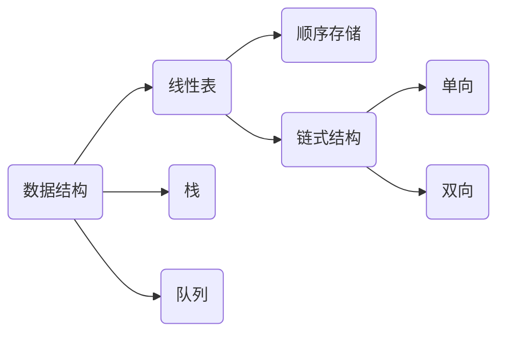
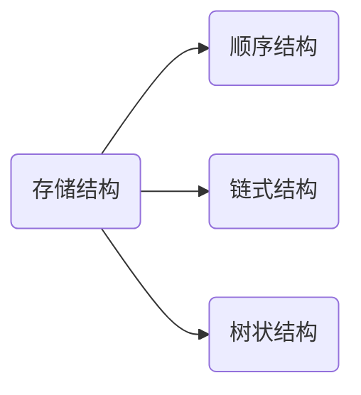

# 数据结构 C

[TOC]

## 1 简介





## 2 线性表

### 2.1 顺序表

顺序表在物理结构上表现为连续的内存地址，建立顺序表是一次申请固定大小的连续内存，另外需要一个整型数据指示表内最后一个元素的下标，由于顺序表的存储特点，顺序表表现为一下特点：

> 优点：快速查找修改指定位置的元素，由于顺序结构能够通过下标定位元素地址，故能通过下标快速读取数据地址；
>
> 缺点：同样由于存储结构的特性，决定了顺序表的插入和删除需要移动大量元素（删除需要将后边的元素依次先前移动覆盖实现删除，插入需要从表尾依次先后移动直到指定位置随后插入元素）。


下面为实现顺序存储操作的实例：

makefile

```makefile
all:main

main:main.o sqlist.o
	$(CC) $^ -o $@
	
clean:
	rm *.o main -rf

```


sqlist.h

```c
#ifndef SQLIST_H__
#define SQLIST_H__

#define DATASIZE	1024

typedef int	datatype;

typedef struct node_st{
	datatype data[DATASIZE];
    int last;
}sqlist;

sqlist *sqlist_create();
void sqlist_create1(qsqlist **ptr);
int sqlist_insert(sqlist *, int i, datatype * );
int sqlist_delete(sqlist *, int i);
int sqlist_find(sqlist *, datatype *);
int sqlist_isempty(sqlist *);
int sqlist_setempty(sqlist *);
int sqlist_getnum(sqlist *);
int sqlist_destroy(sqlist *);
void sqlist_display(sqlist *);
int sqlist_union(sqlist *, sqlist *);

#endif
```

sqlist.c

```c
#include <stdio.h>
#include <stdlib.h>
#include "sqlist.h"

sqlist *sqlist_create(){
	sqlist *me;
    me = malloc(sizeof(*me));
    
    if(me ==NULL)
        return NULL;
    
    me->last = -1;
    return me;
}

void sqlist_create1(sqlist **ptr){
    *ptr = malloc(sizeof(**ptr));
    
    if(*ptr == NULL)
        return ;
    
    (*ptr)->last = -1;
    return ;
}

int sqlist_insert(sqlist *me, int i, datatype *data){
    int j;
    
    if(me->last == DATASIZE-1)
        return -1;
    if(i < 0 || i > me->last+1)
        return -2;
    
    for(j = me->last; i <= j; j--){
        me->data[j+1] = me->data[j];
    }
    me->data[i] = *data;
    me->last++;
    
    return 0;
}

int sqlist_delete(sqlist *me, int i){
    if(i < 0 || i > me->last)
        return -1;
    for(int j = i+1; j <= me->last; j++){
        me->data[j-1] = me->data[j];
    }
    me->last--;
    return 0;
}

int sqlist_find(sqlist *me, datatype *data){
    int i;
    if(sqlist_isempty(me) == 0)
        return -1;
    for(i = 0; i < me->last; i++){
        if(me->data[i] == *data)
            return i;
    }
    
    return -2;
}

int sqlist_isempty(sqlist *me){
    if(me->last == -1)
        return 0;
    
    return -1;
}

int sqlist_setempty(sqlist *me){
    me->last = -1;
    return 0;
}

int sqlist_getnum(sqlist *me){
    return (me->last + 1);
}

void sqlist_display(sqlist *me){
    if(me->last == -1)
        return ;
    
    for(int i=0; i<me->last; i++){
        printf("%d ",me->data[i]);
    }
    printf("\n");
}

int sqlist_destroy(sqlist *me){
    free(me);
    return 0;
}

int sqlist_union(sqlist *list1, sqlist *list2){
    int i = 0;
    for(i = 0; i <= list2->last; i++)
        if(sqlist_find(list1, &(list2->data[i])) < 0){
            sqlist_insert(list1, 0, &(list2->data[i]));
        }
}


```


main.c

```c
#include <stdio.h>
#include <stdlib.h>

#include "sqlist.h"

int main(){
    sqlist *list, *list1;
    datatype arr[] = {2,34,423,545,643,78};
    datatype arr1[] = {32,4,34,52,78};
    int i,err;
    
    list = sqlist_create();//sqlist_create1(&list);
    if(list == NULL){
        fprintf(stderr,"sqlist_create() failed!\n");
        exit(-1);
    }
    
    for(i = 0; i < sizeof(arr)/sizeof(*arr); i++)
        if((err = sqlist_insert(list, 0, &arr[i])) != 0){
            if(err == -1)
                fprintf(stderr, "The arr is full!\n");
            else if(err == -2)
                fprintf(stderr, "The pos you want to insert is wrong!\n");
            else
                fprintf(stderr, "Error!\n");
            exit(-1);
        }
    
    sqlist_display(list);
    
    sqlist_delete(list, 1);
    sqlist_display(list);
    
    list1 = sqlist_create();//sqlist_creat(&list);
    if(list1 == NULL){
        fprintf(stderr,"sqlist_create() failed!\n");
        exit(-1);
    }
    
    for(i = 0; i < sizeof(arr1)/sizeof(*arr1); i++)
        if((err = sqlist_insert(list1, 0, &arr1[i])) != 0){
            if(err == -1)
                fprintf(stderr, "The arr is full!\n");
            else if(err == -2)
                fprintf(stderr, "The pos you want to insert is wrong!\n");
            else
                fprintf(stderr, "Error!\n");
            exit(-1);
        }
    sqlist_display(list1);
    
    sqlist_union(list, list1);
    sqlist_display(list);
    
    sqlist_destroy(list);
    sqlist_destroy(list1);
    
    return 0;
}


```


### 2.2 链表

链表采用链式存储结构，链表是一种物理存储单元上非连续、非顺序的存储结构，数据元素的逻辑顺序是通过链表中的指针链接次序实现的。链表由一系列结点（链表中每一个元素称为结点）组成，结点可以在运行时动态生成。每个结点包括两个部分：一个是存储数据元素的数据域，另一个是存储下一个结点地址的指针域。 相比于线性表顺序结构，操作复杂。由于不必须按顺序存储，链表在插入的时候可以达到O(1)的复杂度，比另一种线性表顺序表快得多，但是查找一个节点或者访问特定编号的节点则需要O(n)的时间，而线性表和顺序表相应的时间复杂度分别是O(logn)和O(1)。

> 优点：使用链表结构可以克服数组链表需要预先知道数据大小的缺点，链表结构可以充分利用计算机内存空间，实现灵活的内存动态管理。用户操作不会影响很多数据只会直接影响到操作节点的前驱和后继节点。
>
> 缺点：链表失去了数组随机读取的优点，同时链表由于增加了结点的指针域，空间开销比较大。不能很快读取指定位置的数据。


#### 2.2.1 单向链表

##### 有头单链表

头节点不存储有效数据，便于对链表操作。(Linux环境没配好，代码没测可能有亿点bug)

makefile

```makefile
all:main

main:main.o list.o
	$(CC) $^ -o $@
	
clean:
	rm *.o main -rf

```


list.h

````c
#ifndef LIST_H__
#define LIST_H__

#define DATASIZE	1024
typedef int datatype; 

struct node_st{
    datatype data;
    struct node_st *next;
}linknode;

list *list_create();

int list_insert_at(list *, int i, datatype *);
int list_order_insert(list *, datatype *);

int list_delete_at(list *, int i, datatype *);
int list_delete(list *, datatype *);

int list_isempty(list *);
void list_display(list *);
void list_destroy(list *);
#endif
````


list.c

```c
#include <stdio.h>
#include <stdlib.h>

#include "list.h"

list *list_create(){
    list *me;
    me  = malloc(sizeof(*me));
    if(me == NULL)
        return NULL;
    me->next = NULL;
    return me;
}

int list_insert_at(list *me, int i, datatype *data){
    int j = 0;
    list *node = me, *newnode;
    
    if(i < 0 || i > DATASIZE)
        return -1;
    
    for(j = 0; j < i && node != NULL; j++){
        node = node->next;
    }
    
    if(node != NULL){
        newnode = malloc(sizeof(*newnode));
        if(newnode == NULL)
            return -2;
        newnode->data = *data;
        
        newnode->next = node->next;
        node->next = newnode;
        
        return 0;
    }
    else{
        return -3;
    }
    
}

int list_order_insert(list *me, datatype *data){
    list *p = me, node;
    
    for(p = me; p->next && p->next->data < *data; p = p->next){
        ;
    }
    
    node = malloc(sizeof(*node));
    if(node == NULL)
        return -1;
    
    node->data = *data;
    node->next = p->next;
    p->next = node;
    
    return 0;
    
}

int list_delete_at(list *, int i, datatype *data){
    int j = 0;
    list *p = me, *q;
    
    *data = -1;
    
    if(i < 0)
        return -1;
    
    while(j < i && p){
        p = p->next;
        j++;
    }
    
    if(p){
        q = p->next;
        p->next = q->next;
        free(q);
    }
    else{
        return -2;
    }
    
}

int list_delete(list *, datatype *){
    list *p = me, *q;
    
    for(p = me; p->next && p->next->data != *data; p = p->next){
        ;
    }
    
    if(p->next == NULL)
        return -1;
    else{
        q = p->next;
        p->next = q->next;
        *data = q->data;
        free(q);
        q = NULL;
        return 0;
    }
    
}

int list_isempty(list *me){
    if(me->next == NULL)
        return 0;
    return 1;
}

void list_display(list *me){
    list *node = me;
    if(list_isempty(me) == 0)
        return ;
    for(node = me->next; node != NULL; node = node->next){
        printf("%d ", node->data);
    }
    printf("\n");
    return ;
}

void list_destroy(list *me){
    list *node, *next;
    for(node = me->next; node != NULL; node = next){
        next = node->next;
        free(node);
    }
    free(me);
    return ;
}

```


main.c

```c
#include <stdio.h>
#include <stdlib.h>

#include "list.h"

int main(){
    
    list *l;
    l = list_create();
    if(l == NULL){
        exit(1);
    }
    
    datatype arr[] = {12,34,5,354,64};
    
    for(int i = 0; i < sizeof(arr)/sizeof(*arr); i++){
        if(list_insert_at(l, 0, &arr[i]))//if(list_order_insert(l, &arr[i]))
            exit(-1);
    }
    
    list_display(l);
    
    int value = 12;
    list_delete(l, &value);
    
    datatype v;
    int err = 0;
    err = list_delete_at(l, 2, &v);
    if(err)
        exit(1);
    list_display(l);
    printf("delete:%d\n", v);
    
    list_destroy(l);
    list_display(l);
    
    return 0;
}
```


##### 无头单链表

(代码已测试通过)

makefile

```c
all:main

main:main.o nohead.o
	$(CC) $^ -o $@
	
clean:
	rm *.o main -rf


```


nohead.h

```c
#ifndef NOHEAD_H__
#define NOHEAD_H__


#define NAMESIZE    32

typedef struct score_st datatype;

struct score_st{
    int id;
    char name[NAMESIZE];
    int math;
    int chinese;
};

typedef struct node_st{
    struct score_st data;
    struct node_st *next;
}nohead;

int list_insert(nohead **, datatype *);
void list_show(nohead *);
int list_delete(nohead **);
datatype *list_find(nohead *, int id);

void list_destroy(nohead *);

#endif
```


nohead.c

```c
#include <stdio.h>
#include <stdlib.h>

#include "nohead.h"

int list_insert(nohead **list, datatype *data){
    nohead *new;
    new = malloc(sizeof(*new));
    if(new == NULL)
        return -1;
    new->data = *data;
    new->next = *list;
    *list = new;
    return 0;
}

void list_show(nohead *list){
    nohead *cur;
    for(cur = list; cur != NULL; cur = cur->next){
        printf("%d %s %d %d \n", cur->data.id, cur->data.name, cur->data.math,\
         cur->data.chinese);
    }
}

int list_delete(nohead **list){
    nohead *cur;
    if((*list == NULL))
        return -1;
    
    cur = *list;
    *list = (*list)->next;
    free(cur);
}

datatype *list_find(nohead *list, int id){
    nohead *cur;

    for(cur = list; cur != NULL; cur = cur->next){

        if(cur->data.id == id){
            
            return &(cur->data);
        }
    }

    return NULL;

}

void list_destroy(nohead *list){
    nohead *cur;

    if(list == NULL)
        return ;
    
    for(cur = list; cur != NULL; cur = list){
        list = cur->next;
        free(cur);
    }
}
```


main.c

```c
#include <stdio.h>
#include <stdlib.h>

#include "nohead.h"

int main(int argc, char const *argv[]){
    
    nohead *list = NULL;
    datatype tmp;
    int ret;
    int id_1 = 3, id_2 = 15;
    datatype *ptr;

    for(int i = 0; i < 7; i++){
        tmp.id = i;
        snprintf(tmp.name, NAMESIZE, "stu%d", i);
        tmp.math = rand() % 100;
        tmp.chinese = rand() %100;

        ret = list_insert(&list, &tmp);
        if(ret != 0)
            exit(-1);
    }

    list_show(list);
    printf("\n");
    
    ptr = list_find(list, id_1);
    if(ptr != NULL){
        printf("%d %s %d %d \n", ptr->id, ptr->name, ptr->math, ptr->chinese);
    }
    else{
        printf("Can not find!\n");
    } 
    printf("\n");

    ptr = list_find(list, id_2);
    if(ptr != NULL){
        printf("%d %s %d %d \n", ptr->id, ptr->name, ptr->math, ptr->chinese);
    }
    else{
        printf("Can not find!\n");
    } 
    printf("\n");
    
    list_delete(&list);
    list_show(list);
    printf("\n");

    list_destroy(list);

    return 0;
}

```

结果：

```txt
wangs7_@WangQ7:~/Cprogram/nohead$ ./main
6 stu6 90 59
5 stu5 62 27
4 stu4 49 21
3 stu3 86 92
2 stu2 93 35
1 stu1 77 15
0 stu0 83 86

3 stu3 86 92

Can not find!

5 stu5 62 27
4 stu4 49 21
3 stu3 86 92
2 stu2 93 35
1 stu1 77 15
0 stu0 83 86
```


##### 单向循环链表

约瑟夫算法：

> 杀人游戏：问题描述，有8个人围坐一圈分别为1号，2号...8号，从1号开始按照某一顺序(1->2->...->8->1...)循环报数每次报到3的人会被带走枪毙，并从下一个人从新报数，直到剩下最后一个人能够存活。
>
> 问题分析：将8人围坐抽象为一个8个节点的屋头循环链表，从头结点开始一次遍历，每到第三个节点就输出该节点标号并删除该节点，直到链表只剩最后一个节点。
>
> 效果：
>
> 原环链 1 2 3 4 5 6 7 8 
>
> 遍历输出 3 6 1 5 2 8
>
> 最后留下的节点 7


makefile

```c
all:main

main:main.o josephu.o
	$(CC) $^ -o $@
	
clean:
	rm *.o main -rf

```


josephu.h

```c
#ifndef JOSEPHU_H__
#define JOSEPHU_H__


typedef int datatype;

typedef struct node_st{
    datatype data;
    struct node_st *next;
}Jose;


Jose *jose_create(int n);
void jose_show(Jose *);
void jose_kill(Jose **, int n);


#endif
```


josephu.c

```c
#include <stdio.h>
#include <stdlib.h>

#include "josephu.h"

Jose *jose_create(int n){
    Jose *me, *newnode, *cur;
    int i = 1;

    me = malloc(sizeof(*me));
    if(me == NULL)
        return NULL;
    
    me->data = i;
    me->next = me;
    i++;
    
    cur = me;
    for( ; i <= n; i++){
        newnode = malloc(sizeof(*newnode));
        if(newnode == NULL)
            return NULL; //可能存在内存泄漏 

        newnode->data = i;
        newnode->next = me;

        cur->next = newnode;
        cur = newnode;
    }

    return me;
}


void jose_show(Jose *me){

    Jose *ptr;

    for(ptr = me; ptr->next != me; ptr = ptr->next){
        printf("%d ", ptr->data);
    }

    printf("%d\n", ptr->data);

    return ;
}

void jose_kill(Jose **me, int n){
    Jose *cur = *me, *node;
    int i;
    while(cur != cur->next){

        for(i = 1; i < n; i++){
            node = cur;
            cur = cur->next;
        }

        node->next = cur->next;
        printf("%d ", cur->data);
        free(cur);
        cur = node->next;
    }
    printf("\n");

    *me = cur;

    return ;

}
```


main.c

```c
#include <stdio.h>
#include <stdlib.h>

#include "josephu.h"

#define JOSE_NR 8

int main(int argc, char const *argv[]){
    
    Jose *list;
    int n = 3;
    list = jose_create(JOSE_NR);

    jose_show(list);

    jose_kill(&list, n);

    jose_show(list);

    return 0;
}
```


结果：

```txt
wangs7_@WangQ7:~/Cprogram/josephu$ ./main
1 2 3 4 5 6 7 8
3 6 1 5 2 8 4
7
```


#### 2.2.2 双向链表

双向环链

>组成：每个节点主要包含三个部分，数据域、前驱指针、后继指针。
>
>分类：带头结点的和无头结点的。

* **带头结点的双向环链** 

实现目的，写一个针对不同数据的双向的库。

> 链表指针操作小贴士：假设链表节点内有三部分组成，数据域，前驱指针，后继指针三部分，现在在双向链表中有A、B两个相邻的节点，即A的后继指向B，B的前驱指向A。此时要在AB中插入节点N，如何快捷简单地操作指针？
>
> 首先，将节点N接入到A，B之间，将N的前驱指向A，N的后继指向B，这一步很简单；接下来将有一个很奇幻的操作，将N的前驱的后继指向N，N的后继的前驱指向N，这样就完成了指针变换的操作。第二步发生了什么？首先当第一步将N的前驱指向A，那么N的前驱的后继就是A的后继，将N的前驱的后继指向N也就是将A的后继指向N，剩下的部分同理，这样就避免了对A，B节点指针的多余操作，减小了出错的概率，另外从逻辑上分析N的前驱的后继也确实是N，这样就确保了指针操作的逻辑正确性。


makefile

```makefile
all:llist

llist:llist.o main.o
	$(CC) $^ -o $@

clean:
	rm *.o llist -rf
```


llist.h

```c
#ifndef LLIST_H__
#define LLIST_H__

#define LLIST_FORWARD   0x0
#define LLIST_BACKWARD  0x1

typedef void llist_op(const void *);
typedef int llist_cmp(const void *, const void *);

struct llist_node_st{
    void *data;
    struct llist_node_st *prev;
    struct llist_node_st *next;
};

typedef struct {
    int size;
    struct llist_node_st head;
}LLIST;


LLIST *llist_creat(int size);

int llist_insert(LLIST *, const void *data, unsigned char mode);

void *llist_find(LLIST *, const void *key, llist_cmp *);

int llist_delete(LLIST *, const void *key, llist_cmp *);

int llist_fetch(LLIST *, const void *key, llist_cmp *, void *data);

void llist_travel(LLIST *, llist_op *);

void llist_destroy(LLIST *);


#endif
```


llist.c

```c
#include <stdio.h>
#include <stdlib.h>
#include <string.h>

#include "llist.h"

LLIST *llist_creat(int size){
    LLIST *new;
    new = malloc(sizeof(*new));
    if(new == NULL){
        return NULL;
    }

    new->size = size;
    new->head.data = NULL;
    new->head.prev = &new->head;
    new->head.next = &new->head;

    return new;
}

int llist_insert(LLIST *ptr, const void *data, unsigned char mode){
    struct llist_node_st *newnode;
    
    newnode = malloc(sizeof(*newnode));
    if(newnode == NULL){
        return -1;
    }

    newnode->data = malloc(ptr->size);
    if(newnode->data == NULL){
        return -2;
    }
    memcpy(newnode->data, data, ptr->size);

    if(mode == LLIST_FORWARD){
        newnode->prev = &ptr->head;
        newnode->next = ptr->head.next;

    }
    else if(mode == LLIST_BACKWARD){
        newnode->prev = ptr->head.prev;
        newnode->next = &ptr->head;
    }
    else{
        return -3;
    }

    newnode->next->prev = newnode;
    newnode->prev->next = newnode;
    
    return 0;
}

static struct llist_node_st *find_(LLIST *ptr, const void *key, llist_cmp *cmp){
    struct llist_node_st *cur = NULL;

    for(cur = ptr->head.next; cur != &ptr->head; cur = cur->next){
        if(cmp(key, cur->data) == 0)
            break;
    }

    return cur;
}


void *llist_find(LLIST *ptr, const void *key, llist_cmp *cmp){
    
    return find_(ptr, key, cmp)->data;
  
}

int llist_delete(LLIST *ptr, const void *key, llist_cmp* cmp){
    struct llist_node_st *node;
    node = find_(ptr, key, cmp);
    if(node == &ptr->head){
        return -1;
    }

    node->prev->next = node->next;
    node->next->prev = node->prev;

    free(node->data);
    free(node);
    return 0;

}

int llist_fetch(LLIST *ptr, const void *key, llist_cmp *cmp, void *data){
    struct llist_node_st *node;
    node = find_(ptr, key, cmp);
    if(node == &ptr->head){
        return -1;
    }

    node->prev->next = node->next;
    node->next->prev = node->prev;

    if(node->data != NULL){
        //memset(data, 0, ptr->size);
        memcpy(data, node->data, ptr->size);
        
    }

    free(node->data);
    free(node);
    return 0;    
}

void llist_travel(LLIST *ptr, llist_op *op){
    struct llist_node_st *cur, *next;

    for(cur = ptr->head.next; cur != &ptr->head; cur = cur->next){
        op(cur->data);
    }

}

void llist_destroy(LLIST *ptr){
    struct llist_node_st *cur, *next;

    for(cur = ptr->head.next; cur != &ptr->head; cur = next){
        next = cur->next;
        free(cur->data);
        free(cur);
    }

    free(ptr);
    ptr = NULL;

}
```


main.c

```c
#include <stdio.h>
#include <stdlib.h>
#include <string.h>

#include "llist.h"

#define NAMESIZE    32
typedef struct score_st SCORE;

struct score_st{
      
    int id;
    char name[NAMESIZE];
    int math;
    int chinese;
           
};

void print_s(const void *record){
    const SCORE *r = record;
    printf("%d %s %d %d\n", r->id, r->name, r->math, r->chinese);
}

static int id_cmp(const void *key, const void *record){
    const int *k = key;
    const SCORE *r = record;

    return (*k - r->id);
}

static int name_cmp(const void *key, const void *record){
    const char *k = key;
    const SCORE *r = record;

    return strcmp(k, r->name);
}

int main(){

    LLIST *handler;
    SCORE tmp, *data = NULL;
    int ret, id = 3;
    char *del_name = "stu6";

    handler = llist_creat(sizeof(SCORE));
    if(handler == NULL){
        exit(-1);
    }


    for(int i = 0; i < 7; i++){
        tmp.id = i;
        snprintf(tmp.name, NAMESIZE, "stu%d", i);
        tmp.math = rand() % 100;
        tmp.chinese = rand() % 100;

        ret = llist_insert(handler, &tmp, LLIST_BACKWARD);
        if(ret){
            exit(-1);
        }

    }
    
    llist_travel(handler, print_s);
    printf("\n\n");

    data = llist_find(handler, &id, id_cmp);
    if(data == NULL){
        printf("Can not find!\n");
    }
    else{
        print_s(data);
    }

    printf("\n\n");

    ret = llist_delete(handler, del_name, name_cmp);
    if(ret){
        printf("llist_deleter failed!\n");
    }

    llist_travel(handler, print_s);
    printf("\n\n");

    data = malloc(sizeof(*data));
    memset(data, 0, sizeof(*data));
    llist_fetch(handler, &id, id_cmp, data);
    if(data == NULL){
        printf("llist_deleter failed!\n");
    }
    else{
        print_s(data);
    }

    printf("\n\n");

    llist_travel(handler, print_s);

    llist_destroy(handler);

    return 0;
}
```


测试结果

```txt
wangs7_@WangQ7:~/Cprogram/double/lib1$ ./llist
0 stu0 83 86
1 stu1 77 15
2 stu2 93 35
3 stu3 86 92
4 stu4 49 21
5 stu5 62 27
6 stu6 90 59


3 stu3 86 92


0 stu0 83 86
1 stu1 77 15
2 stu2 93 35
3 stu3 86 92
4 stu4 49 21
5 stu5 62 27


3 stu3 86 92


0 stu0 83 86
1 stu1 77 15
2 stu2 93 35
4 stu4 49 21
5 stu5 62 27
```


* 变长结构体的实现

> 在上述双向环链中节点中不可避免地引入了数据指针 void *data占用了8byte的空间，那么能不能在链表每个节点中省去这8byte的空间呢？我们可以使用一个长度为0的字符串指针作为一个不占空间的指示符（数据域的入口地址），在申请节点空间时就需要申请节点结构体空间大小加上头结点中用户设置的size大小的空间，这样每个节点的下方就会附加上一段数据域的空间用于存放数据。

简单示例

```c

struct node_st{
	struct node_st *prev;
    struct node_st *next;
    char data[0];//长度为0的数组仅作为一个地址知识的作用不占用内存空间
};

struct node_st *node = malloc(sizeof(*node) + head->size);//申请节点空间

/*
 * 除此之外还需要改动一些其他操作
 */
```

改进版本

```c

//llist,h :10 
struct llist_node_st{
    //void *data;
    struct llist_node_st *prev;
    struct llist_node_st *next;
    char data[0];
};

//llist.c :15
    //new->head.data = NULL;

//llist.c :30
    //newnode->data = malloc(ptr->size);

//llist.c :56
    struct llist_node_st *cur = NULL;

    for(cur = ptr->head.next; cur != &ptr->head; cur = cur->next){
        if(cmp(key, cur->data) == 0)
            break;
    }

    return cur;

//llist.c :83
    //free(node->data);

//llist.c :105
    //free(node->data);

//llist.c :124
        //free(cur->data);

/*
 * 其他部分不需要改动
 */
```

