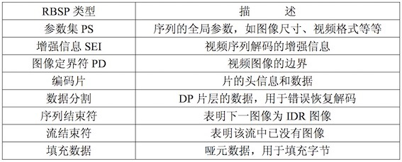

# 音视频封装格式、编码格式

## 概述
 
常见的AVI、RMVB、MKV、ASF、WMV、MP4、3GP、FLV等文件其实只能算是一种封装标准。

一个完整的视频文件是由音频和视频2部分组成的。H264、Xvid等就是视频编码格式，MP3、AAC等就是音频编码格式。例如：将一个Xvid视频编码文件和一个MP3音频编码文件按AVI封装标准封装以后，就得到一个AVI后缀的视频文件，这个就是我们常见的AVI视频文件了。

由于很多种视频编码文件、音频编码文件都符合AVI封装要求，则意味着即使是AVI后缀，也可能里面的具体编码格式不同。因此出现在一些设备上，同是AVI后缀文件，一些能正常播放，还有一些就无法播放。

同样的情况也存在于其他容器格式。即使RMVB、WMV等也不例外。部分技术先进的容器还可以同时封装多个视频、音频编码文件，甚至同时封装进字幕，如MKV封装格式。MKV文件可以做到一个文件包括多语种发音、多语种字幕，适合不同人的需要。

因此，视频转换需要设置的本质就是：A设置需要的视频编码、B设置需要的音频编码、C选择需要的容器封装。一个完整的视频转换设置都至少包括了上面3个步骤。常用的有Xvid，H264，MPEG1，MPEG2。

> Xvid：与RMVB格式差不多的压缩率，通用性很强，特别是用于家用DVD和便携式MP4等设备。
> 
> H264：压缩率最高的视频压缩格式，与其他编码格式相比，同等画面质量，文件体积最小，远远超过RMVB编码格式，电脑都可以播放，部分便携式视频设备也支持，如苹果播放器。PDA/PPC等设备也可以使用。
> 
> MPEG1：其实就是VCD编码格式。
> 
> MPEG2：DVD编码格式。比MPEG1强，与MPEG1一样，已经落后的编码格式，压缩率都不高，编码后的文件体积大，多用于希望把网上下载的文件转换为VCD或DVD碟的时候。


**简单理解就是音视频编码+组合封装=我们最后看到的可以播放的视频文件**，常见的组合方式（封装容器视频流编码格式音频流编码格式）：

* AVI ： Xvid  MP3
* AVI ： Divx  MP3
* Matroska（后缀就是MKV）： Xvid  MP3
* Matroska（后缀就是MKV）： Xvid  AAC
* Matroska（后缀就是MKV）： H264  AAC
* MP4 ： Xvid  MP3
* MP4 ： H264  AAC
* 3GP ： H.263  AAC

事实上，很多封装容器对音频编码和视频编码的组合方式放的很开，如AVI还可以使用H264+AAC组合，可以在具体使用中自己体会。尤其是MKV封装容器，基本无论什么样的组合都可以！但一般MKV用的最多的就是H264+AAC组合，此组合文件体积最小，清晰度最高。因此网上很多MKV视频都是高清晰度的。

## H264编码

### H264简介
H264 是 MPEG-4 标准所定义的最新编码格式，同时也是技术含量最高、代表最新技术水平的视频编码格式之一，标准写法应该是H.264

H264 视频格式是经过有损压缩的，但在技术上尽可能做的降低存储体积下获得较好图像质量和低带宽图像快速传输。


### H264码流分层结构


如上图，在 H264 中，句法元素共被组织成：序列、图像（帧）、片、宏块、子宏块五个层次。

句法元素的分层结构有助于更有效地节省码流。例如，在一个图像中，经常会在各个片之间有相同的数据，如果每个片都同时携带这些数据，势必会造成码流的浪费。更为有效的做法是将该图像的公共信息抽取出来，形成图像一级的句法元素，而在片级只携带该片自身独有的句法元素。


### VCL & NAL

H264 原始码流是由一个接一个 NALU（NAL Unit） 组成，它的功能分为两层，VCL（Video Coding Layer）视频编码层和 NAL（Network Abstraction Layer）网络提取层。

> VCL：包括核心压缩引擎和块、宏块和片的语法级别定义，设计目标是尽可能地独立于网络进行高效的编码；
> 
> NAL：负责将 VCL 产生的比特字符串适配到各种各样的网络和多元环境中，覆盖了所有片级以上的语法级别；

NAL是 H.264 为适应网络传输应用而制定的一层数据打包操作。传统的视频编码算法编完的视频码流在任何应用领域下（无论用于存储、传输等）都是统一的码流模式，视频码流仅有视频编码层 VCL（Video Coding Layer）。而 H.264 可根据不同应用增加不同的 NAL 片头，以适应不同的网络应用环境，减少码流的传输差错。

在 VCL 进行数据传输或存储之前，这些编码的 VCL 数据，被映射或封装进NAL单元（NALU）。

#### NALU Header & RBSP 结构

```txt
一个 NALU = 一组对应于视频编码的 NALU 头部信息 + 一个原始字节序列负荷（RBSP，Raw Byte Sequence Payload）

    +------------+----------------+------------+---
 ...| NAL header |      RBSP      | NAL header | RBSP  ...
    +------------+----------------+------------+---
```

一个原始的 H.264 NALU 单元常由 [StartCode] [NALU Header] [NALU Payload] 三部分组成，其中 Start Code 用于标示这是一个NALU 单元的开始，必须是 `00 00 00 01`。**实际原始视频图像数据保存在 VCL 分层的 NAL Units 中**。

#### NALU Header

前面已经说到，每个 NALU 由一个字节的 Header 和 RBSP（Raw Byte Sequence Payload） 组成。其中NALU Header 由三部分组成：
> forbidden_bit（1bit）；
> 
> nal_ref_idc（2bits）代表优先级；
> 
> nal_unit_type（5bits）代表该 NALU 的类型。

* forbidden_zero_bit

> 1 bit，H264 规定此位必须为 0。

* nal_ref_idc

> 用于表示当前 NALU 的重要性，值越大，越重要。解码器在解码处理不过来的时候，可以丢掉重要性为 0 的 NALU。
> 
> 1. nal_ref_idc 不等于0时, NAL unit 的内容可能是 SPS/PPS/参考帧的片。
> 2. nal_ref_idc 等于0时，NAL unit 的内容可能是非参考图像的片。
> 3. 当某个图像的片的 nal_ref_id 等于0时，该图像的所有片均应等于0.


* nal_unit_type

> nal_unit_type 是否包含 VCL 层编码数据分为 VCL NAL units 和 non-VCL NAL units；
> 
> VCL NAL units 中包含 VCL 层编码输出的数据, 而 non-VCL NAL units 则不包含。

|      nal_unit_type     | the content of NAL unit |
|------------------------|-------------------------|
|           1~5          |     VCL NAL units       |
|  others(SPS/PPS .etc)  |   non-VCL NAL units     |

所有的值对于类型如下：


#### RBSP

RBSP 序列示例：

```txt
+-----+-----+---------+---------------+---------+---------+
| SPS | SEI | I slicp | Image definer | P slicp | P slicp |
+-----+-----+---------+---------------+---------+---------+
```

RBSP描述



SODB & RBSP

> SODB 数据比特串 -> 是编码后的原始数据。
> 
> RBSP 原始字节序列载荷 -> 在原始编码数据的后面添加了结尾比特，一个 bit “1” 若干比特 “0”，以便字节对齐。


### slice（片）

片是 H.264 提出的新概念，实际原始视频图像数据保存在 VCL 层级的 NAL Unit 中，这部分数据在码流中被称作是片（slice）。一个 slice 包含一帧图像的部分或全部数据，换言之，一帧视频图像可以编码为一个或若干个 slice。一个 slice 最少包含一个宏块，最多包含整帧图像的数据。在不同的编码实现中，同一帧图像中所构成的 slice 数目不一定相同

```txt
slice = Slice Header + Slice Data
一个 slice 编码之后被打包进一个 NALU，所以 slice = NALU

```

设置片的目的是为了限制误码的扩散和传输，应使编码片相互间是独立的。某片的预测不能以其他片中的宏块为参考图像，这样某一片中的预测误差才不会传播到其他片中。


在上图中，可以看到每个图像中，若干宏块（Macroblock）被排列成片。一个视频图像可编成一个或更多个片，每片包含整数个宏块 (MB)，每片至少包含一个宏块。


### Macroblock 宏块


宏块是视频信息的主要承载者。一个编码图像通常划分为多个宏块组成.包含着每一个像素的亮度和色度信息。视频解码最主要的工作则是提供高效的方式从码流中获得宏块中像素阵列。

一个宏块由一个 16×16 亮度像素和附加的一个 8×8 Cb 和一个 8×8 Cr 彩色像素块组成。

* 宏块分类 & 意义

> I宏块: 利用从当前片中已解码的像素作为参考进行帧内预测。
> 
> P宏块: 利用前面已编码图像作为参考进行帧内预测。
> 
> B宏块: 利用双向的参考图像（当前和未来的已编码图像帧）进行帧内预测。

### frame（帧）和 filed（场）

视频的一场和一帧用来产生一个编码图像，一帧通常是一个完整的图像，当采集视频信号时，如果采用隔行扫描（奇、偶数行），则扫描下来的一帧图像就被分成了两个部分，这每一部分都被称为 [场]，根据次序，分为 [顶场] 和 [底场]。

扩展阅读：为什么会产生场的概念？

> 人眼可察觉到的电视视频图像刷新中的闪烁为 0.02 秒，即当电视系统的帧率低于 50 帧/秒，人眼可感觉得出画面的闪烁。常规如 PAL 制式电视系统帧率为 25 帧/秒、NTSC 制式的则为 30 帧/秒，如果采用逐行扫描将不可避免地在视频刷新时产生闪烁现象。而另一方面如果单纯的提高帧率达到避免闪烁刷新效果，则会增加系统的频带宽度。
> 
> 这便引出了隔行扫描技术及 [场] 的概念。
> 
> 在隔行扫描中，每一帧包含两个场（top field）和（bottom field），其中每个 field 包含一帧中一半数量的水平线，top field 包含所有奇数线，bottom field 则包含所有偶数线。则在电视显示过程中，电子枪每发射一行隔一行—先发射奇数行13579…（top field）回头再发射2468…（bottom field）利用两次扫描来完成一幅图像，因为视觉的滞留性，我们看到的效果是差不多的。如在 NTSC 视频中 frame 的频率为30次/秒-àfield的频率则为 60 次/秒，大于了人眼可察觉闪烁的频率。
> 
> 适用类型
> 
> 帧编码方式 -> 活动量较小或者静止的图像宜采用
> 
> 场编码方式	-> 活动量较大的运动图像


### I 帧、P 帧、B 帧与 pts/dts


| 帧的分类 |            中文             |         意义          |
|:-------:|----------------------------|----------------------|
|   I 帧  |	帧内编码帧，又称 intra picture |I 帧通常是每个 GOP（MPEG 所使用的一种视频压缩技术）的第一个帧，经过适度地压缩，做为随机访问的参考点，可以当成图象。I帧可以看成是一个图像经过压缩后的产物。 |
|   P 帧	 |前向预测编码帧，又称 predictive-frame|通过充分将低于图像序列中前面已编码帧的时间冗余信息来压缩传输数据量的编码图像，也叫预测帧。 |
|   B 帧	 |双向预测帧，又称 bi-directional interpolated prediction frame|既考虑与源图像序列前面已编码帧，也顾及源图像序列后面已编码帧之间的时间冗余信息来压缩传输数据量的编码图像,也叫双向预测帧。|

* I frame: 自身可以通过视频解压算法解压成一张单独的完整的图片；
* P frame：需要参考其前面的一个 I frame 或者 B frame 来生成一张完整的图片；
* B frame: 则要参考其前一个 I 或者 P帧 及其后面的一个 P 帧来生成一张完整的图片；

pts/dts

> PTS（Presentation Time Stamp）	PTS 主要用于度量解码后的视频帧什么时候被显示出来；
> 
> DTS（Decode Time Stamp）	DTS 主要是标识内存中的 bit 流什么时候开始送入解码器中进行解码。


DTS 与 PTS 的不同：

DTS 主要用户视频的解码，在解码阶段使用。PTS主要用于视频的同步和输出，在 display 的时候使用。再没有 B frame 的时候输出顺序是一样的。

### GOP 图片组

GOP 是画面组，一个 GOP 是一组连续的画面。

GOP 一般有两个数字，如 M = 3，N = 12，M 制定 I 帧与 P 帧之间的距离，N 指定两个 I 帧之间的距离。那么现在的 GOP 结构是

```txt
    I BBP BBP BBP BB I
```

增大图片组能有效的减少编码后的视频体积，但是也会降低视频质量，至于怎么取舍，得看需求了。

### IDR 立即解码刷新

一个序列的第一帧叫做 IDR帧（Instantaneous Decoding Refresh，立即解码刷新）。

I 帧和 IDR 帧都是使用帧内预测，本质上是同一个东西，在解码和编码中为了方便，将视频序列中第一个 I 帧和其他 I 帧区分开，所以把第一个 I 帧称作 IDR，这样就方便控制编码和解码流程。

IDR 帧的作用是立刻刷新，使错误不致传播，从 IDR 帧开始，重新算一个新的序列开始编码。

**核心作用**

H.264 引入 IDR 帧是为了解码的重同步，当解码器解码到 IDR 帧时，立即将参考帧队列清空，将已解码的数据全部输出或抛弃，重新查找参数集，开始一个新的序列。这样，如果前一个序列出现重大错误，在这里可以获得重新同步的机会，IDR 帧之后的帧永远不会使用 IDR 之前的图像的数据来解码。


## AAC编码

### AAC简介

AAC是高级音频编码（Advanced Audio Coding）的缩写，出现于1997年，最初是基于MPEG-2的音频编码技术。由Fraunhofer IIS、Dolby Laboratories、AT&T、Sony等公司共同开发，目的是取代MP3格式。2000年，MPEG-4标准出台，AAC重新集成了其它技术（PS,SBR），为区别于传统的MPEG-2 AAC，故含有SBR或PS特性的AAC又称为MPEG-4 AAC。

AAC是新一代的音频有损压缩技术，它通过一些附加的编码技术（比如PS,SBR等），衍生出了LC-AAC,HE-AAC,HE-AACv2三种主要的编码，LC-AAC就是比较传统的AAC，相对而言，主要用于中高码率(>=80Kbps)，HE-AAC(相当于AAC+SBR)主要用于中低码(<=80Kbps)，而新近推出的HE-AACv2(相当于AAC+SBR+PS)主要用于低码率(<=48Kbps）,事实上大部分编码器设成<=48Kbps自动启用PS技术，而>48Kbps就不加PS,就相当于普通的HE-AAC。


### AAC规格简述

AAC共有9种规格，以适应不同的场合的需要：

> MPEG-2 AAC LC 低复杂度规格（Low Complexity）--比较简单，没有增益控制，但提高了编码效率，在中等码率的编码效率以及音质方面，都能找到平衡点
> 
> MPEG-2 AAC Main 主规格。
> 
> MPEG-2 AAC SSR 可变采样率规格（Scaleable Sample Rate）。
> 
> MPEG-4 AAC LC 低复杂度规格（Low Complexity）------现在的手机比较常见的MP4文件中的音频部份就包括了该规格音频文。
> 
> MPEG-4 AAC Main 主规格 ------包含了除增益控制之外的全部功能，其音质最好。
> 
> MPEG-4 AAC SSR 可变采样率规格（Scaleable Sample Rate）。
> 
> MPEG-4 AAC LTP 长时期预测规格（Long Term Predicition）。
> 
> MPEG-4 AAC LD 低延迟规格（Low Delay）。
> 
> MPEG-4 AAC HE 高效率规格（High Efficiency）-----这种规格适合用于低码率编码，有。
> 
> Nero ACC 编码器支持。


目前使用最多的是**LC和HE(适合低码率)**。流行的Nero AAC编码程序只支持LC，HE，HEv2这三种规格，编码后的AAC音频，规格显示都是LC。HE其实就是AAC（LC）+SBR技术，**HEv2就是AAC（LC）+SBR+PS技术**；

```txt
+----------------------------------------+
|     The aacPlus audio codec family     |
|  +----------------------------------+  |
|  | +----------------------+         |  |
|  | | +--------+   +-----+ |  +----+ |  |
|  | | | AAC-LC | + | SBR | +  | PS | |  |
|  | | +--------+   +-----+ |  +----+ |  |
|  | |  aacPlus v1          |         |  |
|  | +----------------------+         |  |
|  |                    accPlus v2    |  |
|  +----------------------------------+  |
+----------------------------------------+
```
**HE：“High Efficiency”（高效性）**。HE-AAC v1（又称AACPlusV1，SBR)，用容器的方法实现了AAC（LC）+SBR技术。SBR其实代表的是Spectral Band Replication(频段复制)。简要叙述一下，音乐的主要频谱集中在低频段，高频段幅度很小，但很重要，决定了音质。如果对整个频段编码，若是为了保护高频就会造成低频段编码过细以致文件巨大；若是保存了低频的主要成分而失去高频成分就会丧失音质。SBR把频谱切割开来，低频单独编码保存主要成分，高频单独放大编码保存音质，“统筹兼顾”了，在减少文件大小的情况下还保存了音质，完美的化解这一矛盾。
 
**HEv2**：用容器的方法包含了HE-AAC v1和PS技术。PS指“parametric stereo”（参数立体声）。原来的立体声文件文件大小是一个声道的两倍。但是两个声道的声音存在某种相似性，根据香农信息熵编码定理，相关性应该被去掉才能减小文件大小。所以PS技术存储了一个声道的全部信息，然后，花很少的字节用参数描述另一个声道和它不同的地方。

### AAC特点

> (1)AAC是一种高压缩比的音频压缩算法，但它的压缩比要远超过较老的音频压缩算法，如AC-3、MP3等。并且其质量可以同未压缩的CD音质相媲美。
> 
> (2)同其他类似的音频编码算法一样，AAC也是采用了变换编码算法，但AAC使用了分辨率更高的滤波器组，因此它可以达到更高的压缩比。
> 
> (3)AAC使用了临时噪声重整、后向自适应线性预测、联合立体声技术和量化哈夫曼编码等最新技术，这些新技术的使用都使压缩比得到进一步的提高。
> 
> (4)AAC支持更多种采样率和比特率、支持1个到48个音轨、支持多达15个低频音轨、具有多种语言的兼容能力、还有多达15个内嵌数据流。
> 
> (5)AAC支持更宽的声音频率范围，最高可达到96kHz，最低可达8KHz，远宽于MP3的16KHz-48kHz的范围。
> 
> (6)不同于MP3及WMA，AAC几乎不损失声音频率中的甚高、甚低频率成分，并且比WMA在频谱结构上更接近于原始音频，因而声音的保真度更好。专业评测中表明，AAC比WMA声音更清晰，而且更接近原音。
> 
> (7)AAC采用优化的算法达到了更高的解码效率，解码时只需较少的处理能力。


### AAC音频文件格式

**AAC的音频文件格式有 ADIF ＆ ADTS：**

> ADIF：Audio Data Interchange Format 音频数据交换格式。这种格式的特征是可以确定的找到这个音频数据的开始，不需进行在音频数据流中间开始的解码，即它的解码必须在明确定义的开始处进行。故这种格式常用在磁盘文件中。
> 
> ADTS：Audio Data Transport Stream 音频数据传输流。这种格式的特征是它是一个有同步字的比特流，解码可以在这个流中任何位置开始。它的特征类似于mp3数据流格式。
> 
> 简单说，ADTS可以在任意帧解码，也就是说它每一帧都有头信息。ADIF只有一个统一的头，所以必须得到所有的数据后解码。且这两种的header的格式也是不同的，目前一般编码后的和抽取出的都是ADTS格式的音频流。

```txt
AAC的ADIF格式：ADIF头信息位于AAC文件的起始处，接下来就是连续的 raw data blocks。
+----------+---------------------------+
| header() | raw_data_stream()         |
+----------+---------------------------+

AAC的ADTS的一般格式：两端空白矩形表示一帧前后的数据。
+------+----------+----------+-------------+------------------+-----+
|      | syncword | header() | err_check() | raw_data_block() |     |
+------+----------+----------+-------------+------------------+-----+
（1）帧同步目的在于找出帧头在比特流中的位置，13818-7规定，aac ADTS格式的帧头同步字为12比特的“1111 1111 1111”。
（2）ADTS的头信息为两部分组成，其一为固定头信息，紧接着是可变头信息。固定头信息中的数据每一帧都相同，而可变头信息则在帧与帧之间可变。
```

### AAC元素信息 & AAC文件处理流程

* 在AAC中，原始数据块的组成可能有六种不同的元素：

> SCE: Single Channel Element单通道元素。单通道元素基本上只由一个ICS组成。一个原始数据块最可能由16个SCE组成。
> 
> CPE: Channel Pair Element 双通道元素，由两个可能共享边信息的ICS和一些联合立体声编码信息组成。一个原始数据块最多可能由16个SCE组成。
> 
> CCE: Coupling Channel Element 藕合通道元素。代表一个块的多通道联合立体声信息或者多语种程序的对话信息。
> 
> LFE: Low Frequency Element 低频元素。包含了一个加强低采样频率的通道。
> 
> DSE: Data Stream Element 数据流元素，包含了一些并不属于音频的附加信息。
> 
> PCE: Program Config Element 程序配置元素。包含了声道的配置信息。它可能出现在 ADIF 头部信息中。
> 
> FIL: Fill Element 填充元素。包含了一些扩展信息。如SBR，动态范围控制信息等。


* AAC文件处理流程

```txt
(1)判断文件格式，确定为ADIF或ADTS
(2)若为ADIF，解ADIF头信息，跳至第6步。
(3)若为ADTS，寻找同步头。
(4)解ADTS帧头信息。
(5)若有错误检测，进行错误检测。
(6)解块信息。
(7)解元素信息。
```

### AAC 解码流程

在主控模块开始运行后，主控模块将AAC比特流的一部分放入输入缓冲区，通过查找同步字得到一帧的起始，找到后，根据ISO/IEC 13818-7所述的语法开始进行Noisless Decoding(无噪解码)，无噪解码实际上就是哈夫曼解码，通过反量化(Dequantize)、联合立体声（Joint Stereo），知觉噪声替换（PNS）,瞬时噪声整形（TNS），反离散余弦变换（IMDCT），频段复制（SBR）这几个模块之后，得出左右声道的PCM码流，再由主控模块将其放入输出缓冲区输出到声音播放设备。


* **技术解析**：

1.主控模块：
> 所谓的主控模块，它的主要任务是操作输入输出缓冲区，调用其它各模块协同工作。其中，输入输出缓冲区均由DSP控制模块提供接口。输出缓冲区中将存放的数据为解码出来的PCM数据，代表了声音的振幅。它由一块固定长度的缓冲区构成，通过调用DSP控制模块的接口函数，得到头指针，在完成输出缓冲区的填充后，调用中断处理输出至I2S接口所连接的音频ADC芯片（立体声音频DAC和DirectDrive耳机放大器）输出模拟声音。
 
2.Noisless Decoding(无噪解码)：
> 无噪编码就是哈夫曼编码，它的作用在于进一步减少尺度因子和量化后频谱的冗余，即将尺度因子和量化后的频谱信息进行哈夫曼编码。全局增益编码成一个8位的无符号整数，第一个尺度因子与全局增益值进行差分编码后再使用尺度因子编码表进行哈夫曼编码。后续的各尺度因子都与前一个尺度因子进行差分编码。量化频谱的无噪编码有两个频谱系数的划分。其一为4元组和2元组的划分，另一个为节划分。对前一个划分来说，确定了一次哈夫曼表查找出的数值是4个还是2个。对后一个划分来说，确定了应该用哪一个哈夫曼表，一节中含有若干的尺度因子带并且每节只用一个哈夫曼表。
> 
> ——分段
> 
> 无噪声编码将输入的1024个量化频谱系数分为几个段（section），段内的各点均使用同一个哈夫曼表，考虑到编码效率，每一段的边界最好同尺度因子带的边界重合。所以每一段必段传送信息应该有：段长度，所在的尺度因子带，使用的哈夫曼表。
> 
> ——分组和交替
> 
> 分组是指忽略频谱系数所在窗，将连续的，具有相同尺度因子带的频谱系数分为一组放在一起，共享一个尺度因子从而得到更好的编码效率。这样做必然会引起交替，即本来是以 c[组][窗][尺度因子带][ 系数索引]
> 
> 为顺序的系数排列，变为将尺度因子带同的系数放在一起：
> 
> c[组][尺度因子带][窗][ 系数索引]
> 
> 这样就引起了相同窗的系数的交替。
> 
> ——大量化值的处理
> 
> 大量化值在AAC中有两种处理方法：在哈夫曼编码表中使用escape标志或使用脉冲escape方法。前者跟mp3编码方法相似，在许多大量化值出现时采用专门的哈夫曼表，这个表暗示了它的使用将会在哈夫曼编码后面跟跟一对escape值及对值的符号。在用脉冲escape方法时，大数值被减去一个差值变为小数值，然后使用哈夫曼表编码，后面会跟一个脉冲结构来帮助差值的还原.


3.尺度因子解码及逆量化

> 在AAC编码中，逆量化频谱系数是由一个非均匀量化器来实现的，在解码中需进行其逆运算。即保持符号并进行4/3次幂运算。
> 
> 在频域调整量化噪声的基本方法就是用尺度因子来进行噪声整形。尺度因子就是一个用来改变在一个尺度因子带的所有的频谱系数的振幅增益值。使用尺度因子这种机制是为了使用非均匀量化器在频域中改变量化噪声的比特分配。
> 
> ——尺度因子带（scalefactor-band）
> 
> 频率线根据人耳的听觉特性被分成多个组，每个组对应若干个尺度因子，这些组就叫做尺度因子带。为了减少信息含有短窗的边信息，连续的短窗可能会被分为一组，即将若干个短窗当成一个窗口一起传送，然后尺度因子将会作用到所有分组后的窗口去。

4.联合立体声(Joint  Stereo)

> 联合立体声的是对原来的取样进行的一定的渲染工作，使声音更”好听”些。

5.知觉噪声替换（PNS）

> 知觉噪声替换模块是一种以参数编码的方式模拟噪声的模块。在判别出音频值中的噪声后，将些噪声不进行量化编码，而是采用一些参数告诉解码器端这是某种噪声，然后解码器端将会对这些噪声用一些随机的编码来制造出这一类型的噪声。
> 
> 在具体操作上，PNS模块对每个尺度因子带侦测频率4kHz以下的信号成分。如果这个信号既不是音调，在时间上也无强烈的能量变动，就被认为是噪声信号。其信号的音调及能量变化都在心理声学模型中算出。
> 
> 在解码中，如果发现使用了哈夫曼表13(NOISE_HCB)，则表明使用了PNS。由于M/S立体声解码与PNS解码互斥，故可以用参数ms_used来表明是否两个声道都用同样的PNS。如果ms_used参数为1，则两个声道会用同样的随机向量来生成噪声信号。PNS的能量信号用noise_nrg来表示，如果使用了PNS，则能量信号将会代替各自的尺度因子来传送。噪声能量编码同尺度因子一样，采用差分编码的方式。第一个值同样为全局增益值。它同强度立体声位置值及尺度因子交替地放在一起，但对差分解码来说又彼此忽略。即下一个噪声能量值以上一个噪声能量值而不是强度立体声位置或尺度因子为标准差分解码。随机能量将会在一个尺度因子带内产生noise_nrg所计算出的平均能量分布。此项技术只有在MPEG-4 AAC中才会使用。

6.瞬时噪声整形（TNS）

> 这项神奇的技术可以通过在频率域上的预测，来修整时域上的量化噪音的分布。在一些特殊的语音和剧烈变化信号的量化上，TNS技术对音质的提高贡献巨大！
> 
> TNS瞬态噪声整形用于控制一个转换窗口内的瞬时噪声形态。它是用一个对单个通道的滤波过程来实现的。传统的变换编码方案常常遇到信号在时域变化非常剧烈的问题，特别是语音信号，这个问题是因为量化后的噪声分布虽然在频率域上得到控制，但在时域上却以一个常数分布在一个转换块内。如果这种块中信号变化得很剧烈却又不转向一个短块去，那这个常数分布的噪声将会被听到。
> 
> TNS的原理利用了时域和频域的二元性和LPC(线性预测编码)的时频对称性，即在其中的任意一个域上做编码与在另一域上做预测编码等效，也就是说，在一个域内做预测编码可以在另一域内增加其解析度。量化噪声产生是在频域产生的，降低了时域的解析度，故在这里是在频域上做预测编码。在AACplus中，由于基于AAC profile LC，故TNS的滤波器阶数被限制在12阶以内。
           
7.反离散余弦变换（IMDCT）

> 将音频数据从频域转换到时域的过程主要是由将频域数据填入一组IMDCT滤波器来实现的。在进行IMDCT变换后，输出数值经过加窗，叠加，最后得到时域数值。

8.频段复制（SBR）

> 简要叙述，音乐的主要频谱集中在低频段，高频段幅度很小，但很重要，决定了音质。如果对整个频段编码，若是为了保护高频就会造成低频段编码过细以致文件巨大；若是保存了低频的主要成分而失去高频成分就会丧失音质。SBR把频谱切割开来，低频单独编码保存主要成分，高频单独放大编码保存音质，“统筹兼顾”了，在减少文件大小的情况下还保存了音质，完美的化解这一矛盾。

9.参数立体声(PS）

> 对于之前的立体声文件来说，其文件大小是单声道的两倍，但是两个声道的声音存在某种相似性，根据香农信息熵编码定理，相关性应该被去掉才能减小文件大小。所以PS技术存储了一个声道的全部信息，之后，用很少的字节当作参数来描述另一个声道和它不同的地方。

--------
术语说明：

AAC: Advanced Audio Coding 高级音频编码

AAC LC: AAC with Low Complexity AAC的低复杂度配置

AAC plus: 也叫HE-AAC, AAC+,MPEG4 AAC LC加入SBR模块后形成的一个AAC版本

MPEG：Motion Picture Expert Group

IMDCT：反离散余弦变换

ADIF：Audio Data Interchange Format 音频数据交换格式

ADTS：Audio Data Transport Stream 音频数据传输流

SCE: Single Channel Element单通道元素

CPE: Channel Pair Element 双通道元素

CCE: Coupling Channel Element 藕合通道元素

DSE: Data Stream Element 数据流元素

PCE: Program Config Element 程序配置元素

FIL: Fill Element 填充元素

ICS: Individual Channel Stream 独立通道流

PNS: Perceptual Noise Substitution 知觉噪声替换

SBR: Spectral Band Replication 频段复制

TNS: Temporal Noise Shaping 瞬时噪声整形

ch：channel 通道

PS：parametric stereo 参数立体声

SBR：Spectral Band Replication 频段复制


