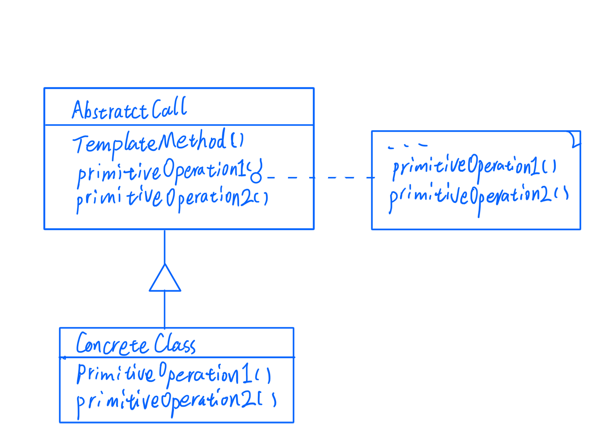
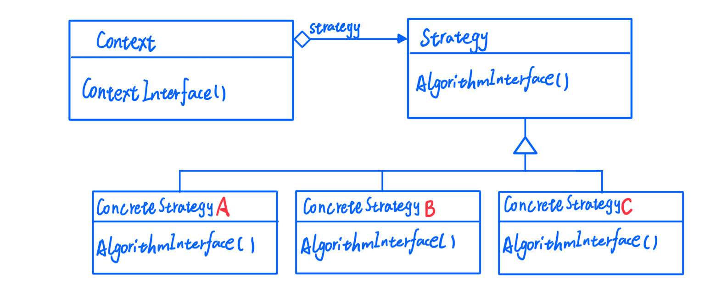
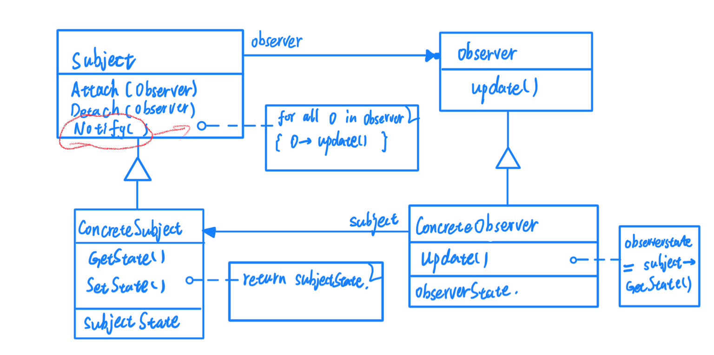

# 01组件协作

## Template Method 模版方法

Template Method 模版方法是一种类行为模式，比较官方的说法是：一项任务有稳定的整体操作结构，但是子步骤有很多改变，能够定义一个算法的骨架，而将一些步骤延迟到子类中的模式。通俗点讲，就是定义一个类实现完整的框架流程，但是其中部分具体的细节对外提供接口，由外部实现的方法，具体体现在一个类（C++）中如果有虚函数（Java中使用的是重载）那么这个类就有极大的可能使用了模版方法。

这种处理方法，与C语言中的回调函数（函数指针）有些类似，实现的是一种反向控制的机制，客户程序不用在意具体的实现逻辑，只需要自定义自己关注的部分即可。

结构图如下：




这里的 AbstractClass（笔误写成Call了）就是我们的抽象类，而右边虚线连接的就是我们定义的抽象方法，具体的流程为TemplateMethod() 而下面的 ConcreteCalss 继承自AbstractClass 这里只需要重写上面的两个抽象方法即可，无需关注具体的流程实现。

这种模式主要适用于流程固定但是具体细节需要经常改动的情况。


## Strategy 策略

Strategy 策略模式，就是定义一系列的算法，把它们一个个的封装起来，并且使它们可以互相替换。本模式使得算法可独立于使用它的客户而变化。简短地说："算法可能改变，算法和对象解耦"。

这种模式的重点在于，提供一个通用接口来实现算法的可互相替代，实现在对客户程序不可见的情况下可以更改算法，并且附加实现了运行时加载而非编译时加载，大大减少了程序运行时的负荷。结构图如下：




如上图，Strategy 是一个抽象类，负责提供所有算法的公共接口；ConcreteStrategy 是算法的具体实现；Context 是使用算法的客户程序，用一个 ConcreteStrategy 对象来配置，具体是通过维护一个对 Strategy 对象的引用来实现，定义一个接口来让Strategy 访问他的数据。

不规范的说，Strategy 是一个抽象类用于定义而不实现接口，具体的A、B、C算法都继承自它，并且实现方法。客户程序只需要定义一个 Strategy对象的引用，只需要讲A、B或者C的对象传入到Strategy对象的引用中，就能通过指针向下转型（或虚函数表）找到正确的算法，直接通过对象的引用即可。

举个例子，可以使用策略模式实现人民币和其他国家货币的转换函数。


## Observer 观察者


Observer 观察者模式，定义对象间的一种一对多的依赖关系，当一个对象的状态发生改变时，所有依赖于它的对象都会得到通知并被自动更新。本质上是一种通知依赖关系。

首先来看一下最简单的观察者模式如下：




首先来分析什么情况下需要使用观察者模式，如果有一个方法在执行的过程中在发生某种变化时需要通知其他方法的情况下就需要观察者模式。典型的观察者模式有按钮的点击事件的监听器，下载程序通知进度条的更新等。如果我们不使用观察者模式这类程序会发生很严重的耦合，但是如果我们只用单纯的提取抽象类的方法设计时，会发现在不可避免的还是会依赖具体实现的部分，这时可以考虑讲整个目标类和观察者抽象提取出来，如上图的 Subject 和 Observer ，Subject 内包含并且负责维护一个Observer的 List（也可以只接受唯一观察者） ，Notify() 方法负责通知注册过的所有 observer 执行更新；而 observer 可以只提供一个 update 的接口，这就是上层抽象结构的设计，通过抽象结构的设计，我们可以将目标和观察者的耦合一定程度地转移到上层抽象类中。在具体的实现 ConcreteSubject 和 ConcreteObserver 分别继承 Subject 和 Observer 首先 ConcreteSubject 添加 subjectState 并提供 get 和 set 方法，ConcreteObserver 类要包含一个Subject引用，类的构造函数要接收一个 ConcreteSubject 参数，用于调用 get 和 set 方法甚至是 Notify()，这样下层具体实现依靠上层抽象而相互关联，这里可以通过 ConcreteSubject set 状态变量并主动调用 Notify() 实现通知，ConcreteObserver 里的 subject 调用 get 获取状态从而判断需要执行某项操作（可以在updata中加入switch-case条件分支）。

其实这种设计模式使很灵活的，我们可以重写 Subject 中的 Notify() 方法，有选择地进行通知。下面将讨论一下实现依赖机制相关的问题。

1）**创建目标到其观察者之间的映射**

> 一个目标对象跟踪它应通知的观察者的最简单的方法是显示地在目标中保存对它们的引用。然而，当目标很多而观察者较少时，这样存储可能代价太高。一个解决办法是用时间换空间，用一个关联查找机制来维护目标到观察者的映射。这样一个没有观察者的目标就不产生存储开销。但是另一方面，这一方法增加了访问观察者的开销。

2）**观察多个目标**

> 在某些情况下，一个观察者依赖于多个目标可能是有意义的。例如，一个表格对象可能依赖于多个数据源。这种情况下，必须扩展 Update 接口以使观察者知道是哪个目标送来的通知。目标对象可以简单地将自己作为 Update 操作的一个参数，让观察者知道应该去那个目标。

3）**谁触发更新**

> 目标和它的观察者依赖于通知机制来保持一致。但是到底哪个对象调用 Notify 来触发更新？这里有两个选择：
> 
> 1. 由目标对象的状态设定操作在改变目标对象的状态后自动调用 Notify。这种方法的优点是客户目标不需要记住在目标对象上调用 Notify，缺点是多个连续的操作会产生多次连续的更新，可能效率较低。
> 2. 让客户负责在适当的时候调用 Notify。这样的优点是客户可以在一系列的状态改变完成后一次性地触发更新，避免了不必要的中间更新。缺点是给客户增加了触发更新的责任。由于用户可能会忘记调用 Notify，这种方式较易出错。

4）**对已删除目标的悬挂引用**

> 删除一个目标时应该注意不要在其观察者中遗留对该目标的悬挂引用。一种避免悬挂引用的方法是，当一个目标被删除时，让它通知它的观察者将对该目标的引用复位。一般来说，不能简单地删除观察者，因为其他的对象可能会引用它们，或者也可能它们还在观察其他的目标。

5）**在发出通知前确保目标的状态自身是一致的**

> 在发出通知前确保目标的状态自身是一致这一点很重要，因为观察者在更新其状态的过程中需要查询目标当前的状态。


6）**避免特定于观察者的更新协议————推/拉模型**

> 观察者模式的实现经常需要让目标广播关于其改变的其他一些信息。目标将这些信息作为 Update 的一个参数传递出去。这些信息的量可能很小，也可能很大。
> 
> 一个极端的情况是，目标向观察者发送关于改变的详细信息，而不管他们需要与否。我们称之为推模型。另一个极端的是拉模型，目标出最小通知外什么也不送出，而在此之后由观察者显式地向目标询问细节。
> 
> 拉模型强调的是目标不知道它的观察者，而推模型假定目标知道一些观察者需要的信息。推模型可能使得观察者相对难以复用，因为目标对观察者的假定可能并不是总是正确的。另一方面，拉模型可能效率较差，因为观察者对象需要在没有目标对象的帮助下确定什么发生了改变。


7）**显示地指定感兴趣的改变**

> 可以适当扩展目标的注册接口，让各观察者注册为仅对特定时间感兴趣，以提高更新的效率。当一个事件发生时，目标仅通知那些已经注册为对时间感兴趣的观察者。支持这种做到发的一个途径是，使用目标对象的方面（aspect）概念。
>
> ```c++
> void Subject::Attach(Observer*, Aspect& interest);
> ```
> 此处的 interest 制定感兴趣的事件。在通知的时刻，目标将这方面的改变作为 Update 操作的一个参数提供给他的观察者，例如：
> ```c++
> void Observer::Update(Subject*, Aspect& interest);
> ```


8）**封装复杂的更新语义**

> 当目标和观察者间的依赖关系特别复杂时，可能需要一个维护这些关系的对象。我们称这样的对象为更改管理器（ChangeManager）。它的目的是尽量减少观察者反映其目标状态变化所需的工作量。例如，如果一个操作涉及对几个相互依赖的目标进行改动，就必须保证仅在所目标都已经完成更改完毕后，才一次性地通知他们的观察者，而不是每个目标都通知观察者。
> 
> ChangeManager 有三个责任：
> * 它将一个目标映射到它的观察者并提供一个接口来维护这个映射。这就不需要由目标来维护其对观察者的引用，反之依然。
> * 它定义一个特定的更新策略。
> * 根据一个目标的请求，它更新所有依赖这个目标的观察者。


