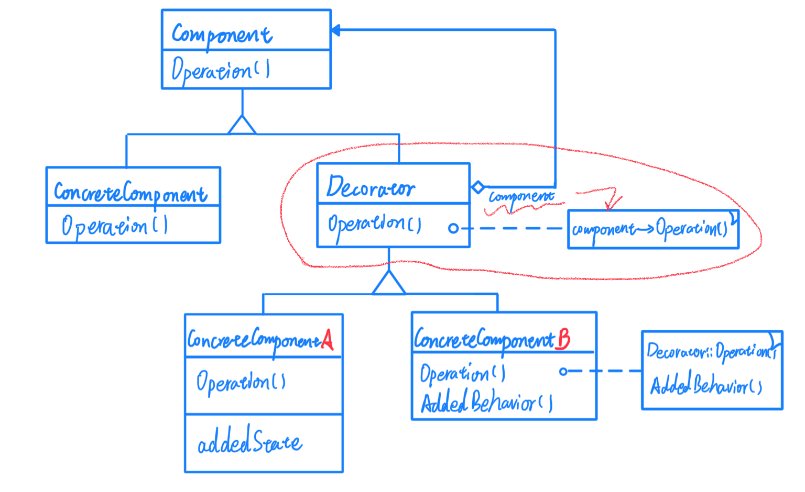
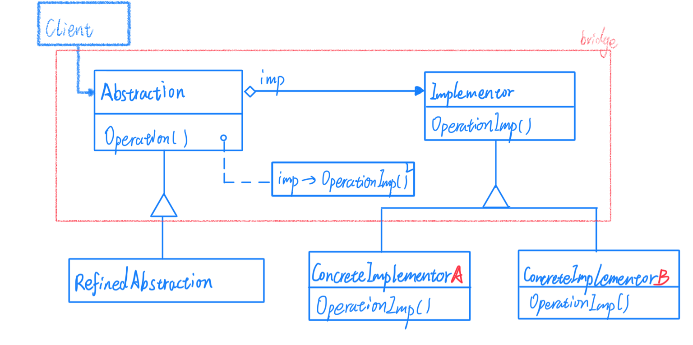

# 单一职责 模式

## Decorator 装饰

动机希望给某个对象而不是整个类添加一些功能，能够动态地给一个对象添加一些额外的职责。

由于过度地继承来扩展对象的功能，由于继承为类型引入的静态特质，使得这种扩展方式缺乏灵活性；并且随着子类的增多（扩展功能的增多），各种子类的组合（扩展功能的组合）会导致更多子类的膨胀。

动态地给一个对象添加一些额外的职责。就增加功能而言，Decorator模式比生成子类（继承）更为灵活（能够有效消除重复代码并且减少子类个数）。

这样就诞生了 Decorator 模式，我们可以使用组合而非继承，来实现一个中间类，这个类通过维护一个父类的引用（指针）来实现不同子类方法的动态加载，将编译时的任务转移到了运行时，能够大大减少子类的衍生。结构图如下：

对于上图来说，其中的 Decorator 类是整个模式的核心，其中组合了 Component 类，又继承了 Component 类，继承是为了继承接口实现，方便继承自 Decorator 类的子类调用 Decorator::Operation() 方法，而组合是为了能够提供动态性的方法调用，组合的 component 能够通过构造函数传入的对象自动向下转型为对应的 ConcreteComponent 对象（包含和ConcreteComponent平级的对象以及ConcreteComponentA、B这种 Decorator 的子类），从而能够动态调用对应的 Operation 方法，可以选择在 Decorator 的子类中重写 Operation 方法，并调用 Decorator::Operation() 并且添加需要扩展的功能，另外也可以在 Decorator 的子类中添加其他参数方法等。

总体来说，Decorator 模式使用的是"装饰"的手法，本质上是修饰是添加功能，要求在功能结构具有极高相似度的条件下，对类的功能多方向的扩展时才会使用到，而不是为解决多子类衍生的继承问题。

Decorator 类在接口上表现为 "is-a" 是一个继承的行为，即继承了父类所有的接口。但在实现上有表现为 "have-a" 是一个组合行为，即其中使用了一个父类。这就是 Decorator 模式的精髓。特点是继承一个类，同时又包含同一个类（必要不充分条件）。

## Bridge 桥接

由于某些类型的固有的实现逻辑，使得他们具有两个变化为维度，乃至多个维度的变化。

解决方法将抽象部（业务功能）与实现部分（平台实现）分离，使他们都可以独立地变化。其核心思想是将抽象类中可能出现或者需要多个变化版本的部分分离隔离出来，在抽象类地实现过程中不需要对这部分进行实现，这一部分需要另行实现，一般不需要客户程序关心，这样在面对某些跨平台的程序就能够极大方便平台间的移植，也简化客户程序的开发复杂度。

模式结构图如下：

如图，红色框内的部分为核心部分，Implementor（实施者）抽象类其实是从原始 Abstraction 类中分离出来的部分抽象方法，这些抽象方法有一个共同的特点，就是有固定且明显的两个或多个变化方向，这些变化与客户的实现过程无关，不需要客户程序关心。我们在 Abstraction 中维护一个 Implementor 的引用，用于动态加载 ConcreteImplementorA 和 ConcreteImplementorB 两个类，而这个过程不需要客户程序关心。

举个例子，一个希望能够跨平台的 window 应用程序大部分的方法应该都是通用的，但是一些底层的驱动和接口调用可能不同，我们就可以将这一部分分离出来，构造一个 Implementor 抽象类然后分别继承这个抽象类对不同平台做实现，然后定义一个抽象基类将 Implementor 组合进来，并且再继承这个抽象基类（RefinedAbstraction）再去实现不同的功能。

总的来说，Bridge 模式是一种将抽象和它的实现部分分离的设计思想。通过这种模式不同的抽象类和实现方法能够进行自由组合，而且抽象的实现部分的修改对客户不产生影响也就意味着客户的部分不需要重新编译。一个实现未必不变地绑定在一个接口上。抽象类的实现可以在运行时进行配置甚至改变它的实现。再次说明，将 Abstraction 和 Implementor。分离有助于降低对实现部分编译时的依赖性，当改变一个实现类时，并不需要重新编译 Abstraction 类和它的客户程序。为了保证一个类库的不同版本之间的二进制兼容性，一定要有这个性质。

另外，Bridge 模式允许独立地对  Abstraction 和 Implementor 层次结构进行扩充。

## 小结

对于 Decorator 和 Bridge 模式看上去比较相似，其实这两种模式的基本思路也是比较相同的，其主要区别在于 Decorator 模式是为了对某一种或某一类的类功能进行扩充，相当于在原有基础上不断添加功能，视为一种扩展的模式。而 Bridge 模式是将一个类拆分出来两个部分一部分是相对固定不变的，另一部分有比较明确的变化方向的，是为了方便对原有类进行部分修改，视为一种兼容的模式。

