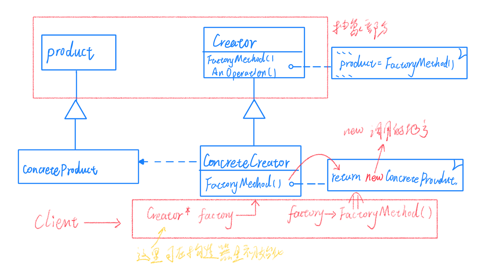
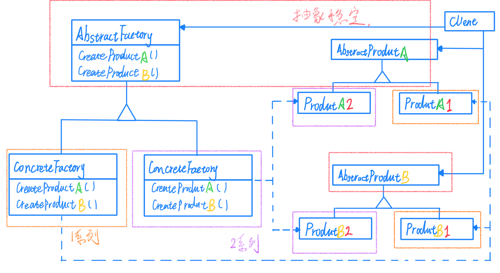
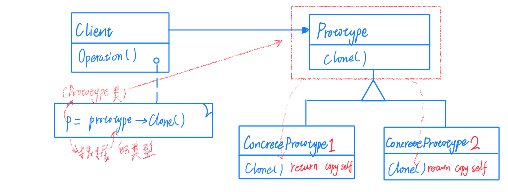
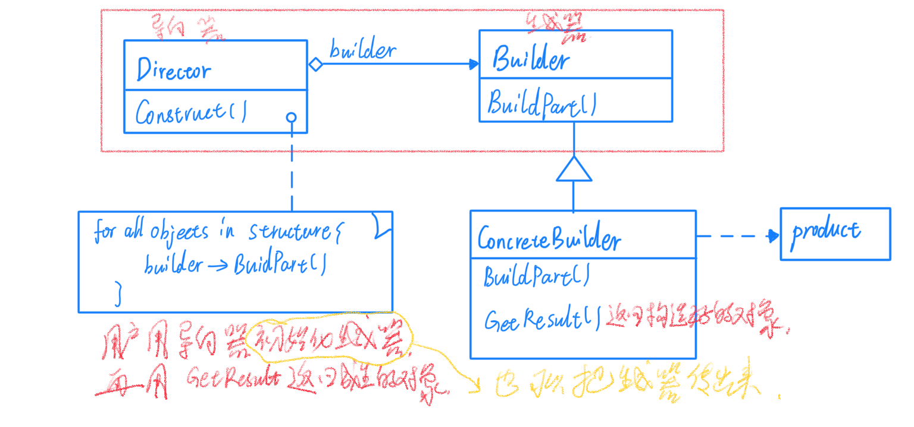

# 对象创建

通过"对象创建"模式绕开 new，避免对象创建（new）过程中所导致的紧耦合（依赖具体类），从而支持对象创建的稳定。它是接口抽象之后的第一步工作。

## Factory Method 工厂方法

定义一个用于创建对象的接口，让子类决定实例化哪一个类。Factory Method 使一个类的实例化延迟到其子类。

其中：

> * Product 定义工厂方法所创建的对象接口，简单来说就是我们要创建的目标对象的抽象基类。
> 
> * ConcreteProduct 实现 Product 接口，对应我们要创建的目标对象的类
> 
> * Creator 声明一个工厂方法，该方法返回一个 Product 对象。Creator 也可以定义一个工厂方法的缺省实现，它返回一个缺省的 ConcreteProduct 对象。这里就是定义一个返回 目标对象抽象基类的抽象方法，便于后面的实现。
> 
>  ConcreteCreator 重新定义工厂方法以返回一个 ConcreteProduct 对象。也就是具体调用 new 的地方。

用户在创建对象的时候只需要维护一个 Creator 的指针，如果需要更换创建的对象只需要更换 Creator 的指针指向的工厂对象。创建时，只需要调用Creator的工厂创建方法。

但是这种工厂模式只能用于创建接受参数相同的对象，如果创建时接受的参数不同那么就不能够统一结构，另外工厂模式（基本上所有的设计模式）都不是为了消除依赖，而是为了缩小依赖的范围，实现代码的可复用。

工厂方法不再将与特定应用有关的类绑定到你的代码中。代码仅处理 Product 接口，因此它可以与用户定义的任何 ConcreteProduct 类一起使用。工厂方法的一个潜在缺点在于，客户可能仅仅为了创建一个特定的 ConcreteProduct 对象，就不得不创建一个 Create 子类。

## Abstract Factory 抽象工厂

在软件系统中，经常面临着"一系列相互依赖的对象的创建工作，由于需求的变化，往往存在更多系列对象的创建工作。抽象工厂提供一种"封装机制"来避免客户程序和这种"多系列具体对象创建工作"的紧耦合。

就基本思想来说，抽象工厂与工厂方法基本相同，都是为了增强可维护性，而将创建延迟到子类中，尽量缩小依赖的范围。

抽象工厂结构图如下：

其中：
> AbstractFactory 声明一个创建抽象产品对象的操作接口。
> 
> ConcreteFactory 实现创建具体产品对象的操作。
> 
> AbstractProduct 为一类产品对象声明一个接口。
> 
> ConcreteProduct 定义一个将被相应的具体工厂创建的产品对象。
> 
> Client 仅使用由 AbstractFactory 和 AbstractProduct 类声明的接口。

适用条件：一个系统要独立于它的产品的创建、组合和表示；一个系统要由多个产品系列中的一个来配置；要强调一系列相关产品对象的设计一边进行联合使用；提供一个产品类库，但是只想显示他们的接口而不是实现。

优点：能很方便地增加一个系列的对象。

缺点：不能增加新的功能。

但是就具体用途来说又稍有不同，工厂方法是为了解决单一种类的对象创建，而抽象工厂是为了将相同功能的不同实现隔离开，可以灵活地将不同方法的不同实现相互组合，并且维持统一的风格。从某种程度上也可以说，工厂方法是特殊的抽象工厂（只有一个抽象产品），所以有时也将二者合称为工厂模式。

## Prototype 原型

在软件系统中，经常面临着"某些结构复杂的对象"的创建工作；由于需求的变化，这些对象经常面临着剧烈的变化，但是他们却拥有比较稳定一致的接口。原型模式是用原型实例指定创建对象的种类，并且通过拷贝这些原型来创建新的对象。

结构图如下：

其中：

> Prototype 声明一个克隆自身的接口。
> 
> ConcretePrototype 实现一个克隆自身的操作。
> 
> Client 让一个原型克隆自身的操作。

适用性：当一个系统应该独立于与它的产品创建、构成和表示时；要当实例化的类是在运行时指定时，例如动态装载；为了避免创建一个与产品类层次平行的工厂类层次时；当一个类的实例只能有几个不同状态组合中的一种时，建立相应数目的原型并克隆可能比每次都手工实例化更方便时。

概括地说，原型模式也可以看成是工厂模式的一个特例变形，只不过不包含工厂模式的中间类，如果需要创建的对象过于复杂，或者我们不需要留存中间类的时候都可以采用原型模式，但是原型模式相比于工厂模式在实际中使用较少，我们需要了解，但是不要过度刻意去使用原型模式。

## Builder 生成器

在软件系统中，有时候会面临着"一个复杂对象"的创建工作，其通常由各个部分的子对象用一定的算法构成；由于需求的变化，这个复杂对象的各个部分经常面临着剧烈的变化，但是将他们组合在一起的算法却相对稳定。

为了解决这种问题，Builder 将一个复杂对象的构建与它的表示分离，其结构图如下：

其中：

> Builder 为创建一个 Product 对象的各个部件指定抽象接口。
>
> ConcreteBuilder 实现 Builder 的接口以构造和装配该产品的各个部件；定义并跟踪它所创建的表示；提供一个检索产品的接口。
> 
> Director 构造一个使用 Builder 接口的对象。
> 
> Product 表示被构造的复杂对象。ConcreteBuilder 创建该产品的内部表示并定义它的装配过程。包含定义组成部件的类，包括将这些部件装配成最终产品的接口。

**其实在某些情况下 Builder 和 Director 是可以合并到 Builder 中的，这样能够大大简化Builder 的结构，但是分离出来便于后续的维护，各有利弊需要自己权衡。**

适用性：Builder 模式主要用于"分步骤构建一个复杂的对象"。在这其中"分步骤"是一个稳定的算法，而复杂对象的各个部分则经常变化；变化点在哪里，就封装哪里——主要应对"复杂对象个部分"的频繁需求变动。其缺点在于难以应对"分步骤构建算法的需求变动；要注意不同语言中构造器内调用虚函数的差别。（c++中的构造函数调用虚函数是静态绑定不是动态绑定）。

当然我们还需要考虑一些实际问题：

1）**装配和构造器接口** 生成器逐步地构造他们的产品。因此 Builder 类接口必须足够普遍，以便为各种类型的具体生成器构造产品。还有一种就是像语法分析树，自底向上构建的树形结构，在这种情况下，生成器会将子结点返回给导向器，然后导向器将他们回传给生成器去创建父结点。

2）**为什么产品没有抽象类** 通常情况下，由具体的生成器生成的产品，其表示相差非常大，以至于给不同的产品以公共类没有太大的意义。客户通常用合适的具体生成器来配置导向器，客户所处的位置使它知道 Builder 的哪一个具体子类被使用，并能相应地处理它的产品。

3）**在 Builder 中缺省的方法为空** C++中生成方法故意不声明为纯虚函数，而是把它们定义成空方法，这使客户只重定义它们所感兴趣的操作。

