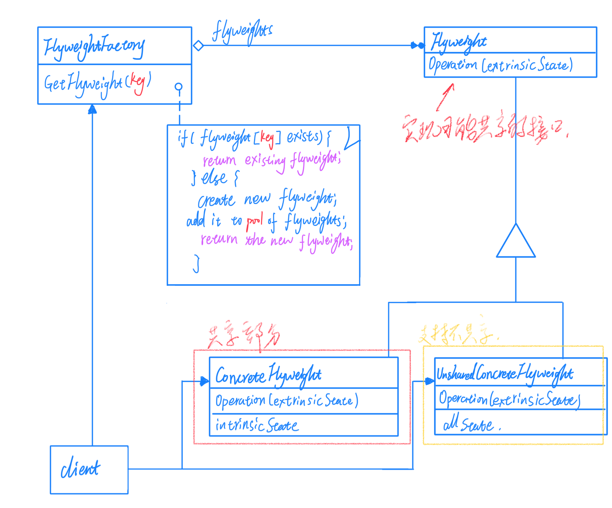

# 04对象性能

面向对象很好地解决了"抽象"的问题，但是必不可免地要付出一定的代价。但是某些情况下，面向对象所带来的成本必须谨慎处理。

## Singleton 单件模式

保证一个类仅有一个实例，并提供一个访问它的全局访问点（绕过常规的构造器）。这是类的设计者的责任，而不是使用者的责任。

单例模式的设计需要考虑线程安全的问题，如下考虑。

```c++
Singleton* Singleton::m_instance = nullptr;
// 线程非安全版本
Singleton* Singleton::getInstance() {
    if (m_instance == nulptr) {
        m_instance = new Singleton();
    }
    return m_instance;
}

// 线程安全版本，但锁的代价过高
Singleton* Singleton::getInstance() {
    Lock lock；
    if (m_instance == nulptr) {
        m_instance = new Singleton();
    }
    return m_instance;
}

// 双检查锁，但由于内存读写 reorder 不安全
Singleton* Singleton::getInstance() {
   
    if (m_instance == nulptr) {
        Lock lock；
        if (m_instance == nulptr) {
            m_instance = new Singleton();
        }
    }
    return m_instance;
}

// C++ 11版本之后的跨平台实现（volatile）
std::atomic<Singleton*> Singleton::m_instance;
std::mutex Singleton::m_mute;

Singleton* Singleton::getInstance(){
    Singleton* tmp = m_instance.load(std::memory_order_relaxed);
    std::atmoic_thread_fence(std::memory_order_acquire);
    if (tmp == nullptr) {
        std::lock_guard<std:mutex> lock(m_mutex);
        tmp = m_instance.load(std::memory_order_relaxed);
        if (tmp == nullptr) {
            tmp = new Singleton;
            std::atomic_thread_fence(std::memory_order_release);
            m_instance.store(tmp, std::memory_order_relaxed);   
        }
    }
    return tmp;
}

```

Singleton 模式中的实例构造器可以设置为 protected 以允许子类派生。

Singleton 模式一般不要支持拷贝构造函数和 Clone 接口，因为有可能导致多个对象实例，与 Singleton 模式的初衷违背。

要保证 Singleton 模式在多线程环境下保持安全。


## Flyweight 享元模式

在软件系统采用纯粹对象方案的问题在于大量细粒度的对象会很快充斥在系统中，从而带来很高的运行时代价————主要指内存需求方面的代价。

运用共享技术有效地支持大量细粒度的对象。





Flyweight 模式共享的对象应该是只读的，因为一旦对象具有可写性那么共享就变的没有意义，而且它是为了解决性能问题而产生的模式，如果对象的数量过少，就没有必要使用 Flyweight 模式。在 java 中的字符串的写时拷贝技术就是 Flyweight 模式思想的一种体现，尽管实现方法可能不同。

**这两种模式是少有的为了解决性能问题而产生的模式。**


