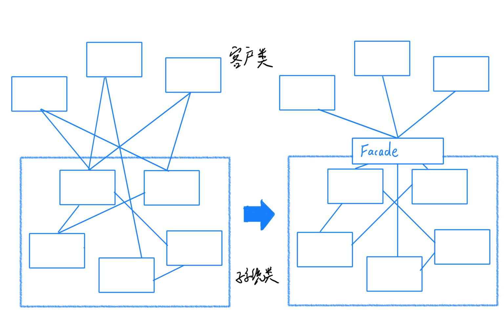
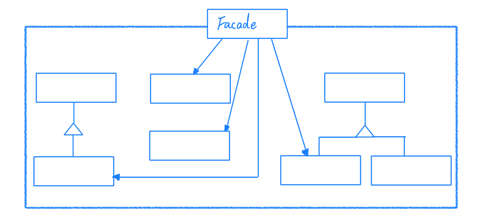
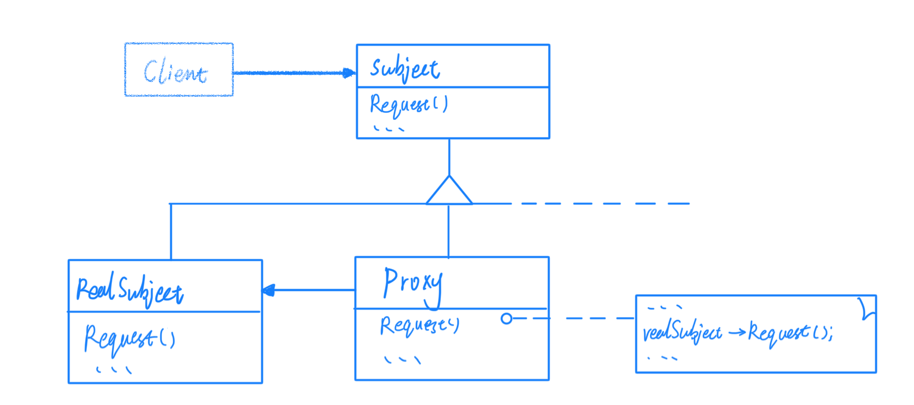
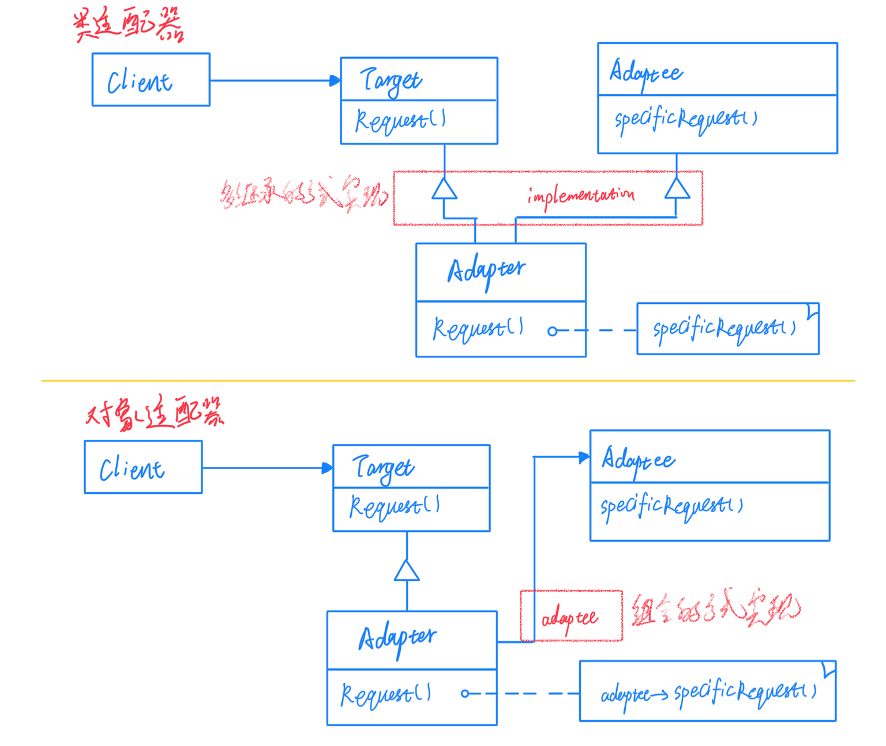
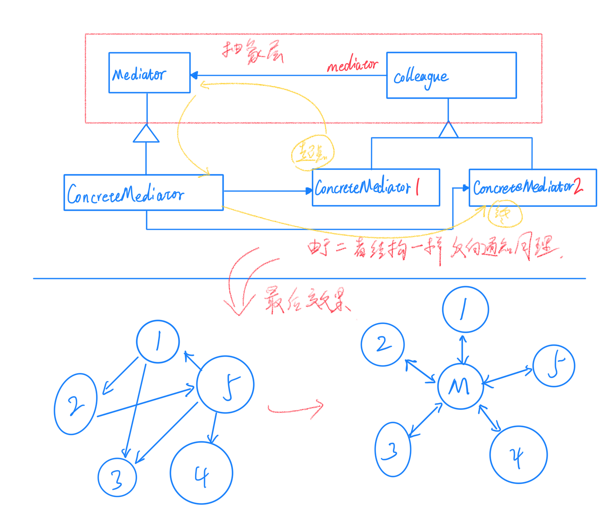

# 05接口隔离

在组件构建过程中，某些接口的直接依赖常常会带来很多问题、甚至根本无法实现。采用添加一层间接（稳定）接口，来隔离本来互相紧密关联的接口是一种常见的解决方案。

## Facade 外观模式

为了降低系统的复杂性。一个常见的设计目标是使用子系统间的通信和相互依赖关系。

为子系统中的一组接口提供一个一致的界面，Facade 模式定义了一个高层接口，这个接口使得这一子系统更加容易使用。

Facade 更多的是一种设计思想是从架构的层次去看整个系统，没有固定的代码结构。但是它并不是一个集装箱，可以任意地放进任何对象。Facade 模式中组件的内部应该是"互相耦合关系比较大的一系列组件"，而不是一个简单的功能集合。可以高度概括为"松耦合，高内聚"。

## Proxy 代理模式

在面向对象系统中，有些对象由于某种原因（比如对象创建的开销很大，或者某些操作需要安全控制、或者需要进程外的访问等）直接访问会给使用者、或者系统结构带来很多麻烦。需要一种不失去透明操作对象的同时来管理/控制这些对象，增加一层间接层是软件开发中常见的解决方式。

为其他对象提供一种代理以控制这个对象的访问。

适用性：
> **远程代理（Remote Proxy）** 为一个对象在不同的地址空间提供局部代表。
> 
> **虚代理（Virtual Proxy）** 根据需要创建开销很大的对象。
> 
> **保护代理（Protection Proxy）** 控制对原始对象的访问。保护代理用于对象应该有不同的访问权限的时候。
> 
> **智能指引（Smart Reference）** 取代了简单指针，它在访问对象时执行一些附加操作。它的典型用途包括：
> * 对指向实际对象的引用计数，这样当该对象没有引用时，可以自动释放它（也称为 Smart Pointer）。
> 
> * 当第一次引用一个持久对象时，将它装入内存。
> 
> * 在访问一个实际对象前，检查是否已经锁定了它，以确保其他对象不能改变它。

结构图如下：

* Proxy

> 1）保存一个引用使得代理可以访问实体。若 RealSubject 和 Subject 的接口相同，Proxy 会引用 Subject。
> 
> 2）提供一个与 Subject 的接口相同的接口，这样代理就可以用来替代实体。
> 
> 3）控制对实体的存取，并可能负责创建和删除它。
> 
> * Remote Proxy 负责对请求及其参数进行编码，并向不同地址空间中的实体发送已编码的请求。
> 
> * Virtual Proxy 可以缓存实体的附加信息，以便延迟对它的访问。
> 
> * Protection Proxy 检查调用者是否具有实现一个请求所必须的访问权限。

* Subject

> 定义 RealSubject 和 Subject 的公共接口，这样就可以在任何使用 RealSubject 的地方都可以使用 Proxy。

* RealSubject

> 定义 Proxy 所代表的实体。

 

## Adapter

在软件系统中，由于应用环境的变化，常常需要将"一些现存的对象"放在新的环境中应用，但是新环境要求的接口是这些现存对象所不满足的。

将一个类的接口转换成客户希望的另外一个接口。Adapter模式使得原本由于接口不兼容而不能一起工作的那些类可以一起工作。

适用性
> 1）你想使用一个已经存在的类，而它的接口不符合你的需求。
> 
> 2）你想创建一个可以复用的类，该类可以与其他不相关的类或不可预见的类（即那些接口可能不兼容的类）协同工作。
> 
> 3）（仅适用于对象Adapter）你想使用一些已经存在的子类，但是不可能对每一个都进行子类化以匹配它们的接口。对象适配器可以适配他的父类接口。

* Target

定义 Client 使用的与特定领域相关的接口。

* Client

与符合 Target 接口的对象协同。

* Adaptee

定义一个已经存在的接口，这个接口需要适配器。

* Adapter

对 Adaptee 的接口与 Target 接口进行适配。

对于类适配器和对象适配器的区别，主要是一个采用多继承的方式实现，另一个使用的是组合的方式实现，就应用而言，业界普遍认为采用组合的对象适配器更加优秀，因为由于是组合关系，首先避免了继承的复杂性，另外组合关系能更好的兼容被适配的对象，不会因为捆版了实现类，或者需要在适配器中实现需方法的问题。所以我们要尽量使用对象适配器。

## Mediator 中介者

在软件构建过程中，经常会出现多个对象互相关联交互的情况，对象之间常常会维持一种复杂的引用关系，如果遇到一些需求的更改，这种直接引用关系将面临不断的变化。

可以用一个中介对象来封装（封装变化）一系列的对象交互。中介者使各个对象不需要显式的相互引用（编译时依赖->运行时依赖），从而使其耦合松散（管理变化），而且可以独立地改变它们之间的交互。

适用性

> 1）一组对象以定义良好但复杂的方式进行通信，产生的相互依赖关系结构混乱且难以理解。
> 
> 2）一个对象引用其他很多对象并且直接与这些对象通信，导致难以复用该对象。
> 
> 3）想定制一个分布在多个类中的行为。

* Mediator

中介者定义一个接口用于各同事（colleague）对象通信。

* ConcreteNediator 

具体的中介者通过协调各同事对对象实现协作行为，了解并维护它的各个同事。

* Colleague class

每个同事都知道它的中介者对象，每一个同事需要与其他同事通信时都要与它的中介者通信。

## 总结
这几个模式都是比较相似的，但是每种模式有自己独特的用途。

* 接口隔离

> Facade（外观）主要是模块间的接口隔离。
> 
> Proxy（代理）主要是用于原来能够相互通信的对象，后因特殊需求被隔离了。
> 
> Meditator（中介者）主要用于互相依赖对象间的隔离。
> 
> Adapter（适配器）主要用于新老接口的兼容设计。

