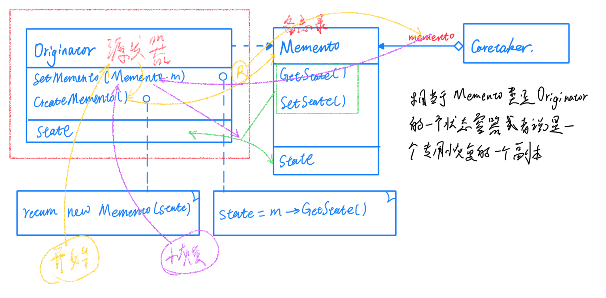
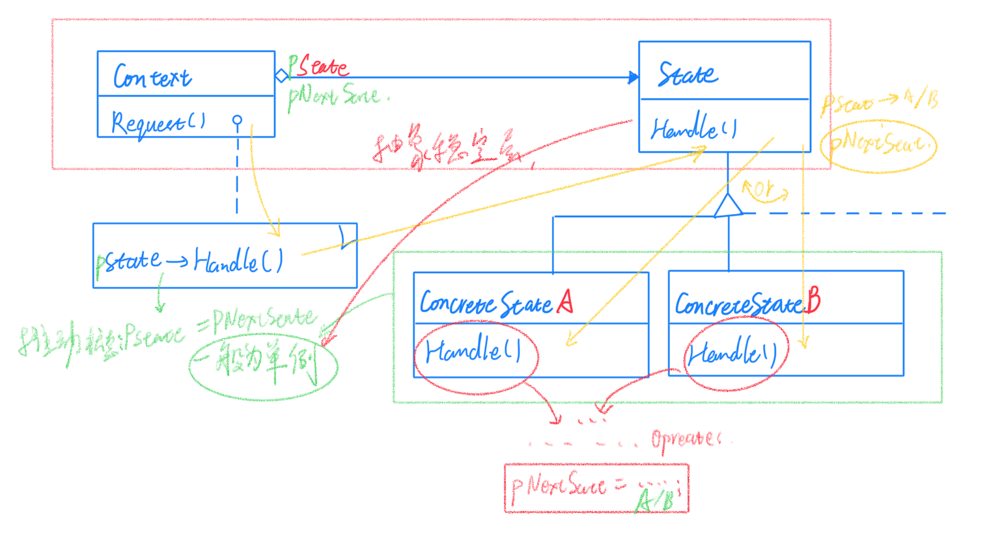

# 06状态变化

在组件的构建中，某些对象的状态经常面临变化，如何对这些变化进行有效的管理，同时又维持高层模块的稳定是一个很重要的问题。"状态变化"模式为这一问题提供了一种解决方案。

## Memento（备忘录）

在软件构建过程中，某些对象的状态在转换过程中，可能由于某些需要，要求程序能够回溯到对象之前处于某个点时的状态。如果使用一些共有接口来让其他对象得到对象的状态，遍会暴露对象的细节实现。

备忘录在不破坏封装性的前提下，捕获一个对象内部状态，并在该对象之外保存这个状态。这样以后就可以将该对象恢复到原先保存的状态。

由于现代语言运行时都具有相当的对象序列化支持，因此往往采用效率高、又容易序列化的方式实现备忘录模式了。

Memento模式的核心思想是数据隐藏，目的是在隐藏Originator（原发器）的内部数据的同时能够将其状态在外部存储，本质上是一个深拷贝的实现，但是当复杂对象需要深拷贝时又会产生巨大开销，这时就要考虑到序列化的问题了。

## State（状态）

在软件构建过程中，某些对象的状态如果改变，其行为也会随之而发生改变，比如文档处于只读状态，其支持的行为和读写状态支持的行为就可能完全不同。

状态模式 允许一个对象在其内部状态改变时改变它的行为。对象看起来似乎修改了它的类。

适用性：

在下面两种情况下均可使用 State 模式：

* 一个对象的行为取决于它的状态，并且它必须在运行时根据状态改变它的行为。
* 一个对象的操作中含有庞大的多分支依赖于该对象的状态。这个状态通常用一个或者多个枚举常量表示。通常有多个操作包含这一相同条件的条件结构。State 模式将每一个条件分支放入一个独立的类中。这使得你可以根据对象自身的情况将对象的状态作为一个对象，这一对象可以不依赖于其他对象而独立变化。

参与者
> Context 定义客户感兴趣的接口，维护一个ConcreteStae子类的实例，这个实例定义定义当前状态。
> 
> State 定义一个接口以封装与Context的一个特定状态相关的行为。
> 
> ConcreteState subclasses 具体状态子类，每一子类实现一个与Context的一个状态相关的行为。

State模式将所有与一个特定状态相关的行为都放入一个State的子对象中，在对象状态切换时，切换相应的对象；但同时维持State的接口，这样实现了具体操作与状态转换之间的解耦合。

为不同的状态引入不同对象使得状态转换变得更加明确，而且可以保证不会出现状态不一致的情况，因为转换是原子性的，即要么彻底转换过来，要么不转换。

如果State对象没有实例变量，那么各个上下文可以共享同一个State对象，从而节省对象开销。

总的来说，State模式将原来由高层负责对状态机进行驱动（通常是一堆if-else，进行执行方法并改变状态），变成了，高层只负责"驱动"每次向下推一次，至于要推到哪里就不再由高层负责，而是落到了底层的具体实现。这样就很好的将状态和驱动隔离开了，无论是增加还是减少状态都不要对高层进行修改，只需要改动具体实现中推动的方向即可，每个实现只需要关心我的后继是谁就可以了。

> Memento（备忘录）
> 
> State（状态）