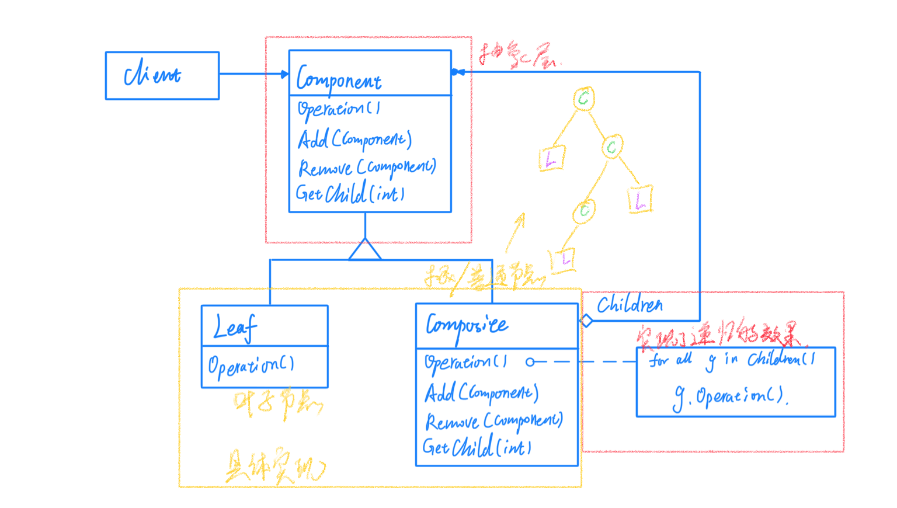
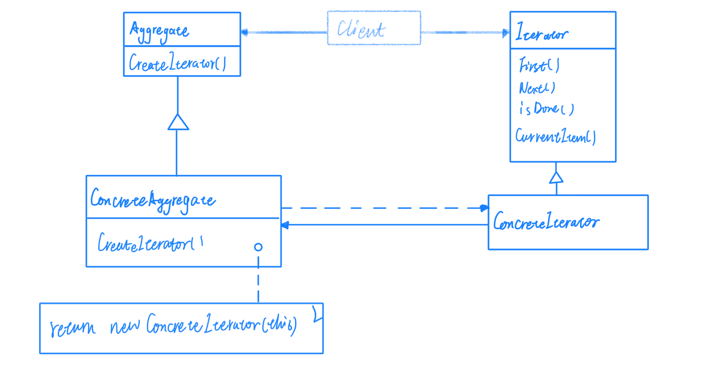
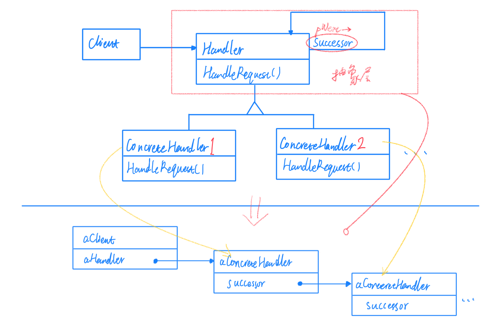

# 07数据结构

常常有一些组件在内部具有特定的数据结构，如果客户程序依赖这些特定的数据结构，将极大地破坏组件的复用。这时候，将这些特定的数据结构封装在内部，在外部提供统一的接口，来实现与特定数据结构无关的访问，是一种行之有效的解决方案。

## Composite（组合）

将对象组合成树形结构以表示 "部分-整体" 的层次结构。Composite使得用户对单个对象和组合对象的使用具有一致性。

对于Composite模式，采用树形结构来实现普遍存在的对象容器，从而将"一对多"的关系转化为"一对一"的关系，使得客户代码可以一致地（复用）处理对象和对象容器，无需关心处理的是单个对象，还是组合的对象容器（相当于隐式表达了递归调用）。

其实对于结构中的Add、Remove以及Get方法到底需不需要在抽象基类中定义是比较有争议的，两种方法各有优缺点；如果在抽象基类中定义，那么leaf也就是叶子结点由于不需要这些操作，那么就要把leaf中的这虚方法写成空实现或者抛出异常，这显然是不符合我们设计的出发点；然而如果不在抽象基类中定义，那么就不再有良好的扩展性，如果有其他类型的结点加入那么就不能再使用多态的方法解决扩展性的问题了。

所以这个部分怎么设计，需要根据实际情况去判断，当然Composite模式的关键在于Operation方法，Operation方法可以通过多态的方式在树状结构中自动形成递归调用的模式。

将"客户代码与复杂的对象容器结构"解耦合是Composite的核心思想，解耦合之后，客户代码将与纯粹的抽象和接口————而非对象容器的内部实现结构————发生依赖，从而更能"应对变化"。

Composite模式在具体的实现中，可以让父对象中的子对象反向追溯，如果父对象有频繁的遍历需求，可使用缓存技巧改善效率。

## Iterator（迭代器）

在软件构建过程中，集合对象内部结构常常变化各异。但对于这些集合对象，我们希望在不暴露其内部结构的同时，可以让外部客户代码同名地访问其中包含的元素；同时这种"透明遍历"也为"同一种算法在多种集合对象上进行操作"提供了可能。

提供一种方法顺序访问一个聚合对象中的各个元素，而又不需要暴露该对象的内部表示。

实际上，迭代器在C++中有了更好的实现方式，范型编程，但是在其他不支持翻译时多态的语言，迭代器模式的应用还是很广的。

## Chain of Responsiblity（职责链）
在软件构建过程中，一个请求可能被多个对象处理，但是每个请求在运行时只能有一个接收者，如果显示指定，将必不可少地带来发送者和接收者的紧耦合。

使多个对象都有机会处理请求，从而避免请求的发送者和接收者之间的耦合关系。将这些对象连成一条链，并沿着这条链传递该请求，直到有一个对象处理它为止。

通俗地说，就是将处理请求的对象做成一个单向链表，请求从表头开始向后传递，直到遇到能够处理该请求的对象为止。

## 总结

* 数据结构

> Composite（组合）
> 
> Iterator（迭代器）
> 
> Chain of Responsiblity（职责链）

这一部分的三种模式更加想数据结构，本身来看不是很像模式，而且确实在实际工作中并不常用或者已经被淘汰，但是这些思想还是值得借鉴的。