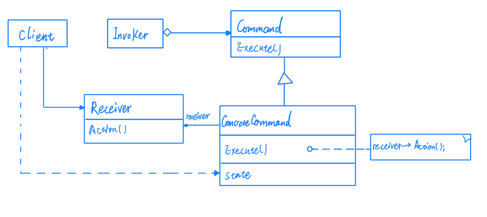
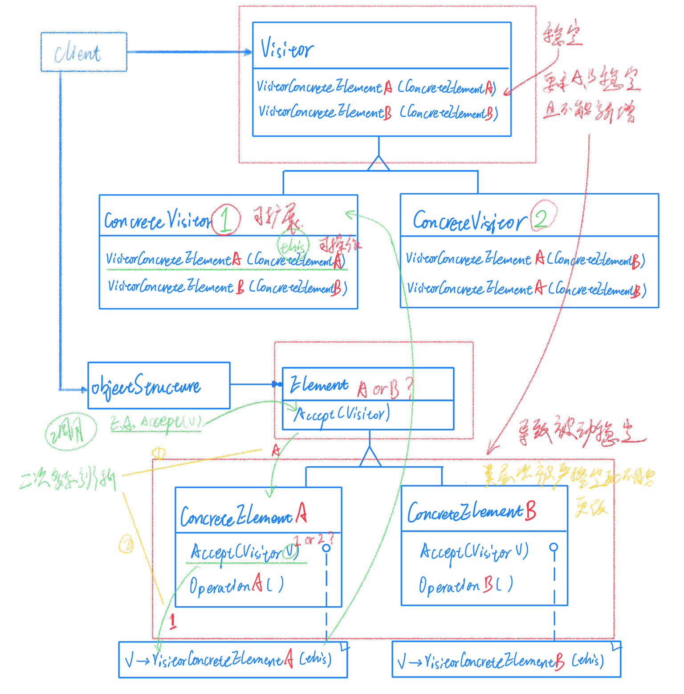
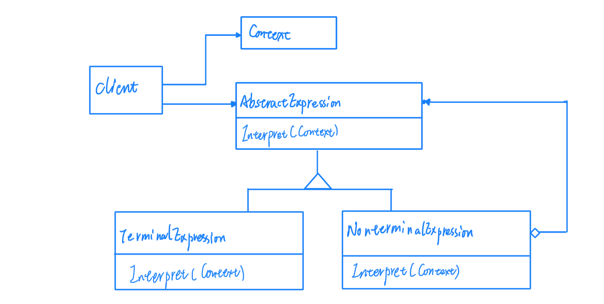

# 08行为变化 & 领域问题

## 行为变化

在组件的构建过程中，组件行为的变化经常导致组件本身剧烈的变化。"行为变化"模式将组件的行为和组件本身进行解耦合，从而支持组件行为的变化，实现两者之间的松耦合。

行为一般是指一段代码，所以天然的行为就和对象形成了编译时的紧耦合。

### Command（命令）

在软件构建过程中，"行为请求者"与"行为实现者"通常呈现一种紧耦合。但是在某些场合————比如需要对行为进行记录、撤销、重做、等事物处理，这种无法抵御变化的紧耦合是不合适的。

将一个请求封装成一个对象，从而使你可用不同的请求对客户进行参数化，对请求排队或记录请求日志，以及支持可撤销的操作。

* 总结

> Command模式的根本目的在于将"行为请求者"与"行为实现者"解耦合，在面向对象语言中，常见的实现手段是将行为抽象为对象。
> 
> 实现Command接口的具体命令对象ConcreteCommand有时候根据需要可能会保存一些额外的状态信息。通过使用Composite模式，可以将多个"命令"封装成为一个复合命令MacroCommand。
> 
> Command模式与C++的函数对象有些相似。但是两者定义行为接口的规范有所区别：Command以面向对象中的"接口-实现"来定义行为接口规范，更严格，但有性能损失；C++函数对象以函数签名来定义行为接口规范，更灵活，性能更高。

### Visitor（访问者）

在软件构建过程中，由于需求的改变，某些类层次结构中常常需要增加新的行为（方法），如果直接在基类中做这样的更改，将会给子类带来很繁重的变更负担，甚至破坏原有的设计。

表示一个作用于某对象结构中的各元素的操作。它使你可以在不改变各元素的类的前提下定义作用于这些元素的新操作。

* 总结

> Visitor模式通过所谓的双重分发（double dispatch 二次多态辨析）来实现在不更改（不添加新的操作-编译时）Element类层次结构的前提下，在运行时透明地为类层次结构上的各个类动态添加新的操作（支持变化）。
> 
> 所谓的双重分发，即Visitor模式中间包括了两个多态分发（注意其中的多态机制）：第一个为accept方法的多态辨析；第二个为visitorElementX方法的多态辨析。
> 
> Visitor模式的最大缺点在于扩展类层次结构（增加新的Element子类），会导致Visitor类的改变。因此Visitor模式适用于Elament类层次结构稳定，而其中的操作却经常面临频繁改动。

## 领域问题

在特定领域中，某些变化虽然频繁，但是可以抽象为某种规则。这时候，结合特定领域，将问题抽象为语法规则，从而给出在该领域下的一般性解决方案。

### Interpreter（解释器）

在软件构建过程中，如果某一特定领域的问题比较复杂，类似的结构不断重复出现，如果使用普通的编程方式来实现将面临非常频繁的变化。

给定一个语言，定义它的文法的一种表示，并非定义一个解释器，这个解释器使用该表示解释语言中的句子。

* 总结

> Interpreter模式的应用场合是Interpreter模式应用中的难点，只有满足 业务规则频繁变化，且类似结构不断重复出现，并且容易抽象为语法规则的问题，才适合使用Interpreter模式。
> 
> 使用Interpreter模式来表示文法规则，从而可使用面向对象技巧来方便地扩展文法。
> 
> Interpreter模式比较适合简单的文法表示，对于复杂的文法表示，Interpreter模式会产生比较大的类层次结构，需要求助语法分析生成器这种标准工具。

* 行为变化

> Command（命令）
> 
> Visitor（访问者）

* 领域问题

> Interpreter（解释器）