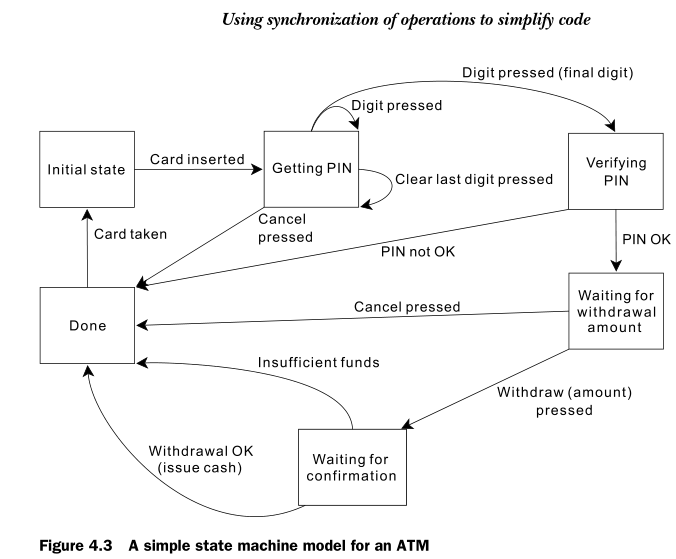

##            03 重修C++之并发实战4

【同步并发操作】

有些时候我们不仅要保护数据，还需要在独立的线程上进行同步操作。例如，一个线程在能够完成其认为u之前可能需要等待另一个线程完成任务。一般来说一个西安城等待特定事件的发生或是一个条件变为true是常见的。虽然通过定期检查“任务完成”的标识或是在共享数据中存储类似的东西也能实现这种功能，但是效果和效率却不够理想。对于这样的需求，C++标准库提供了以**条件变量（condition）**和**期值（future）**为形式的工具来处理它。

### 4.1等待事件或其它条件

如果一个线程正等待另一个线程完成一项任务，那么它有以下几个选择：

> 1. 它可以一直检查共享数据（由互斥元保护）中的标识，并且让执行任务的线程在完成任务时设置该标识。这个方法是有一定问题的，首先线程占用了宝贵的时间反复检查该标识，其次就是当互斥元被等待的线程锁定后就不能被任何其它线程锁定。这两个问题都造成了线程的忙等，限制了等待中的线程的可用资源，甚至可能导致完成任务的时候无法设置标识。


> 2. 第二个选择是使用`std::this_thread::sleep_for()`函数，让等待中的线程在检查之间休眠一会。这是一个进步，因为在线程休眠时并不浪费处理时间，但是得到正确的休眠时间是很难的。检查之间休眠过短仍然会浪费处理时间，过长又会导致延迟，而且更多时候等待的时间是不固定的，可能会出现不同时间段需要休眠的时间各不相同。

```cpp
#include <iostream>
#include <thread>
#include <mutex>

bool flag = false; //任务完成标志
std::mutex m;

void wait_for_flag()
{
    std::unique_lock<std::mutex> lk(m);
    
    while (!flag) //循环等待
    {
        lk.unlock(); //休眠之前解锁互斥元
        std::cout << "waiting target finish...... ......" << std::endl;
        std::this_thread::sleep_for(std::chrono::milliseconds(100));
        lk.lock(); //休眠之后解锁互斥元 以保证其它线程能够设置完成标识
    }
    std::cout << "target has finished!" << std::endl;
    
}

void target()
{
    std::cout << "/* target is running...... */" << std::endl;
    std::this_thread::sleep_for(std::chrono::milliseconds(1000));
    
    std::unique_lock<std::mutex> lk(m);
    flag = true;
    std::cout << "/* target is end...... */" << std::endl;

}

int main(int argc, const char** argv) {
    
    std::thread t1(wait_for_flag);
    std::thread t2(target);

    t1.join();
    t2.join();

    return 0;
}
/*************************************************
运行结果：
/* target is running...... */
waiting target finish...... ......
waiting target finish...... ......
waiting target finish...... ......
waiting target finish...... ......
waiting target finish...... ......
waiting target finish...... ......
waiting target finish...... ......
waiting target finish...... ......
waiting target finish...... ......
waiting target finish...... ......
/* target is end...... */
target has finished!
*************************************************/
```


> 3. 第三个选择，也是目前最好的选择，使用C++标准库提供的工具来等待事件本身。等待由另一个线程触发一个事件的最基本机制。从概念上说，条件变量与某些事件或其他条件相关，并且一个或多个线程可以等待该条件被满足。当某个线程已经确定条件得到满足，他就可以通过通知一个或多个正在条件变量上进行等待的线程，以便唤醒它们继续处理。下面将详细介绍这种方法。


#### 4.1.1 用条件变量等待

标准C++库提供了两个条件变量的实现：`std::condition_variable`和`std::condition_variable_any`。这两个实现都在`<condition_variable>`库的头文件声明。两者都需要和互斥元一起工作，以便提供恰当的同步；前者仅限于和`std::mutex`一起工作，而后者可以与符合称为雷士互斥元的最低标准的任何东西一起工作，因此以`_any`为后缀。因为`std::condition_variable_any`泛用性更强，所以会有大小、性能或者操作系统资源方面形式的额外代价的可能，因此一般都会优先考虑`std::condition_variable`。下面的示例将展示条件变量的使用。

```cpp
#include <iostream>
#include <thread>
#include <mutex>
#include <queue>
#include <condition_variable>
#include <unistd.h>

std::mutex mut; 
std::queue<int> data_queue; //传递数据的队列
std::condition_variable data_cond; //条件变量

void data_preparation_thread() //准备数据线程
{
    for (int i = 0; i < 10; i++)
    {   //上锁 入队
        std::lock_guard<std::mutex> lk(mut);
        data_queue.push(i);
        std::cout << "----------------------" << std::endl;
        //通知
        data_cond.notify_one();
        //休眠1sm不然执行太快看不到效果
        std::this_thread::sleep_for(std::chrono::milliseconds(1));
    } 
}

void data_processing_thread() //处理产生的数据
{
    while (true)
    {
        //获取锁的状态
        std::unique_lock<std::mutex> lk(mut);
        //等待通知 并检查队列状态
        data_cond.wait(lk, []{ //可以不传参数 或者传一个现有的检查函数
            return !data_queue.empty();
        });
        //取数据 解锁
        int data = data_queue.front();
        data_queue.pop();
        lk.unlock(); //这个地方解锁和不解锁好像没区别，有待研究
        //打印数据
        std::cout << data << std::endl;
        if(data == 9)
        {
            break;
        }
    }
}

int main(int argc, const char** argv) {
    std::thread t1(data_processing_thread);
    sleep(1);
    std::thread t2(data_preparation_thread);

    t1.join();
    t2.join();
    return 0;
}
/*************************************************
[wangs7@localhost 4th_chapter]$ ./exec
----------------------
0
----------------------
1
----------------------
2
----------------------
3
----------------------
4
----------------------
5
----------------------
6
----------------------
7
----------------------
8
----------------------
9
*************************************************/
```

现在整理一下流程，首先当数据准备就绪时，准备数据线程使用`std::lock_guard`锁定保护队列的互斥元，并将数据入队；然后在`std::condition_varoable`的实例上调用`notify_one()`通知等待中的线程。在另一侧如果有处理线程。该线程会锁定互斥元，但是这次使用的是`unique_lock`，不使用`std::lock_guard`的原因是该线程下面会在`std::condition_varoable`的实例上调用`wait()`传入锁对象以及等待 条件的lambda函数，以检查队列中是否有数据，如果返回false就解锁互斥元并将该线程置于阻塞等待状态。当来自数据准备线程调用对应条件变量的`notify_one()`时，处理线程从睡眠中被唤醒，重新获取到互斥元上的锁并检查条件，如果条件满足就从wait返回（此时互斥元依然是锁定状态），如果条件不满足，该线程就解锁互斥元，并从新回到阻塞状态等待唤醒。这就是不使用`std::lock_guard`的原因，如果使用数据处理线程使用`std::lock_guard`，那么互斥元将始终被锁定，数据准备线程会一直无法锁定互斥元，队列就会无法更新，数据线程就会一直在等待。

条件变量可能会对所提供的检查条件检查任意多次。然而，这总是在互斥元被锁定的情况下这样做，并且当且仅当测试条件返回true时立即返回。当等待线程重新获取互斥元并检查条件时，如果它并非是直接相应另一个线程的通知，那么这种就是所谓的伪唤醒。由于这种伪唤醒的次数和频率根据定义是不确定的，所以使用对于条件检查具有副作用的函数是不可取的。如果非要这么做就要准备好多次产生副作用的准备。

使用队列在线程之间传输数据，是很常见的场景。做得好的话，同步可以被现在在队列本身，大大减少了同步问题和竞争条件大概得数量。


####  4.1.2 使用条件变量建立一个线程安全的队列

如果要设计一个泛型队列，就需要好好考虑需要怎么组织数据结构怎么设计接口。首先除去必要的构造函数、析构函数、赋值和交换函数，那么还需要查询队列状态的函数（empty和size）、查询队列元素（front和back）、以及修改队列（push、pop和emplace），这里为了简化操作，将查询和修改操作合并，直接设置到push和pop操作中，但是由于该队列要在多线程中提供线程安全的队列模式，所以在出队的地方要考虑到阻塞（wait_and_pop）和非阻塞（try_pop）的操作。然后我们需要一个内置锁，一个条件变量还有一个承载数据的队列容器。大致定义如下：

```cpp
#include <queue>
#include <mutex>
#include <condition_variable>

template<typename T>
class threadsafe_queue
{
private:
    mutable std::mutex queue_mutex; //互斥元必须是可变的
    std::condition_variable queue_cond;
    std::queue<T> data_queue;

public:
    threadsafe_queue() { }
    threadsafe_queue(const threadsafe_queue &) { }
    //删除移动构造函数和赋值操作符
    threadsafe_queue(threadsafe_queue &&) = delete;  
    threadsafe_queue &operator=(threadsafe_queue &&) = delete;
    threadsafe_queue &operator=(const threadsafe_queue &) = delete;
    
    ~threadsafe_queue() { }

public: //这里的阻塞非阻塞是相对队列是否为空 不是能不能拿到锁
    void push(T new_value); //入队
    //非阻塞出队 必须携带能反映是否成功的标识
    bool try_pop(T& value); 
    std::shared_ptr<T> try_pop();
	//阻塞出队
    void wait_and_pop(T& value);
    std::shared_ptr<T> wait_and_pop();
	//判空
    bool empty() const;

};
```

下面开始实现功能，注意模板类的方法实现必须在头文件中，否则编译成库的时候找不到。

```cpp
#include <queue>
#include <mutex>
#include <condition_variable>

template<typename T>
class threadsafe_queue
{
private:
    mutable std::mutex queue_mutex;
    std::condition_variable queue_cond;
    std::queue<T> data_queue;

public:
    threadsafe_queue() { }
    threadsafe_queue(const threadsafe_queue &other) 
    {
        std::lock_guard<std::mutex> lk(other.queue_mutex);
        this->data_queue = other.data_queue;
    }
    
    threadsafe_queue(threadsafe_queue &&) = delete;  
    threadsafe_queue &operator=(threadsafe_queue &&) = delete;
    threadsafe_queue &operator=(const threadsafe_queue &) = delete;
    ~threadsafe_queue() { }

public:
    void push(T new_value)
    {
        std::lock_guard<std::mutex> lk(queue_mutex);
        data_queue.push(new_value);
        queue_cond.notify_one();
    }
    
    bool try_pop(T& value)
    {
        std::lock_guard<std::mutex> lk(queue_mutex);
        if (data_queue.empty())
            return false;
        value = data_queue.front();
        data_queue.pop();
        return true;
    }
    std::shared_ptr<T> try_pop()
    {
        std::lock_guard<std::mutex> lk(queue_mutex);
        if (data_queue.empty())
            return std::shared_ptr<T> ();
        std::shared_ptr<T> ret( std::make_shared<T>(data_queue.front()) );
        data_queue.pop();
        return ret;
    }

    void wait_and_pop(T& value)
    {
        std::unique_lock<std::mutex> lk(queue_mutex);
        queue_cond.wait(lk, [&]{ return !data_queue.empty(); });
        value = data_queue.front();
        data_queue.pop();
    }
    std::shared_ptr<T> wait_and_pop()
    {
        std::unique_lock<std::mutex> lk(queue_mutex);
        queue_cond.wait(lk, [&]{ return !data_queue.empty(); });
        std::shared_ptr<T> ret( std::make_shared<T>(data_queue.front()) );
        data_queue.pop();
        return ret;
    }

    bool empty() const
    {
        std::lock_guard<std::mutex> lk(queue_mutex);
        return data_queue.empty();
    }

};
```

上述代码经过测试，功能都能可靠运行，特点是wait_and_pop会一直等，try_pop则会一直返回（由于数据push是很快的，所以try_pop不会因为等锁而一直等待，只要push一释放就很快会拿到锁返回，无论是否成功）。

【2021.11.04】


### 4.2 使用future等待一次性事件

C++标准库使用future为这一次性事件提供模型。所谓一次性事件是指，如果一个线程需要等待特定的一次性事件，那么他就会获取一个future来代表这个事件。然后，该线程可以周期性地在这个future上等待一小段时间以检查事件是否发生，而在检查间隙执行其它任务。另外它还可以去做其它任务，直到其所需要的事件已经发生才能继续执行，随后就等待future变成就绪。future可能关联数据也可能不关联，但是一旦future变成就绪就无法复位了。

C++标准库中有两类future，是由`<future>`库的头文件中声明的两个类模板实现的：**唯一future**（`std::future<>`）和**共享future**（`std::shared_future<>`）。这两个类模板是参考`std::unique_ptr`和`std::shared_ptr`建立的。

> `std::future<>`的实例是仅有一个指向其关联事件的实例，而多个`std::shared_future`的实例则可以指向同一个事件。对于后者而言，所有实例将同时变为就绪，并且它们都可以访问所有与该事件相关联的数据。这些关联的数据就是这两种future称为模板的原因。模板参数就是关联数据的类型，对于`void`参数，是特化的用于无关联数据的场合。
>
> 虽然future被用于线程通信，但是future本身并不提供同步访问。如果需要多个线程访问同一个future需要通过互斥元或其它机制来保护访问。当然多线程可以分别访问自己的`std::shared_future<>`副本而无需进一步同步，即使它们都指向同一个异步结果。


#### 4.2.1 从后台任务返回“值”

* 接收返回值

如果想从后台获取到返回值就需要使用到`std::async`函数模板（需要包含头文件`<future>`）。在不需要立刻得到结果的时候，可以使用`std::async`来启动一个异步任务。`std::async`返回一个`std::future`对象，而不是一个`std::thread`对象让你在上面等待，`std::future`对象最终将持有函数的返回值。当需要这个值的时候，只需要在`future`对象上调用`get()`线程就会阻塞到`future`就绪，然后返回该值。

```cpp
#include <iostream>
#include <thread>
#include <future>
#include <mutex>
#include <unistd.h>

int find_the_answer()
{
    std::cout << "find_the_answer start---------------------------" << std::endl;
    sleep(5);
    std::cout << "find_the_answer over---------------------------" << std::endl;
    return 0;
}

void do_something()
{
    std::cout << "do_something start---------------------------" << std::endl;
    sleep(1);
    std::cout << "do_something over---------------------------" << std::endl;
}

int main(int argc, const char** argv) {
    
    std::future<int> ft = std::async(find_the_answer);
    do_something();
    int res = ft.get();
    std::cout << "answer is " << res << std::endl;

    return 0;
}

/**************************************************
运行结果：
do_something start---------------------------
find_the_answer start---------------------------
do_something over---------------------------
find_the_answer over---------------------------
answer is 0
**************************************************/
```


* 传递参数给函数

下面是几种传递参数的方法

```cpp
struct X
{
    void foo(int, std::string const&);
    std::string bar(std::string const&);
};
X x;

//调用的是(&x)->foo(42, "hello")
auto f1 = std::async(&X::foo, &x, 42, "hello");
//调用的是tmpx.bar("goodbye")，其中tmpx是x的副本
auto f2 = std::async(&X::bar, x, "goodbye");

struct Y
{
    double operator()(double);
};
Y y;

//调用的是tmpy(3.14)，其中tmpy是Y()移动构造的
auto f3 = std::async(Y(), 3.14);
//调用的是y(2.718)
auto f4 = std::async(std::ref(y), 2.718);

X baz(X& a);

//调用的是baz(x)
auto f5 = std::async(baz, std::ref(x));

class move_only
{
public:
    move_only();
    move_only(move_only &&) = default;
    move_only &operator=(move_only &&) = default;

    move_only(const move_only &) = delete;
    move_only &operator=(const move_only &) = delete;
    ~move_only();

    void operator()();  
};

//调用的是tmp()，其中tmp是从std::move(move_only())构造的
auto f6 = std::async(move_only());
```

默认情况下，`std::async`是否启动一个线程，或者在等待future时任务是否同步运行都取决于具体实现方式。大多数情况下这就是我们想要的执行方式，但是我们也可以在函数调用之前使用一个额外的参数显式指出我们要使用何种方式调用。这个参数为`std::launch`类型，可以是`std::launch::deferred`表示函数调用会延迟，直到future上调用`wait()`或`get()`为止；或者是`std::launch::async`，以表明该函数必须运行在它自己的线程上；又或者是`std::launch::deferred|std::launch::async`，以表明可以由具体实现来选择。最后一个选项是默认的。如果函数调用被延迟，它有可能永远都不会实际运行。如下：

```cpp
//在新线程中运行
auto f7 = std::async(std::launch::async, Y(), 1.2);
//在wait或get中运行
auto f8 = std::async(std::launch::deferred, baz, std::ref(x));
//f9 f0由具体实现来选择
auto f9 = std::async(
            std::launch::async | std::launch::deferred, 
            baz, std::ref(x));
auto f0 = std::async(baz, std::ref(x));
//延迟调用
f8.wait();
```

另外在后面，还会看到能使用`std::async`轻易地将算法转化成可以并行地任务。

#### 4.2.2 将任务与future关联

`std::packaged_task<>`将一个future绑定到一个函数或者可调用的对象上，`std::packaged_task<>`对象被调用时，它就调用相关联的函数或可调用的对象，并且让future就绪，将返回值作为关联数据存储。这样可以被用作线程池的构件，或其它任务管理模式。例如在每个任务自己的线程上运行或在一个特定的后台上运行所有的任务。如果一个大型操作可以分成许多自包含的子任务，其中每一个都可以被封装在一个`std::packaged_task<>`实例中，然后将该实例传给任务调度器或线程池。这样就抽象出了任务的详细信息，调度程序仅需要处理`std::packaged_task<>`，而非各个函数。

`std::packaged_task<>`类模板的参数为函数签名，比如`void()`表示无返回值的函数，当构造`std::packaged_task<>`实例时必须传入一个函数或者可调用的对象，它可以接受指定的参数并且返回指定的返回类型。类型无需严格匹配，你可以用一个接受int并且返回float的函数构造`std::packaged_task<double(double)>`，因为这些类型时可以隐式转换的。


* 在线程中传递任务

下面模拟使用`std::packaged_task<>`提供一种更新GUI的方法GUI的方法，该方法无需为每个GUI相关活动获取自定义的消息。

```cpp
#include <iostream>
#include <thread>
#include <deque>
#include <mutex>
#include <future>
#include <utility>

std::mutex m;
std::deque<std::packaged_task<void()> > tasks;

bool gui_shutdown_message_received();
void get_and_process_gui_message();

void gui_thread() //GUI线程
{
    //循环接收GUI停止的消息
    while (!gui_shutdown_message_received())
    {   //轮询待处理的GUI消息
        get_and_process_gui_message();
        std::packaged_task<void()> task;
        { //锁定队列
            std::lock_guard<std::mutex> lk(m);
            if (tasks.empty()) //从队列中取任务
                continue;
            task = std::move(tasks.front());
            tasks.pop_front();
        } //解锁
        task(); //执行任务 与该任务相关的future将变为就绪状态
    }
}
std::thread gui_bg_thread(gui_thread);

template<typename Func>
std::future<void> post_task_for_gui_thread(Func f)
{
    //利用提供的函数f创建一个新任务
    std::packaged_task<void()> task(f);
    //获取future
    std::future<void> res = task.get_future();
    //锁定队列 入队
    std::lock_guard<std::mutex> lk(m);
    tasks.push_back(std::move(task));
    return res; //返回future
} //自动解锁

int main(int argc, const char** argv) {
    //...
    return 0;
}
```

本示例中的任务使用`std::packaged_task<void()>`，它封装了一个接受零参数且返回空的函数或可调用对象（如果有返回值，返回值将会被丢弃）。


#### 4.2.3 生成std::promise

如果无法用一个简单函数调用表达的任务和那些结果可能来自不止一个地方的任务，可以通过创建future的方式来处理：使用`std::promise`来显式地设置值。

当有一个需要处理大量网络链接的应用程序时，通常倾向于在独立的线程上分别处理每个链接，因为这能使得网络通信更容易理解也跟更容易编程。这对于较低连接数效果较好，但是随着线程数的增加，这种方法就变得不那么合适了。在具有超大量连接的应用程序中，通常用少量线程（可能仅有一个）来处理链接，每个线程一次处理多个链接。

考虑其中一个处理这种链接的线程。数据包将以基本上随机的顺序来自于待处理的各个连接，同样的数据包将以随机顺序进行排队发送。在多数情况下，应用程序的其它部分将通过特定的网络连接，等待着数据被成功发送回事新的一批数据被成功接收。

> `std::promise<T>`提供一种设置值（类型T）的方式，它可以在这之后通过相关联的`std::future<T>`对象进行读取。一对`std::promise<T>/std::future<T>`为这种方法提供了一种可能的机制；等待中的线程可以阻塞future，同时提供数据的线程可以使用配对中的promise项，来设置相关值并使future就绪。
>
> 可以通过调用`get_future()`成员函数来获取与给定的`std::promise<T>`相关的`std::future<T>`对象，例如std::packaged_task。当设置完promise的值（使用set_value()成员函数），future就会变为就绪，并且可以用来获取所储存的数值。如果销毁`std::promise<T>`时未设置值，则将存入一个异常。

下面将使用一对`std::promise<bool>/std::future<bool>`对，来标识一块传出数据是否传输成功，与future关联的值就是一个简单的成功/失败标志。对于传入的数据包，与future为数据包的负载。（伪码）

```cpp
#include <mutex>
#include <future>

void process_connections(connection_set& connections)
{
    while (!done(connections)) //一直循环直到所有连接断开
    {
        for (onnection_siterator //遍历整个连接列表 轮询处理
                connection = connections.begin(), end = connections.end();
                connection != end; 
                connection++)
        {
            if(connection->has_incoming_data()) //如果有数据来
            {
                data_packet data = connection->incoming(); //收数据
                std::promise<payload_type>& p = //获取promise
                    connection->get_promise(data.id); 
                p.set_value(data.payload); //设置promise的值 将数据通过future传出去
            }
            if(connection->has_outgoing_data()) //如果要发数据
            {
                outgoing_packet_data data = //获取发的数据
                    connection->top_of_outgoing_queue();
                connection->send(data.payload); //发送
                data.promise.set_value(ture); //设置成功标识
            }
        }
    }
}
```

上述伪码，的promise/future结构可能不适用于某些情况，但是这种风格跟一些操作系统的异步I/O的结构很很相似。


#### 4.2.4 future保存异常

如果在正当前线程中调用函数引发异常，一场会立刻抛出，函数的调用者能够捕获到；但是如果异步调用的函数触发了异常呢？假设下面的异步调用中的函数（`int func(void)`）会发生异常。

```cpp
std::future<int> f = std::async(func);
int res = f.get();
```

那么产生的异常会被存储在future中，并替换原来所存储的值把future设置为就绪。当调用get时会重新引发异常（这里的异常可能是原始异常对象也可能是其副本，根据不同编译器实现的方式不同）。同样封装到任务中的函数引发异常也是这种效果。当然`std::promise`在显式调用函数的时候也听过相同的功能。如果期望存储一个异常而不是一个值，则应该调用`set_exception()`而不是`set_value()`。这通常是在引发异常作为算法的一部分时用在catch块中，将该异常填入promise。

```cpp
extern std::promise<int> some_promise;

try
{
    some_promise.set_value(calculate_value());
}
catch(...)
{
    some_promise.set_exception(std::current_exceptio());
}
```

这里的`std::current_exceptio()`是用来获取已引发的异常。作为代替，可以用`std::copy_exceptio()`直接储存异常而不引发。

```cpp
    some_promise.set_exception(std::copy_exceptio(std::logic_error("foo")));
```

在异常的类型已知的情况下try/catch语句块是最好的方法。

除此之外还有另一种将异常存储至future的方式，是销毁与future相关的promise或是packet_task，而无需在promise上调用设置函数或调用打包任务。在任何情况下，如果future还没有就绪，promise或packet_task的析构函数就会将具有`std::future_errc::broken_promise`错误代码的`std::future_errc`异常存储在相关联的状态中。通过创建future，然后承诺为future提供一个值或异常，而通过销毁该值或异常的来源，显然违背了这个承诺。在这种情况下如果编译器不放任何东西存进future，等待线程可能会永远等下去。


#### 4.2.5 多个线程等待同一个事件

由于`std::future`在设计的时候就不支持在不同步的情况下多个线程同时等待一个future。因为一旦其中一个线程调用了get那么就会取走future中的值，那么其它线程就永远都拿不到期望的值，为了解决这个问题C++标准库提供了`std::share_future`解决这个问题。简单来说`std::future`是仅可移动的，所以所有权可以在实例间转移，但一次只有一个实例能指向特定的一异步结果；`std::share_future`是可复制的，因此可以有多个对象引用同一个相关状态。

现在即使有了`std::share_future`，各个对象的成员函数仍然是不同步的，所以为了避免从多个线程访问单个对象时出现数据竞争，必须使用锁来保护访问。首选的方式是用一个对象的副本来替代，并让每个线程访问自己的副本。从多个线程访问共享的异步状态，如果每个线程都是通过自己的`std::share_future`对象取访问该状态，那么就是线程安全的。


### 4.3 有时间限制的等待

目前有两类可以提供的超时：

> 一、基于**时间段**的超时，即等待一个指定的时间长度，（例如，等待30ms）。
>
> 二、**绝对超时**，即等到一个指定的时间点（例如世界标准时间2021年11月5日16:45.516546）

大多数等待函数都提供处理这两种形式超时的变量，处理基于时间段的变量有`_for`后缀，而处理绝对超时的变量有`_until`后缀。


#### 4.3.1 时钟

C++标准库提供一下几种时间信息的类。

> * 现在时间。
> * 用来表示从时钟获取到时间值的类型。
> * 时钟的节拍周期。
> * 时钟是否以均匀的速率进行计时，决定其是否为匀速时钟。

时钟当前的时间可以通过调用该时钟类的静态成员函数`now()`来获取。如下：

```cpp
std::chrono::system_clock::now();
```

对于具体某个时钟的时间点类型，通过`time_point`成员的`typedef`来指定的，因此`some_clock::now()`的返回类型是`some_clock::time_point`。

时钟的节拍周期是由“分数秒”（可以理解为时间/次数）指定的，具体用法没整明白，暂时用不到，且应该不会引发什么问题，就先不整了。


#### 4.3.2 时间段

时间段是时间支持中的最简单部分，它们是由`std::chrono::duration<>`类模板（线程库使用的所有C++时间处理工具均位于`std::chrono`的命名空间）进行处理的。第一个模板参数为代表类型（如：int、long、或double等）；第二个参数是分数，指定每个时间段由多少秒。例如，以int类型存储的几分钟的数目为：

```cpp
std::chrono::duration<int, std::ratio<60,1>> //时间段一分钟（有60秒），所以时间段是60/1秒，所以是 std::ratio<60,1>
std::chrono::duration<double, std::ratio<1,1000>> //以double类型存储毫秒
```

在标准库`std::chrono`命名空间中为各种时间段提供了一组预定义的`typedef`：

```cpp
nanoseconds //毫微秒，十亿分之一秒
microseconds //微秒，百万分之一秒
milliseconds //毫秒，千分之一秒
seconds //秒
minutes //分
hours //时
```

在无需截断值得场合，时间段之间的转换是隐式得（因此将小时转换成秒是可以的，但是将秒转换成小时则不可以）。显式转换可以通过下面的方式：

```cpp
std::chrono::millisconds ms(54802);
std::chrono::seconds s = std::chrono::duration_cast<std::chrono::second>(ms);
```

结果是四舍五入的，上面的结果为s的值为54。除此之外时间按段还支持算数运算，因此可以加减时间段得到新的时间段，或乘除一个底层表示类型（模板类型中的第一个参数的类型）的常数。

基于时间段的等待是通过`std::chrono::duration<>`实例完成的，如下：等待future就绪，最多等待25ms。

```cpp
	std::future<int> f = std::async(some_task);
	if (f.wait_for(std::chrono::milliseconds(25) == std::future_status::ready)
    {
    	do_something_with(f.get());    
    }
```

等待函数都会返回一个状态以表示等待是否超时，或者所等待的事件是否发生。有一种情况，程序正在等待future，若等待超时，函数返回`std::future_atatus::timeout`，若future就绪，就返回`std::future_status::ready`，或者如果future任务推迟，则返回`std::future_status::deferred`。

基于时间的等待使用类库内部的匀速时钟来衡量时间，因此25ms就意味着25ms的时间流逝，即使系统时钟在等待期间进行了调整（向前或向后）。当然，系统调度的多变和OS时钟的不同精度意味着线程之间发出调用并返回的实际时间可能远远长于25ms。


#### 4.3.3 时间点

时钟的时间点是通过`std::chrono::time_point<>`类模板的实例来表示的，它以第一个模板参数指定其参考的时钟，并且以第二个模板参数指定计量单位（`std::chrono::duration<>`的特化）。时间点的值是时间长度（指定时间端的倍数），因而一个特定时间点被称为时钟的**纪元（epoch）**。时钟的纪元是一项基本参数，但是却不能直接查询，也未被C++标准指定。典型的纪元包括1970年1月1日00:00，以及运行应用程序的计算机引导启动的瞬间。时钟可以共享纪元或拥有独立的纪元。如果两个时钟共享一个纪元，则在一个类中的`time_point typedef`可指定另一个类作为与`time_point`相关的时钟类型。虽然无法找出纪元的时间所在，但是可以获取给定 `time_point`的 `time_since_epoch()`。该成员函数返回一个时间段的值，反应从时间纪元到该时间点的时间长度。

> 例如：你可以指定一个时间点为`std::chrono::time_point<std::chrono::system_clock, std::chrono::minutes>`。这将保持时间与系统时钟相关，但是以分钟（第二个参数指定）进行测量。
>
> 我们可以从`std::chrono::time_point<>`的实例加上和减去时间段来产生新的时间点：
>
> ```cpp
> //将在future中给500纳秒的时间
> std::chrono::hight_reslution_clock::now() + std::chrono::nanoseconds(500);
> ```
>
> 这种形式的等待好处就是不需要判断前面的时间是否等待，也不用计算前面的等待时间，而是用时间点计算等待的绝对时间。

当然`std::chrono::time_point<>`实例的时钟参数能做的不仅仅是指定纪元。当你将时间点传到接受绝对超时的等待函数时，时钟参数可以用来测量时间。当时钟改变时会产生一个重要影响，因为这一等待会跟踪时钟的改变，并且在时钟的now()函数返回一个晚于指定超时的值之前都不会返回。如果时钟向前或向后调整都将照成等待的减少或延迟等待时长。

时间点以及相应等待函数的`_until`变种的使用方法：

```cpp
#include <iostream>
#include <atomic>
#include <condition_variable>
#include <thread>
#include <chrono>
using namespace std::chrono_literals;
 
std::condition_variable cv;
std::mutex cv_m;
std::atomic<int> i{0};
 
void waits(int idx)
{
    std::unique_lock<std::mutex> lk(cv_m);
    auto now = std::chrono::system_clock::now();
    if(cv.wait_until(lk, now + idx*100ms, [](){return i == 1;}))
        std::cerr << "Thread " << idx << " finished waiting. i == " << i << '\n';
    else
        std::cerr << "Thread " << idx << " timed out. i == " << i << '\n';
}
 
void signals()
{
    std::this_thread::sleep_for(120ms);
    std::cerr << "Notifying...\n";
    cv.notify_all();
    std::this_thread::sleep_for(100ms);
    i = 1;
    std::cerr << "Notifying again...\n";
    cv.notify_all();
}
 
int main()
{
    std::thread t1(waits, 1), t2(waits, 2), t3(waits, 3), t4(signals);
    t1.join(); 
    t2.join();
    t3.join();
    t4.join();
}
/**********************************************
可能的输出：
Thread 1 timed out. i == 0
Notifying...
Thread 2 timed out. i == 0
Notifying again...
Thread 3 finished waiting. i == 1
***********************************************/
```


#### 4.3.4 接受超时的函数

超时的最简单用法，是将延迟添加到特定线程的处理过程中，以便在它无所事事的时候避免占用其他线程的处理时间。

有两个函数可以像闹钟一样工作：

>`std::std::this_thread::sleep_for()` 在一段时间内等待；
>
>`std::std::this_thread::sleep_until()` 等待直到某个时间点。

除了这些之外其实还有很多接受超时的函数。这里不做过多介绍。


### 4.4 使用操作同步来简化代码

前面的描述的同步工具作为构建模块，允许使用者着重关注需要同步的操作而非机制。一种可以简化代码的方式，是采用一种更加**函数式（函数式编程）**的方法来编写并发程序。并非直接在线程之间共享数据，而是每一个任务都可以提供她所需要的数据，并使用future将结果传播至需要它的线程。


#### 4.4.1 带有future的函数式编程

函数式编程（functional programming，FP）是指一种编程风格，函数调用的结果仅单纯依赖于该函数的参数而不依赖于任何外部状态。这与函数的数学概念相关，也意味着如果同一个函数同一个参数执行两次，结果是完全一致的。这使得事情变得易于思考，尤其当涉及并发的时候，如果没有修改共享数据，那么就不会有竞争条件，因此也没有必要使用互斥元保护共享数据。这是一个如此强大的简化，使得一些编程语言，在默认情况下其所有的函数都是纯函数，这样更容易理解它们是如何纳入应用程序的整体结构的。

当然C++作为泛型语言，完全可以使用FP风格编写程序。随着lambda函数的添加，从Boost到TR1的`std::bind`合并，和自动变量类型判断的引入。future是使得C++更容易实现FP风格编程，future可以在线程之间来回传递，使得一个线程的计算结果依赖于另一个结果，而无需任何对共享数据的显式访问。

##### 1.FP风格的快速排序

为了说明在FP风格并发中future的使用，下面使用一个简单的快速排序算法来实现。

> 快速排序：给定一列值，取一个元素为中轴，然后将列表两边分为两组（比中轴小的为一组，大于等于中轴的一组），列表的已排序副本，可以通过对这两个组进行排序，并按照先比中轴小的排序列表，接着是中轴，再返回大于等于中轴的值，最后以排序列表的顺序进行返回来获取。

* 快速排序的顺序实现

```cpp
#include <iostream>
#include <list>
#include <algorithm>
//快速排序模板函数
template<typename T>
std::list<T> sequential_quick_sort(std::list<T> input)
{
    if (input.empty())
    {	//列表为空时结束递归调用 逐级返回
        return input;
    }
    
    std::list<T> result;
    //从input中取出第一个元素
    result.splice(result.begin(), input, input.begin());
    //筛选小于pivot值得元素放在input前面
    T const& pivot = *result.begin();
    //按筛选规则将list分为两部分前部分符合条件后部分不符合，返回得迭代器是第一部分的“end”第二部分的“begin”
    auto divide_point = std::partition(input.begin(), input.end(), [&](T const& t){ return t < pivot; });
    //将符合筛选条件的部分分离出来（小于部分）剩余就是大于等于部分
    std::list<T> lower_part;
    lower_part.splice(lower_part.end(), input, input.begin(), divide_point);
    
    //递归调用 前后两部分分别调用自己
    auto new_lower( sequential_quick_sort(std::move(lower_part)) );
    auto new_higher( sequential_quick_sort(std::move(input)) );

    //组装list
    result.splice(result.end(), new_higher);
    result.splice(result.begin(), new_lower);
	//返回结果
    return result;
}

//测试
int main(int argc, const char** argv) {

    std::list<int> a = {5, 6, 2, 7, 3, 95, 45, 68};
    std::list<int> b = sequential_quick_sort(a);

    for (int i : b)
    {
        std::cout << i << "  ";
    }
    std::cout << " " << std::endl;
    return 0;
}
/***************************************************
结果：
2  3  5  6  7  45  68  95 
***************************************************/
```


##### 2.FP风格并行快速排序

由于已经使用了函数式风格，通过future将其转换成并行版本就很容易了，下面将使用future和函数式编程实现并发快速排序算法。

* 使用future的并行快速排序

```cpp
#include <iostream>
#include <list>
#include <future>
#include <algorithm>

template<typename T>
std::list<T> parallel_quick_sort(std::list<T> input)
{
    if (input.empty())
    {
        return input;
    }
    
    std::list<T> result;
    result.splice(result.begin(), input, input.begin());
    T const& pivot = *result.begin();
    
    auto divide_point = std::partition(input.begin(), input.end(), [&](T const& t){ return t < pivot; });
    std::list<T> lower_part;
    lower_part.splice(lower_part.end(), input, input.begin(), divide_point);
    //添加future开启新线程处理前一部分
    std::future<std::list<T> > future_lower = std::async(&parallel_quick_sort<T>, std::move(lower_part));
    
    auto new_higher( parallel_quick_sort(std::move(input)) );
    result.splice(result.end(), new_higher);
    auto new_lower = future_lower.get(); //get()获取返回结果
    result.splice(result.begin(), new_lower);

    return result;
}
//测试结果同上
```

上述的并行代码严格来说只有两处不同，目的就是将一部分工作放在另一个线程中使用`std::async()`处理。但是其核心还是跟上原来的相同采用递归的方式，这就带来了一个问题，如果需要排序的元素过多，向下递归10次，如果硬件可以处理的话，就将有1024个线程在运行（由于有get()再等待结果所以不会有线程提前结束），如果类库认为产生了过多的任务，则可能改为同步地产生新任务，它们会在调用get()的线程中运行而不是新的线程。

与其使用`std::async()`，不如自行编写`spawn_task()`函数作为`std::package_task`和`std::thread`的简单封装。这么做并不会带来多少优点（实际上可能会导致大量的过度订阅），但它为迁移到一个更复杂的实现做好准备，它通过一个工作线程池，将任务添加到一个即将运行的队列里。但是这种方法只在你确定将要做什么，并且希望要通过线程池建立的方式进行完全掌握和执行任务的时候才优先考虑使用。

* 简单的spawn_task()实现

```cpp
template<class F, class A>
std::future<typename std::result_of<F(A&&)>::type> //加 typename！！！！不加编译不过的
	spawn_task(F&& f, A&& a)
{
	typedef typename std::result_of<F(A&&)>::type result_type;
	std::packaged_task<result_type(A&&)>
		task(std::move(f));
		std::future<result_type> res(task.get_future());
		std::thread t(std::move(task), std::move(a));
		t.detach();
		return res;
}

//main函数中只需要如下修改
//将 std::future<std::list<T> > future_lower = std::async(&parallel_quick_sort<T>, std::move(lower_part));
//替换为 auto future_lower = spawn_task(&parallel_quick_sort<T>, std::move(lower_part));
```


#### 4.4.2 具有消息传递的同步操作

还有一种共享可变数据的并发编程范式，叫通信顺序处理（CSP，Communitcating Sequential Process），在这种范式下，线程在概念上完全独立，没有共享数据，但是具有允许消息再它们之间进行传递的通信通道，也叫消息传递接口（MPI）。状态机的结构可以是显式的也可以是隐式的。

真正的通信序列进程并不共享数据，所有的通信都通过消息队列，但由于C++线程共享一个地址空间，因此不可能强制执行这一需求。这就是准则介入的地方。作为程序或类库的作者，有责任确保不在线程间共享数据。当然，为了线程之间的通信，消息队列必须是共享的，但是其细节可以封装在类库内。


下面考虑一个简单的ATM的简单状态流程：



代码是伪码无法编译运行，实际上这种状态机模型，只会考虑我可能接收到那些消息，该发送那些消息。ATM的逻辑运行在独立的线程上，系统的其它部分则在其它的独立线程上运行。这种程序设计风格被称为角色模型。系统中有多个离散的角色，用来互相发送消息以完成手头的任务，除了直接通过消息传递的状态之外，没有任何共享状态。

【2021.11.11】


